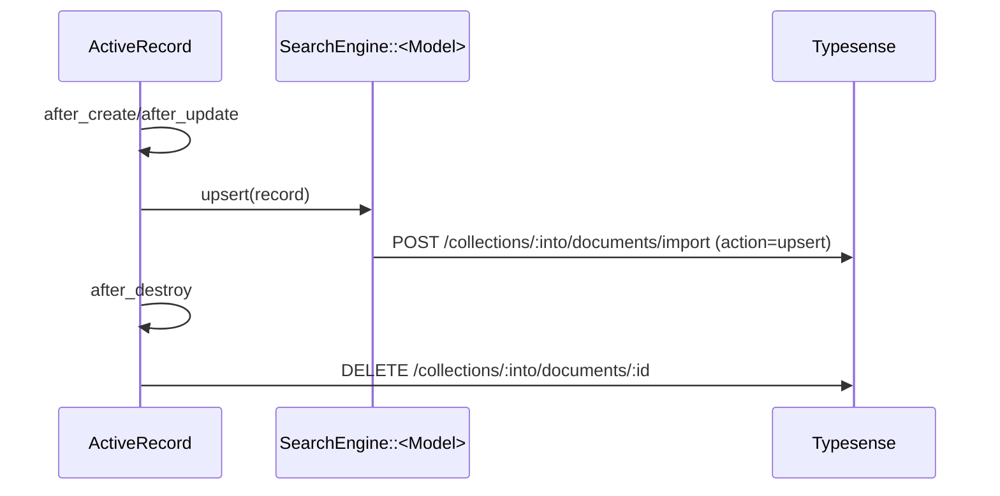

Related: <a href="/projects/search-engine-for-typesense/models">Models</a>, <a href="/projects/search-engine-for-typesense/indexer">Indexer</a>, <a href="/projects/search-engine-for-typesense/deletion">Deletion</a>, <a href="/projects/search-engine-for-typesense/client">Client</a>

## ActiveRecordSyncable (ActiveRecord Concern)

Keep a Typesense collection in sync with your ActiveRecord model. When enabled, the concern upserts on create/update and deletes on destroy so your Typesense documents mirror your database rows.

<Info>
  Note: Formerly named <code>SearchEngine::Syncable</code>. It has been renamed to <code>SearchEngine::ActiveRecordSyncable</code>.
</Info>

### Quick start

```ruby
class Product < ApplicationRecord
  include SearchEngine::ActiveRecordSyncable
  # Defaults: on: %i[create update destroy], collection: :books
  search_engine_syncable
end
```

With explicit options:

```ruby
class Order < ApplicationRecord
  include SearchEngine::ActiveRecordSyncable
  search_engine_syncable collection: :orders, on: %w[create destroy]
end
```

### Defaults and validation

- <strong>collection</strong>: inferred from model name (<code>tableize</code>, e.g., <code>Product</code> → "books").
  - Upserts require a <code>SearchEngine::&lt;Model&gt;</code> mapping for that logical collection.
  - If the mapping is missing at boot, a warning is logged and the concern will attempt lazy resolution later. When still unavailable at upsert time, it logs and skips upsert (no exception).
- <strong>on</strong>: defaults to <code>[:create, :update, :destroy]</code>.
  - Accepts a single symbol/string or an array; values are normalized case‑insensitively.

### What the concern does

- Registers callbacks on your AR model (installed once per class reload):
  - <code>after_create</code> → upsert document
  - <code>after_update</code> → upsert document
  - <code>after_destroy</code> → delete document
- Upserts call your SearchEngine model: <code>SearchEngine::&lt;Model&gt;.upsert(record: ...)</code> using your mapping (see <a href="/projects/search-engine-for-typesense/indexer">Indexer</a> and <a href="/projects/search-engine-for-typesense/models">Models</a>).
- Deletes compute the document id using the SearchEngine model’s <code>identify_by</code> when present, otherwise fall back to <code>record.id</code>.
- Target collection resolution prefers alias → physical mapping when available (see <a href="/projects/search-engine-for-typesense/schema">Schema</a>).



### Lazy resolution & error handling

- Mapping resolution is best‑effort at boot; if unavailable, a one‑time warning is logged. The concern resolves the SearchEngine model lazily on first use.
- Upsert/delete errors are logged and swallowed to avoid interrupting AR lifecycle callbacks (see logs under <code>search_engine_syncable</code>).

### Instance helpers

- <code>record.search_engine_record</code> → fetch the associated Typesense document as a hydrated <code>SearchEngine::&lt;Model&gt;</code> instance.
  - Uses the SearchEngine model’s <code>identify_by</code> to compute id; falls back to <code>record.id</code> when not defined.
  - Returns <code>nil</code> when the model mapping is unavailable or the document is missing.

```ruby
doc = Book.first.search_engine_record
# => #<SearchEngine::Book ...> or nil
```

- <code>record.sync_search_engine_record</code> → map and upsert this ActiveRecord instance to the collection.
  - Returns <code>1</code> when upserted, <code>0</code> on error; failures are logged.

```ruby
Book.first.sync_search_engine_record
# => 1
```

### Performance & Async

The default `after_create/update/destroy` callbacks execute **synchronously** (inline) within the request cycle (and often within the DB transaction).

- **Configuration Ignored**: The `SearchEngine.config.indexer.dispatch` setting (`:active_job` etc.) **does not apply** here. That setting controls bulk rebuilds only.
- **For High Throughput**: If you need background processing to avoid blocking user requests, disable the concern's auto-sync and manually enqueue a job.

```ruby
class Product < ApplicationRecord
  # Disable auto-sync
  include SearchEngine::ActiveRecordSyncable
  search_engine_syncable on: []

  after_commit :enqueue_search_update, on: %i[create update destroy]

  def enqueue_search_update
    SearchIndexJob.perform_later(self.class.name, id)
  end
end

# app/jobs/search_index_job.rb
class SearchIndexJob < ApplicationJob
  def perform(class_name, id)
    record = class_name.constantize.find_by(id: id)
    return unless record

    # Manual sync
    record.sync_search_engine_record
  end
end
```

### Callbacks timing: after_* vs after_commit

- Uses <code>after_create</code>/<code>after_update</code>/<code>after_destroy</code> by default for immediacy.
- If your app requires Typesense writes only after DB commit, switch to <code>after_commit</code> equivalents in your app; the upsert/delete calls are safe to use there as well.

### Migration from Syncable

- Replace:

```ruby
include SearchEngine::Syncable
```

with:

```ruby
include SearchEngine::ActiveRecordSyncable
```

No other API changes are required; keep using <code>search_engine_syncable</code>.

### Troubleshooting

- "Upsert skipped: no SearchEngine model": create a SearchEngine model and mapping for the collection; see <a href="/projects/search-engine-for-typesense/models">Models</a> and <a href="/projects/search-engine-for-typesense/indexer">Indexer</a>.
- "Cannot delete without id": ensure your SearchEngine model defines <code>identify_by</code> (or that the AR record’s <code>id</code> is usable).
- Unknown collection behavior: the concern resolves the target via alias or logical name; override <code>collection:</code> when needed.

### Reference

- Upserting helpers: <a href="/projects/search-engine-for-typesense/upsert">Upsert</a>
- Deletion helpers: <a href="/projects/search-engine-for-typesense/deletion">Deletion</a>
- Client wrapper: <a href="/projects/search-engine-for-typesense/client">Client</a>


