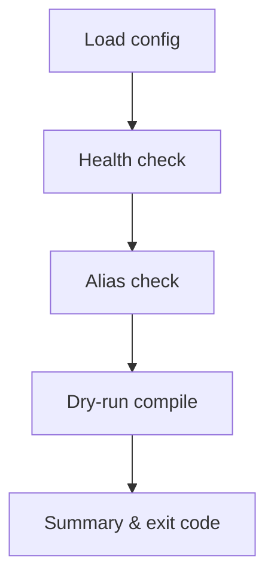

Related: <a href="/projects/search-engine-for-typesense/tuit">TUIT</a>, <a href="/projects/search-engine-for-typesense/troubleshooting#cli">Troubleshooting → CLI</a>, <a href="/projects/search-engine-for-typesense/observability#opentelemetry">Observability → OpenTelemetry</a>

Operator-focused tasks for schema lifecycle and indexing. All tasks are thin facades over documented APIs with small, structured instrumentation.

## Commands

```bash
rails 'search_engine:schema:diff[collection]'
rails 'search_engine:schema:apply[collection]'
rails 'search_engine:schema:rollback[collection]'
rails 'search_engine:index:rebuild[collection]'
rails 'search_engine:index:rebuild_partition[collection,partition]'
rails 'search_engine:index:delete_stale[collection,partition]'
rails search_engine:doctor
```

- <strong>collection</strong>: either a fully-qualified class name (e.g., <code>SearchEngine::Book</code>) or a logical identifier (e.g., <code>book</code>/<code>books</code>).
- <strong>partition</strong>: opaque partition key. Numeric strings are parsed as integers; otherwise treated as strings.

## Usage

- Show tasks: <code>rails -T | grep search_engine</code>
- Diff schema: <code>rails 'search_engine:schema:diff[SearchEngine::Book]'</code>
- Apply schema: <code>rails 'search_engine:schema:apply[books]'</code>
- Rollback schema: <code>rails 'search_engine:schema:rollback[books]'</code>
- Rebuild all partitions: <code>rails 'search_engine:index:rebuild[SearchEngine::Book]'</code>
- Rebuild a partition: <code>rails 'search_engine:index:rebuild_partition[SearchEngine::Book,42]'</code>
- Delete stale docs: <code>rails 'search_engine:index:delete_stale[books,42]'</code>
- Doctor diagnostics: <code>rails search_engine:doctor</code>

<Info>
  <strong>Note</strong>: <code>rails -T</code> always prints task names without quotes (e.g., <code>rails search_engine:index:rebuild[collection]</code>). When invoking tasks that use brackets, wrap the whole invocation in quotes to avoid shell globbing, e.g., <code>rails 'search_engine:index:rebuild[products]'</code>.
</Info>

Tip about commas: quote or avoid spaces inside brackets.

```bash
rails 'search_engine:index:rebuild_partition[SearchEngine::Book,42]'
```

## Environment flags

- <code>DRY_RUN=1</code>: For <code>index:rebuild</code>, preview first batch only (no HTTP); for <code>index:delete_stale</code>, show filter hash and estimation (if enabled) without deleting.
- <code>DISPATCH=inline|active_job</code>: Override dispatch mode for rebuild tasks (defaults from config).
- <code>VERBOSE=1</code>: Print additional details (e.g., schema diff JSON and dry-run sample line). For <code>doctor</code>, shows untruncated hints.
- <code>FORMAT=json</code>: Machine-readable output. For <code>doctor</code>, prints `{ ok, summary, checks }`.
- <code>STRICT=1</code>: For <code>index:delete_stale</code>, treat missing filter as violation.
- <code>TIMEOUT=seconds</code>: For <code>doctor</code>, override per-request timeout for health/API calls.
- <code>HOST</code>/<code>PORT</code>/<code>PROTOCOL</code>: For <code>doctor</code>, temporary overrides to test connectivity.

## Exit codes

| Code | Meaning                             |
| ---- | ----------------------------------- |
| 0    | Success                             |
| 1    | Error                               |
| 2    | Rollback not possible               |
| 3    | Strict safety violation             |
| 10   | Schema drift detected (diff)        |

## Behavior summary

- <code>schema:diff</code>: Compares compiled schema vs the active physical (via alias). Prints compact summary; <code>VERBOSE=1</code> dumps details. Exits <code>10</code> when drift exists.
- <code>schema:apply</code>: Creates a new physical, reindexes (all partitions), swaps alias, drops old physicals per retention. Prints a compact summary.
- <code>schema:rollback</code>: Swaps alias to previous retained physical. Exits <code>2</code> when none available.
- <code>index:rebuild</code>: If <code>partitions</code> DSL exists, enumerates and dispatches per partition; otherwise a single inline run. <code>DRY_RUN=1</code> maps only the first batch and prints a preview. Does not perform alias swaps or retention cleanup; use <code>schema:apply</code> for blue/green and retention.
- <code>index:rebuild_partition</code>: Rebuilds a single partition; respects <code>DISPATCH</code> or config defaults.
- <code>index:delete_stale</code>: Compiles <code>stale</code> rules (declared inside <code>index</code>) into an OR‑merged filter and deletes by filter. If no rules produce a filter: warns and exits <code>0</code>, or <code>3</code> with <code>STRICT=1</code>. <code>DRY_RUN=1</code> prints preview without deleting.
- <code>doctor</code>: Validates config/ENV presence, connectivity (health), API key validity, alias resolution for registered collections, compiles a dry-run single search and a multi-search without I/O, reports logging mode, and OpenTelemetry status. Prints human-readable by default or JSON with <code>FORMAT=json</code>. Exits <code>1</code> on any failure.

### Doctor flow



Backlinks: <a href="/projects/search-engine-for-typesense/observability#opentelemetry">Observability → OpenTelemetry</a>, <a href="/projects/search-engine-for-typesense/installation">Installation</a>, <a href="/projects/search-engine-for-typesense/configuration">Configuration</a>

See also: <a href="/projects/search-engine-for-typesense/configuration">Configuration</a> and <a href="/projects/search-engine-for-typesense/observability#opentelemetry">Observability</a> for logging and OTel.

## Safety notes

- Stale deletes never run with an empty filter. A short hash of the filter is printed for traceability.
- Partition keys are opaque. Numeric strings are converted to integers; other values remain strings.

## See also

- <a href="/projects/search-engine-for-typesense/schema">Schema</a> — compiler, diff, apply! and rollback
- <a href="/projects/search-engine-for-typesense/indexer">Indexer</a> — import flow, dry-run, partitioning, dispatcher
- <a href="/projects/search-engine-for-typesense/observability">Observability</a>


