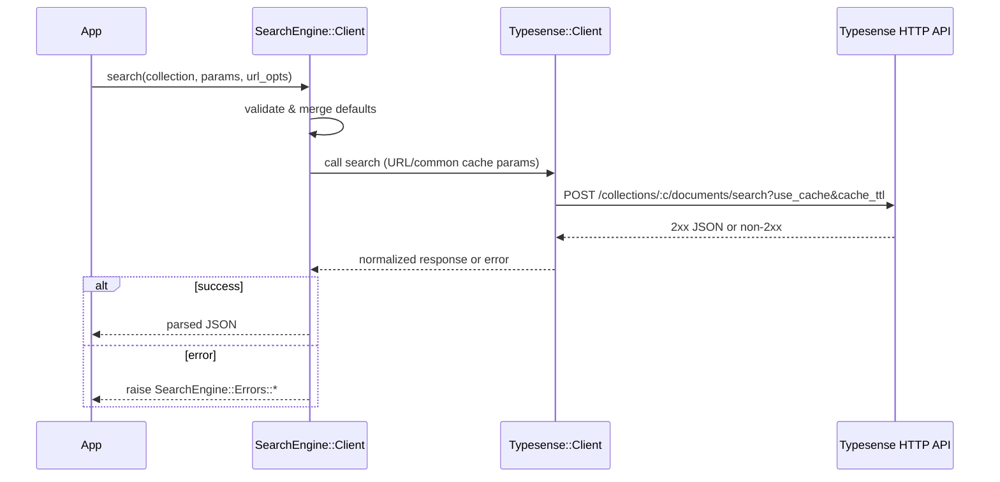

Related: <a href="/projects/search-engine-for-typesense/relation">Relation</a>, <a href="/projects/search-engine-for-typesense/multi-search">Multi-search</a>, <a href="/projects/search-engine-for-typesense/dx">DX</a>

## SearchEngine::Client

A thin wrapper around the official <code>typesense</code> Ruby gem that provides single-search and federated multi-search. It enforces that cache knobs live in URL/common params (never in per-search bodies) and normalizes gem/network failures into <code>SearchEngine::Errors</code>.

### Usage

```ruby
client = SearchEngine::Client.new
client.search(collection: "products", params: { q: "milk", query_by: "name" }, url_opts: { use_cache: true })
client.multi_search(
  searches: [
    { collection: "products", q: "milk", query_by: "name", per_page: 5 },
    { collection: "brands",   q: "mil",  query_by: "name", per_page: 3 }
  ],
  url_opts: { use_cache: true, cache_ttl: 30 }
)

# Top-level convenience returning raw
SearchEngine.multi_search_raw(common: { query_by: SearchEngine.config.default_query_by }) do |m|
  m.add :products, Product.per(5)
  m.add :brands,   Brand.per(3)
end

# Clear server-side cache (Typesense `/operations/cache/clear`)
SearchEngine::Cache.clear
```

<Info>
  Note: The default Typesense client connection timeout is 60 minutes, to avoid aborting long-running writes. You can override it, and you can introduce retry jitter by using a Range for <code>retries[:backoff]</code>. See <a href="/projects/search-engine-for-typesense/configuration#timeouts--retries">Configuration</a>.
</Info>

Example override:

```ruby
SearchEngine.configure do |c|
  c.timeout_ms = 3_600_000
  c.retries = { attempts: 3, backoff: 10.0..60.0 }
end
```

### Cache management

- <code>SearchEngine::Cache.clear</code> issues a <code>POST /operations/cache/clear</code> via the client and returns the symbolized Typesense response. Call it after large imports or schema changes when you need fresh cached results immediately.
- Emits <code>search_engine.cache.clear</code> (see <a href="/projects/search-engine-for-typesense/observability">Observability</a>) so subscribers/loggers capture cadence and duration; uses the injected client from <code>SearchEngine.config.client</code> when present.
- Reference: <a href="https://typesense.org/docs/29.0/api/cluster-operations.html#clear-cache" target="_blank">Typesense cluster operations → Clear cache</a>.

### Request flow



### URL/common params vs body

| Parameter   | Location    |
|-------------|-------------|
| `use_cache` | URL/Common  |
| `cache_ttl` | URL/Common  |
| `q`         | Body/Params |
| `query_by`  | Body/Params |
| `filter_by` | Body/Params |
| `per_page`  | Body/Params |

### Errors

Public errors are exposed via <code>SearchEngine::Errors</code>:

- <code>Timeout</code>: request exceeded timeout budget
- <code>Connection</code>: DNS/socket/TLS/connect failures
- <code>Api</code>: non‑2xx Typesense responses (carries <code>status</code> and <code>body</code>)
- <code>InvalidParams</code>: wrapper pre‑call validation problems

See <code>lib/search_engine/errors.rb</code> for details.

### Internals boundary

- <code>SearchEngine::Client::RequestBuilder</code> assembles concrete request shapes (HTTP method, path, body) from compiled params. It has no network concerns.
- <code>SearchEngine::Client::HttpAdapter</code> executes an assembled request using the injected <code>Typesense::Client</code>. It has no knowledge of Typesense domain semantics.
- These roles clarify responsibilities; there is no change to public behavior.

#### Troubleshooting

- <strong>Timeout / Connection</strong>: Check host/port/protocol and network reachability.
- <strong>API errors</strong>: Inspect <code>status</code> and server body. 4xx are not retried; 5xx/429 may be transient.

Backlinks: <a href="/projects/search-engine-for-typesense/index">Home</a>

See <a href="/projects/search-engine-for-typesense/observability">Observability</a> for emitted events and compact logging.


