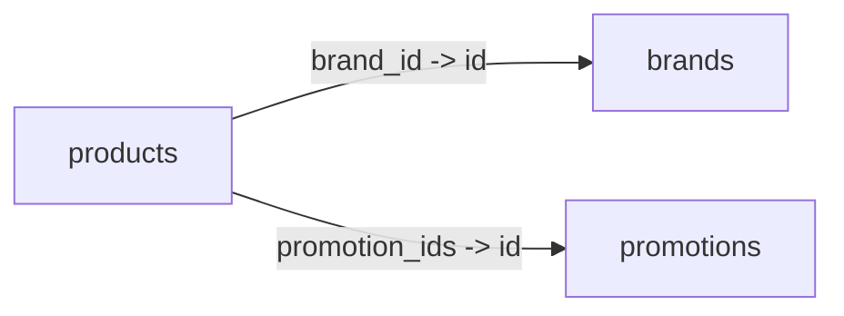

## Overview

Render a live graph of your Typesense collections and their interconnections directly in the terminal, using Unicode box‑drawing by default with an ASCII fallback.

- Discovers collections and references from Typesense live schemas (fallback to local registry).
- Builds a forward graph (from referrer → referenced collection).
- Detects isolated collections and immediate cycles (A ↔ B).
- Renders:
  - <code>ascii</code>: layered boxes with labeled connectors when width allows
  - <code>ascii_compact</code>: grouped list for narrow terminals

## Usage

```ruby
# Auto width detection; Unicode boxes
g = SearchEngine.collections_graph
puts g[:ascii]          # layered when it fits terminal width
puts g[:ascii_compact]  # compact grouped list

# Mermaid (for docs)
File.write('collections.mmd', g[:mermaid])

# Options
SearchEngine.collections_graph(style: :unicode, width: 120)  # force width
SearchEngine.collections_graph(style: :ascii)                # ASCII only
```

### Output (layered)
```
Collections Graph (nodes: N, edges: M)

┌──────────┐                          ┌─────────┐
│ products │  ── via brand_id → id ── │ brands  │
└──────────┘                          └─────────┘

┌──────────┐                                ┌────────────┐
│ products │  ── via promotion_ids → id ──  │ promotions │
└──────────┘                                └────────────┘

Isolated: …
Cycles: none
```

### Output (compact)
```
Collections Graph (nodes: N, edges: M)
- products
  └─ ▶ brands       [via brand_id -> id]
  └─ ▶ promotions   [via promotion_ids -> id]
Isolated: …
Cycles: none
```

## Notes

- Width is detected via <code>IO.console.winsize</code>, then <code>ENV['COLUMNS']</code>, then <code>stty size</code>; defaults to 100 if unknown.
- Live discovery uses field <code>reference: "&lt;collection&gt;.&lt;foreign_key&gt;"</code> from Typesense schemas; falls back to compiled model schemas when Typesense is unavailable.
- Emits <code>search_engine.collections.graph</code> with counts and layout mode.

### Mermaid

Use the returned <code>mermaid</code> string to embed diagrams in docs:



You can also render images locally via <code>@mermaid-js/mermaid-cli</code>:

```bash
npm i -g @mermaid-js/mermaid-cli
mmdc -i collections.mmd -o collections.png
```

## See also

<Columns cols={2}>
  <Card
    title="Schema"
    icon="brackets-curly"
    href="/projects/search-engine-for-typesense/schema"
  >
    Compile model → Typesense schema and manage lifecycle
  </Card>
  <Card
    title="Indexer"
    icon="cloud-arrow-up"
    href="/projects/search-engine-for-typesense/indexer"
  >
    Index collections and documents efficiently
  </Card>
  <Card
    title="Joins"
    icon="shuffle"
    href="/projects/search-engine-for-typesense/joins"
  >
    Related collections and reference/association features
  </Card>
  <Card
    title="DX"
    icon="sparkles"
    href="/projects/search-engine-for-typesense/dx"
  >
    Developer experience tools and CLI
  </Card>
</Columns>
