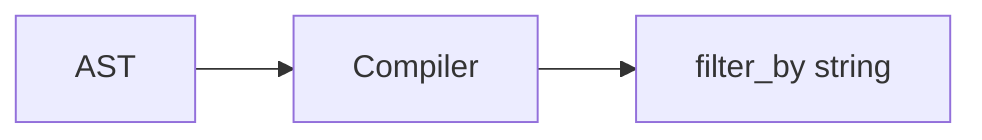

Related: <a href="/projects/search-engine-for-typesense/query-dsl">Query DSL</a>, <a href="/projects/search-engine-for-typesense/relation">Relation</a>, <a href="/projects/search-engine-for-typesense/debugging">Debugging</a>

<Info>
  Instrumentation: <code>search_engine.compile</code> is emitted by the compiler. See <a href="/projects/search-engine-for-typesense/debugging">Debugging</a>.
</Info>

## Compiled Params boundary

- Public output type: <code>SearchEngine::CompiledParams</code> — immutable, read-only wrapper around compiled Typesense params.
- Determinism: <code>to_h</code> returns a symbol-keyed, lexicographically ordered Hash; <code>to_json</code> is stable across runs.
- Usage: callers may treat it like a Hash for read methods (<code>[]</code>, <code>key?</code>, <code>keys</code>, <code>each</code>) or call <code>to_h</code>.
- Construction: internal to the relation/compiler; user code does not instantiate it directly.

The compiler turns a Predicate AST under <code>SearchEngine::AST</code> into a deterministic Typesense <code>filter_by</code> string. It is pure (no I/O), safe (centralized quoting/escaping), and consistent with the <code>where</code> DSL.

## Overview

- <strong>Deterministic</strong>: same AST → same string; no globals.
- <strong>Safe quoting</strong>: uses <code>SearchEngine::Filters::Sanitizer</code> for all values.
- <strong>Parentheses & precedence</strong>: explicit, predictable rules (<code>And</code> &gt; <code>Or</code>).
- <strong>Escape hatch</strong>: <code>AST::Raw</code> is passed through as-is.



## Node mapping

| AST node | Syntax |
| --- | --- |
| `Eq(field, value)` | `field:=VALUE` |
| `NotEq(field, value)` | `field:!=VALUE` |
| `Gt(field, value)` | `field:>VALUE` |
| `Gte(field, value)` | `field:>=VALUE` |
| `Lt(field, value)` | `field:<VALUE` |
| `Lte(field, value)` | `field:<=VALUE` |
| `In(field, [v1, v2])` | `field:=[V1, V2]` |
| `NotIn(field, [v1, v2])` | `field:!=[V1, V2]` |
| `And(n1, n2, ...)` | `... && ...` |
| `Or(n1, n2, ...)` | `... || ...` |
| `Group(child)` | `( ... )` |
| `Raw(fragment)` | passthrough |

- <code>Matches</code> / <code>Prefix</code>: Typesense <code>filter_by</code> does not support these forms; compilation raises <code>UnsupportedNode</code>. Use <code>AST::Raw</code> for adapter-specific fragments if needed.

## Quoting & types

Values are rendered via <code>Filters::Sanitizer.quote</code>:

- <strong>String</strong>: double-quoted, with minimal escaping for `\` and `"`.
- <strong>Boolean</strong>: <code>true</code>/<code>false</code>.
- <strong>Nil</strong>: <code>null</code>.
- <strong>Numeric</strong>: as-is (epoch seconds recommended for <code>:time</code> / <code>:datetime</code>).
- <strong>Time/Date/DateTime</strong>: ISO8601 string (quoted). Upstream parsing coerces Date/DateTime to <code>Time.utc</code>. When the field type is numeric (<code>:time</code>/<code>:datetime</code>), prefer passing epoch seconds.
- <strong>Array</strong>: one-level flatten; each element quoted; wrapped as <code>[a, b]</code>.

## Precedence & parentheses

- Precedence: <code>And</code> = 20, <code>Or</code> = 10. Leaves bind tighter.
- <code>Group</code> always inserts parentheses.
- Parentheses are added when a child has lower precedence than its parent.
- Whitespace: single spaces around <code>&amp;&amp;</code> and <code>||</code>.

## Examples

```ruby
Compiler.compile(AST.and_(AST.eq(:active, true), AST.in_(:brand_id, [1, 2])), klass: Product)
# => "active:=true && brand_id:=[1, 2]"

Compiler.compile(AST.or_(AST.eq(:a, 1), AST.and_(AST.eq(:b, 2), AST.eq(:c, 3))))
# => "a:=1 || (b:=2 && c:=3)"

Compiler.compile(AST.group(AST.or_(AST.eq(:a, 1), AST.eq(:b, 2))))
# => "(a:=1 || b:=2)"

Compiler.compile([AST.eq(:x, 1), AST.eq(:y, 2)])
# => "x:=1 && y:=2"
```

## Integration

- <code>Relation#to_typesense_params</code> prefers compiling <code>ast</code> when present, falling back to legacy string <code>filters</code> for backward compatibility.
- <code>Raw</code> fragments are preserved through the pipeline.
- When joins are applied, joined fields render as <code>$assoc.field</code> in <code>filter_by</code> and as <code>$assoc.field:dir</code> in <code>sort_by</code>. Nested <code>include_fields</code> compile to <code>$assoc(field1,field2,...)</code> segments emitted before base fields. The final <code>include_fields</code> reflects precedence: effective include set = include − exclude (per path); exclude always wins. Empty groups are omitted.
- Curation state maps to body params: <code>pinned_hits</code>, <code>hidden_hits</code>, <code>override_tags</code>, <code>filter_curated_hits</code> (omitted when empty/<code>nil</code>). See <a href="/projects/search-engine-for-typesense/curation">Curation</a>.

### Example with joins

```ruby
rel = SearchEngine::Book
  .joins(:authors)
  .include_fields(authors: [:first_name])
  .where(authors: { last_name: "Rowling" })
  .order(authors: { last_name: :asc })
rel.to_typesense_params
# => { q: "*", query_by: "name, description", include_fields: "$authors(first_name)", filter_by: "$authors.last_name:\"Rowling\"", sort_by: "$authors.last_name:asc", _join: { assocs: [:authors], fields_by_assoc: { authors: ["first_name"] }, referenced_in: { include: [:authors], filter: [:authors], sort: [:authors] } } }
```

<Info>
  The <code>:_join</code> section is an internal context map for downstream components and may be removed by the HTTP layer before sending the request. See <a href="/projects/search-engine-for-typesense/joins">Joins</a> for details.
</Info>

See also: <a href="/projects/search-engine-for-typesense/dx#helpers--examples">DX</a> for <code>Relation#to_params_json</code> — it uses <code>SearchEngine::CompiledParams</code> to ensure stable ordering.

See also: <a href="/projects/search-engine-for-typesense/relation">Relation</a> · <a href="/projects/search-engine-for-typesense/query-dsl">Query DSL</a> · <a href="/projects/search-engine-for-typesense/joins">Joins</a>

## Troubleshooting

- <strong>Unsupported node</strong>: Use <code>AST::Raw</code> for adapter‑specific fragments not supported by <code>filter_by</code>.
- <strong>Unexpected quoting</strong>: All quoting is centralized in the sanitizer; ensure values are passed as plain Ruby objects.
- <strong>Complex precedence</strong>: Wrap with <code>AST.group</code> to force explicit parentheses.

Backlinks: <a href="https://github.com/lstpsche/search-engine-for-typesense#readme" target="_blank">README</a>, <a href="/projects/search-engine-for-typesense/query-dsl">Query DSL</a>


