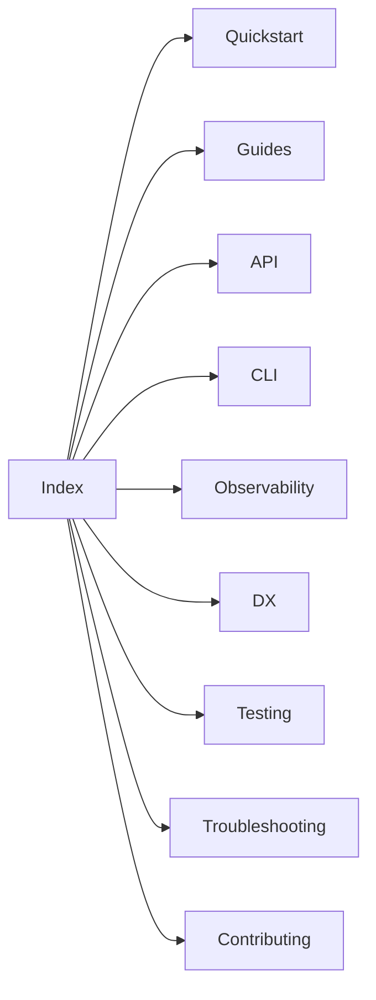

Use this guide to keep docs consistent, clear, and easy to navigate.

- <strong>Audience</strong>: Ruby/Rails engineers integrating the engine
- <strong>Scope</strong>: Markdown/MDX only

## Tone & clarity

- Be direct and actionable. Prefer examples over abstract prose
- Avoid jargon; define terms on first use
- Use short paragraphs and bullet lists; keep lines ≤100 chars
- Prefer present tense and active voice

## Headings & anchors

- Use sentence‑case headings (e.g., “Schema compiler” not “SCHEMA COMPILER”)
- Keep heading levels consistent within a page
- Use hyphenated, lower‑case anchors in links
- Keep section names stable; avoid churn that would break anchors

## Code fences

- Always specify a language: <code>ruby</code>, <code>bash</code>, <code>json</code>, <code>yaml</code>, <code>mermaid</code>, <code>text</code>
- Keep examples minimal and runnable; redact secrets (e.g., <code>***</code>)
- Fit lines ≤100 chars; wrap long command outputs with <code>text</code>

Good

```ruby
SearchEngine.configure do |c|
  c.host = "localhost"
end
```

Bad

```ruby
SearchEngine.configure do |c| c.host = "localhost"; c.port = 8108; end
```

## Mermaid diagrams

- Prefer small diagrams (≤ ~15 nodes) with clear labels
- Use concise titles when helpful
- Keep labels consistent with section names

Example



## Backlinks & related links

Add a compact Related block with 2–4 nearby links (use site‑relative links).

```md
Related: [Relation](/projects/search-engine-for-typesense/relation), [DX](/projects/search-engine-for-typesense/dx), [Observability](/projects/search-engine-for-typesense/observability)
```

## Link phrasing

- Prefer descriptive anchors: “See Observability → Logging” instead of “click here”
- Use site‑relative links; no bare URLs—wrap in backticks or use markdown links

Good

```md
See [Observability](/projects/search-engine-for-typesense/observability).
```

Bad

```md
Click [here].
```

## Cross‑referencing with YARDoc

When public APIs are introduced or changed, update docs and YARDoc together. Use <code>@see</code> to link from YARDoc back to the exact docs anchor.

Example

```ruby
# Compiles the schema for a collection.
#
# See docs → Schema → API for the API overview and return shape
# Returns a deeply frozen Typesense-compatible schema (Hash)
```

## Reusable snippets

Troubleshooting callout

```md
> Having trouble? See [Troubleshooting](/projects/search-engine-for-typesense/troubleshooting) for fixes.
```

## Acceptance criteria snippets

Include the following in acceptance criteria:

- “All new/edited docs must include related links and cross‑links to Observability/Troubleshooting where relevant.”
- “Public APIs touched by this ticket must be referenced in docs and YARDoc with <code>@see</code> links back to the relevant docs section.”

Related: <a href="/projects/search-engine-for-typesense/index">Home</a>, <a href="https://github.com/lstpsche/search-engine-for-typesense#readme" target="_blank">Contribution guide</a>


