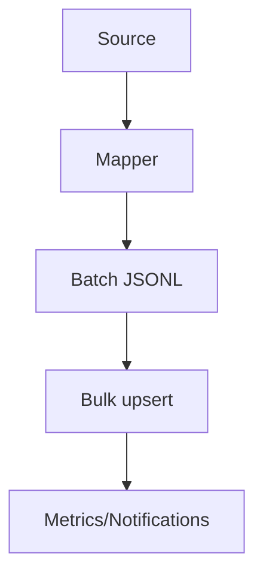
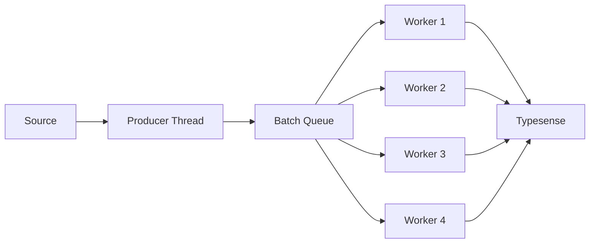
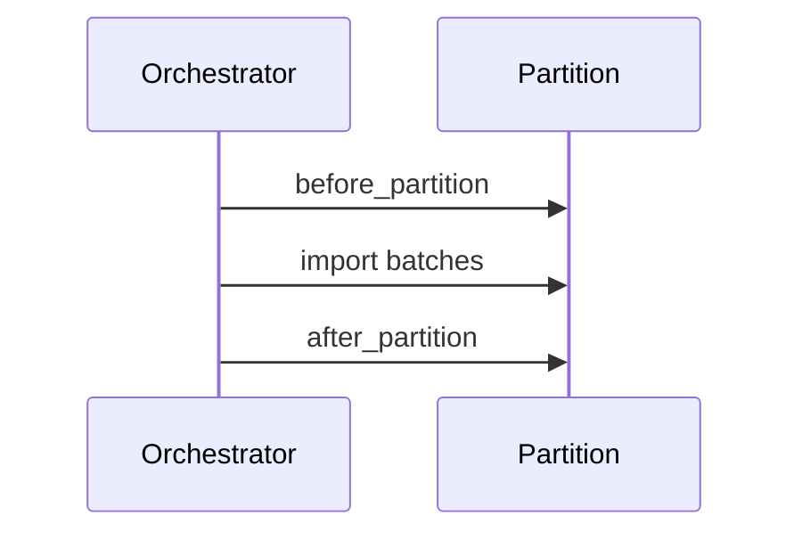
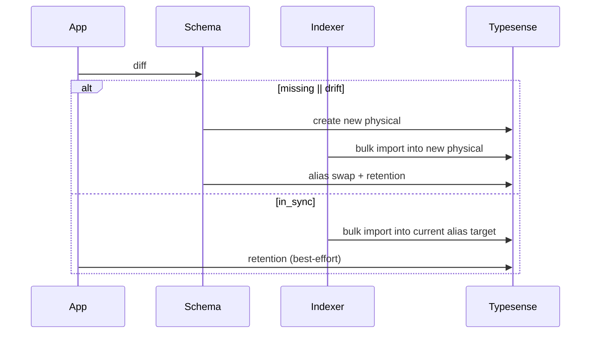

Related: <a href="/projects/search-engine-for-typesense/schema">Schema</a>, <a href="/projects/search-engine-for-typesense/cli">CLI</a>, <a href="/projects/search-engine-for-typesense/observability">Observability</a>, <a href="/projects/search-engine-for-typesense/upsert">Upsert</a>

Stream documents into a physical collection via JSONL bulk import with retries, stable memory, and notifications.

<Info>
  The Indexer focuses on importing documents. It does not create schemas, swap aliases, or enforce retention. Use <code>Schema.apply!</code> (or the <code>schema:apply</code> task) for full blue/green lifecycle: create new physical → import → alias swap → retention cleanup.
</Info>

### API

```ruby
SearchEngine::Indexer.import!(SearchEngine::Book, into: "books_20251001_010203_001", enum: enumerable_batches, batch_size: 2000, max_parallel: 4)
```

- <strong>into</strong>: physical collection name
- <strong>enum</strong>: enumerable yielding batches (Arrays of Hash documents)
- <strong>batch_size</strong>: soft guard for JSONL production; batches are not re-sliced unless handling 413
- <strong>action</strong>: defaults to <code>:upsert</code>
- <strong>max_parallel</strong>: maximum number of parallel threads for batch processing (default: 1, sequential). Set via mapper DSL with <code>max_parallel</code> or override at runtime. See <a href="#parallel-batch-processing">Parallel batch processing</a>.

### Data flow



### JSONL format

- One JSON object per line
- Newline between documents; trailing newline optional
- Strings are escaped by the JSON library

### Retries & backoff

- Transient errors (timeouts, connection, 429, 5xx) are retried with exponential backoff and jitter
- Non-transient errors (401/403/404/400/422) are not retried
- 413 Payload Too Large splits the batch recursively until it fits

### Parallel batch processing

For large collections, you can speed up indexing by processing multiple batches simultaneously using parallel threads. This is especially useful when network latency is a bottleneck.

#### Configuration

Enable parallel processing in your mapper DSL:

```ruby
class SearchEngine::Book < SearchEngine::Base
  collection "books"

  index do
    source :active_record, model: ::Book, batch_size: 2000
    max_parallel 4  # Process up to 4 batches concurrently

    map do |r|
      { title: r.title, author_id: r.author_id }
    end
  end
end
```

The <code>max_parallel</code> setting controls how many batches are processed simultaneously. Each thread gets its own Typesense client instance and buffer to avoid conflicts.

#### Usage examples

<strong>Basic usage:</strong>

```ruby
# Parallel processing is automatically enabled when max_parallel > 1 is set in the mapper DSL
SearchEngine::Book.rebuild_partition!(partition: publisher_id)
```

<strong>Manual control:</strong>

```ruby
# Override the DSL setting at runtime
docs_enum = build_docs_enum(rows_enum, mapper)
SearchEngine::Indexer.import!(
  SearchEngine::Book,
  into: "books_20251001_010203_001",
  enum: docs_enum,
  max_parallel: 8  # Use 8 threads instead of the DSL default
)
```

<strong>When to use:</strong>

- Large collections with thousands of batches
- Network latency is the main bottleneck (not CPU or memory)
- Your Typesense server can handle concurrent requests
- You have sufficient memory for multiple buffers

<strong>When to avoid:</strong>

- Small collections (&lt; 100 batches)
- CPU-bound workloads (parallel processing adds overhead)
- Very memory-constrained environments
- When debugging (sequential processing has clearer error messages)

#### How it works

Parallel batch processing uses a producer-consumer pattern with a thread pool:

1. <strong>Producer thread</strong>: Fetches batches from your source (ActiveRecord, SQL, etc.) and adds them to a queue
2. <strong>Worker threads</strong>: Multiple threads pull batches from the queue and process them concurrently
3. <strong>Thread safety</strong>: Each worker gets its own Typesense client and buffer to avoid conflicts
4. <strong>Statistics</strong>: All counters are synchronized using a mutex to ensure accurate reporting



The queue has a capacity of <code>max_parallel * 2</code> to keep workers busy while the producer fetches more batches. Progress is logged every 10 batches when <code>log_batches</code> is enabled.

<strong>Error handling:</strong>

When a batch fails, the error is caught and recorded with full statistics (document count, failure details) just like in sequential processing. Failed batches are properly counted in the summary's <code>docs_total</code>, <code>failed_total</code>, and <code>batches</code> array to ensure accurate reporting.

### Memory notes

- Operates strictly batch-by-batch, reusing a single buffer per thread
- No accumulation of all records in memory; per-batch array may be materialized to support 413 splitting
- Parallel processing: each worker thread maintains its own buffer and client instance (memory usage scales with <code>max_parallel</code>)

### Instrumentation

- Emits <code>search_engine.indexer.batch_import</code> per attempted batch
- Payload includes: <code>collection</code>, <code>batch_index</code>, <code>docs_count</code>, <code>success_count</code>, <code>failure_count</code>, <code>attempts</code>, <code>duration_ms</code>, <code>http_status</code>, <code>bytes_sent</code>, <code>transient_retry</code>, <code>error_sample</code>

### Dry-run

- <code>SearchEngine::Indexer.dry_run!(...)</code> builds JSONL for the first batch only and returns `{ collection, action, bytes_estimate, docs_count, sample_line }`

### Data Sources

Adapters provide batched records for the Indexer in a memory-stable way. Each adapter implements <code>each_batch(partition:, cursor:)</code> and yields arrays.

Examples:

```ruby
source :active_record, model: ::Book, scope: -> { where(published: true) }, batch_size: 2000
source :sql, sql: "SELECT * FROM books WHERE published = TRUE", fetch_size: 2000
source :lambda do |cursor: nil, partition: nil|
  Enumerator.new { |y| external_api.each_page(cursor) { |rows| y << rows } }
end
```

- <code>partition</code> and <code>cursor</code> are opaque; adapters interpret them per-domain (e.g., id ranges, keyset predicates, external API tokens).
- Instrumentation: emits <code>search_engine.source.batch_fetched</code> and <code>search_engine.source.error</code>.

### Mapper

Backlinks: <a href="/projects/search-engine-for-typesense/models">Models</a>, <a href="/projects/search-engine-for-typesense/schema">Schema</a>

```ruby
class SearchEngine::Book < SearchEngine::Base
  collection "books"
  attribute :publisher_id, :integer
  attribute :author_id, :integer
  attribute :author_name, :string
  attribute :price_cents, :integer

  # Default identity is record.id.to_s; override if needed
  # identify_by :isbn
  # identify_by ->(r) { "#{r.publisher_id}-#{r.id}" }

  index do
    source :active_record, model: ::Book, scope: -> { where(published: true) }
    map do |r|
      # :id from map is ignored; mapper injects computed id
      { publisher_id: r.publisher_id, author_id: r.author_id, author_name: r.author&.name, price_cents: r.price_cents }
    end
  end
end
```

Model → Document mapping:

| Model field | Document field | Transform |
| --- | --- | --- |
| `id` | `id` | identity |
| `publisher_id` | `publisher_id` | identity |
| `author_id` | `author_id` | identity |
| `author.name` | `author_name` | rename + safe navigation |
| `price_cents` | `price_cents` | identity |

Validation:

- Missing required fields: the mapper validates declared attributes; <code>id</code> is injected and not required to be declared.
- Unknown fields: warns by default; set <code>SearchEngine.config.mapper.strict_unknown_keys = true</code> to error.
- Type checks: invalid types reported (e.g., <code>Invalid type for field :price_cents (expected Integer, got String: "12.3").</code>).
- Coercions: enable with <code>SearchEngine.config.mapper.coercions[:enabled] = true</code> (safe integer/float/bool only).

#### Array empty filtering (hidden flags)

If an array attribute is declared with <code>empty_filtering: true</code>, the mapper auto-populates a hidden boolean <code>&lt;name&gt;_empty</code> per document:

```ruby
attribute :category_ids, [:string], empty_filtering: true
# Mapper stores: category_ids_empty = category_ids.nil? || category_ids.empty?
```

Hidden fields are included in the schema and documents but are not exposed via model APIs/inspect.

Runtime API:

- <code>mapper = SearchEngine::Mapper.for(SearchEngine::Book)</code>
- <code>docs, report = mapper.map_batch!(rows, batch_index: 1)</code>
- Emits <code>search_engine.mapper.batch_mapped</code> per batch with: <code>collection</code>, <code>batch_index</code>, <code>docs_count</code>, <code>duration_ms</code>, <code>missing_required_count</code>, <code>extra_keys_count</code>, <code>invalid_type_count</code>, <code>coerced_count</code>.

### Partitioning

Backlinks: <a href="/projects/search-engine-for-typesense/schema">Schema</a>, <a href="/projects/search-engine-for-typesense/cli">CLI</a>, <a href="/projects/search-engine-for-typesense/observability">Observability</a>

```ruby
index do
  partitions { Publisher.pluck(:id) }
  partition_fetch { |publisher_id| ::Book.where(publisher_id: publisher_id).in_batches(of: 2000) }
  before_partition { |publisher_id| delete_by filter_by: "publisher_id:=#{publisher_id}" }
  after_partition  { |publisher_id| nil } # custom metrics
end
```

```ruby
SearchEngine::Indexer.rebuild_partition!(SearchEngine::Book, partition: publisher_id)
```

#### Model-level shortcut

You can call the same operation directly on the collection model. This delegates to the Indexer and returns the same <code>SearchEngine::Indexer::Summary</code> (or an Array when multiple partitions are provided).

```ruby
SearchEngine::Book.rebuild_partition!(partition: publisher_id)
SearchEngine::Book.rebuild_partition!(partition: publisher_id, into: "optional_physical_collection")
# Multiple keys return an Array<Summary>:
SearchEngine::Book.rebuild_partition!(partition: [1, 2, 3])
```



Notes:
- <code>partitions</code> must return an Enumerable of keys; <code>partition_fetch</code> must return an Enumerable of batches (Arrays of records).
- Hooks are optional; if provided, they must accept exactly one argument (the partition key).
- When <code>partition_fetch</code> is missing, the source adapter is used with the partition passed through; for ActiveRecord sources, provide a <code>Hash</code>/<code>Range</code> partition or define <code>partition_fetch</code>.

### Model indexation (`.index_collection`)

Backlinks: <a href="/projects/search-engine-for-typesense/schema">Schema</a>, <a href="/projects/search-engine-for-typesense/cli">CLI</a>, <a href="/projects/search-engine-for-typesense/observability">Observability</a>, <a href="/projects/search-engine-for-typesense/models">Models</a>

High-level convenience API that orchestrates schema lifecycle and (partitioned) indexing from the model class.

```ruby
# Full indexation flow (create/apply schema if needed, reindex, retention)
SearchEngine::Book.index_collection

# Partial indexation by key(s) (requires collection present and schema in-sync)
SearchEngine::Book.index_collection(partition: publisher_id)
SearchEngine::Book.index_collection(partition: [publisher_id_1, publisher_id_2])
```

Behavior:

- Full flow when <code>partition</code> is nil:
  1. Presence check (<code>Schema.diff</code>).
  2. If missing → create new physical and apply schema, then import; else skip.
  3. If present → check drift; report <code>in_sync</code> vs <code>drift</code>.
  4. If drift → apply schema (create new physical, import, alias swap, retention).
  5. If nothing was applied in steps 2–4 → index into the current alias (single or per partition).
  6. Retention cleanup: skipped when <code>Schema.apply!</code> ran (already handled); otherwise best‑effort cleanup of old physicals beyond <code>keep_last</code>.
- Partial flow when <code>partition:</code> is set:
  1. Presence check; if missing → quit early with a message.
  2. Schema status; if drift → quit early with a message to run full indexation.
  3. Index only the provided partition(s) into the current alias.

#### Preflight dependency indexation (optional)

You can ask the engine to walk direct and transitive <code>belongs_to</code> dependencies and ensure they are ready before indexing the current collection:

```ruby
# Ensure dependencies exist (create/apply+index only when missing)
SearchEngine::Book.index_collection(pre: :ensure)

# Ensure dependencies exist and also fix drift (apply+index when missing or drift)
SearchEngine::Book.index_collection(pre: :index)

# Partial with preflight
SearchEngine::Book.index_collection(partition: publisher_id, pre: :ensure)
```

Notes:

- Preflight walks only <code>belongs_to</code> edges recursively, skipping unregistered collections.
- Cycles are guarded with a visited set; already-visited collections are skipped.
- Default remains unchanged when <code>pre:</code> is omitted.

Output

- Emits concise console lines for each step and per‑partition result, for example:

```text
Step 1: Presence — processing → present
Step 3: Check Schema Status — in_sync
Step 5: Indexation — processing
  partition=123 → status=ok docs=2000 failed=0 batches=10 duration_ms=1523.4
Step 5: Indexation — done
Step 6: Retention Cleanup — skip (handled by schema apply)
```

Sequence



### Targeted bulk helpers (`Bulk.index_collections` / `Bulk.reindex_collections!`)

- Run blue/green or destructive indexation for a specific set of collections (not just “all”).
- Two-stage plan:
  - **Stage 1**: inputs that are not referrers of other inputs (referenced-first order).
  - **Stage 2**: unique referencers of any input, topologically sorted and processed once.
- Cascades are suppressed inside individual runs; the final cascade stage handles referencers exactly once.

```ruby
# Blue/green selected collections
SearchEngine::Bulk.index_collections(:products, :brands)

# Destructive reindex of a subset with an injected client
SearchEngine::Bulk.reindex_collections!(
  SearchEngine::Book,
  "publishers",
  client: SearchEngine::Client.new
)
```

Use these helpers when you need a targeted rollout (only changed collections) but still want reference-aware ordering.

### Bulk indexing (all collections)

Use Bulk helpers to index or reindex every declared SearchEngine collection discovered under your configured <code>search_engine_models</code> directory. The engine ensures models are eagerly loaded, discovers collections, and orchestrates a two‑stage, reference‑aware run (inputs first, then a deduped cascade of referencers).

```ruby
# Non‑destructive (blue/green when needed via .index_collection per model)
SearchEngine::Bulk.index_all

# Destructive: drop + index per model
SearchEngine::Bulk.reindex_all!

# Optional client override
SearchEngine::Bulk.index_all(client: SearchEngine::Client.new)
```

Notes:

- index_all uses each model's <code>.index_collection</code> (presence/drift checks, apply+retention when needed; otherwise index into current alias).
- reindex_all! uses each model's <code>.reindex_collection!</code> (drop active physical, then <code>.index_collection</code>).
- Discovery leverages the engine’s dedicated loader and <code>CollectionResolver.models_map</code>; ensure your collections live under <code>app/search_engine</code> (default) or your configured <code>SearchEngine.config.search_engine_models</code> path.
- Emits <code>search_engine.bulk.run</code> with `{ inputs, stage_1, cascade, counts }`. See Observability for payload details.

Backlinks: <a href="/projects/search-engine-for-typesense/models">Models</a> · <a href="/projects/search-engine-for-typesense/schema">Schema</a> · <a href="/projects/search-engine-for-typesense/observability">Observability</a>

### Stale Deletes

Backlinks: <a href="/projects/search-engine-for-typesense/cli">CLI</a>, <a href="/projects/search-engine-for-typesense/observability">Observability</a>, <a href="/projects/search-engine-for-typesense/troubleshooting">Troubleshooting</a>, <a href="/projects/search-engine-for-typesense/configuration">Configuration</a>

```ruby
class SearchEngine::Book < SearchEngine::Base
  index do
    # Register one or more stale rules; they will be OR‑merged
    stale scope: :archived           # scope must return a Relation
    stale :archived                  # attribute equality => { archived: true }
    stale filter: "status:=archived" # raw Typesense fragment
    stale({ ends_at: ..Time.zone.now })
    stale do |partition: nil|        # custom per‑partition rule
      partition ? { publisher_id: partition, archived: true } : "archived:=true"
    end
  end
end
```

```ruby
SearchEngine::Indexer.delete_stale!(SearchEngine::Book, partition: nil)
```

- Compiles all declared <code>stale</code> rules into an OR‑merged <code>filter_by</code> string and issues <code>DELETE /collections/:collection/documents</code> with <code>filter_by</code>.
- If no rules are defined or all resolve to blank for the given partition, deletion is skipped.
- Strict-mode guardrails block suspicious catch-alls; enable via <code>SearchEngine.config.stale_deletes.strict_mode = true</code>.
- Dry-run preview: <code>SearchEngine::Indexer.delete_stale!(..., dry_run: true)</code> returns a summary without deleting.

Typical filters:

| Pattern | Example |
| --- | --- |
| Archived flag | <code>archived:=true</code> |
| Partition + archived | <code>publisher_id:=123 && archived:=true</code> |
| Date threshold | <code>updated_at:&lt;"2025-01-01T00:00:00Z"</code> or <code>updated_at:&lt;1704067200</code> |


Events:
- <code>search_engine.stale_deletes.started</code> — `{ collection, into, partition, filter_hash }`
- <code>search_engine.stale_deletes.skipped</code> — `{ reason, collection, into, partition }`
- <code>search_engine.stale_deletes.finished</code> — `{ collection, into, partition, duration_ms, deleted_count }`
- <code>search_engine.stale_deletes.error</code> — `{ collection, into, partition, error_class, message_truncated }`

Config:

#### Inspect stale docs via a Relation

You can preview or chain on the stale set using a scope-like class method that returns a Relation:

```ruby
# Partition-specific stale docs compiled from `stale` rules
SearchEngine::Book.stale(partition: 42)

# Whole-collection stale docs (if none of the rules depend on partition)
SearchEngine::Book.stale

# Chainable like AR
SearchEngine::Book.stale(partition: 42).limit(10).pluck(:id)
```

Notes:

- <code>.stale</code> compiles only <code>stale</code> rules and returns an empty relation when no rules produce a filter for the given partition.
- For destructive deletes, prefer <code>Model.cleanup</code> or the <code>index:delete_stale</code> task.

- <code>SearchEngine.config.stale_deletes.enabled = true</code>
- <code>SearchEngine.config.stale_deletes.strict_mode = false</code>
- <code>SearchEngine.config.stale_deletes.timeout_ms = nil</code>
- <code>SearchEngine.config.stale_deletes.estimation_enabled = false</code>

### Stale cleanup DSL & model helper

Define stale cleanup rules alongside your index DSL. Each <code>stale</code> call registers one rule; cleanup runs them with OR semantics.

```ruby
class SearchEngine::Book < SearchEngine::Base
  collection "books"

  index do
    stale scope: :archived           # reuse a model scope (must return a Relation)
    stale :marked_as_stale           # attribute equality => { marked_as_stale: true }
    stale filter: "status:=archived" # raw Typesense fragment
    stale({ ends_at: ..Time.zone.now }) # hash converted via Sanitizer
    stale do |partition: nil|        # custom filter per partition
      partition ? "publisher_id:=#{partition} && archived:=true" : "archived:=true"
    end

    map do |record|
      # ...
    end
  end
end
```

Runtime cleanup is available directly on the model:

```ruby
# Deletes documents matching any declared stale rules
SearchEngine::Book.cleanup
SearchEngine::Book.cleanup(partition: 42)
SearchEngine::Book.cleanup(into: "books_20251011_120000_001")
```

<code>SearchEngine::Base.cleanup</code> delegates to <code>SearchEngine::Deletion.delete_by</code>, emitting the same <code>search_engine.indexer.delete_stale</code> instrumentation. When no stale configuration exists, it logs a skip and returns <code>0</code>.

Available <code>stale</code> inputs:

| Form | Result |
| --- | --- |
| <code>stale scope: :archived</code> | Invokes a model scope; must return a Relation |
| <code>stale :flagged</code> / <code>stale attribute: :flagged, value: false</code> | Attribute equality Hash |
| `stale({ flag: true, archived: true })` | Sanitized <code>filter_by</code> hash |
| <code>stale filter: 'status:=archived'</code> | Raw Typesense filter string |
| <code>stale relation</code> | Uses the relation’s compiled <code>filter_by</code> |
| `stale do |partition:| … end` | Custom block returning String/Hash/Relation |

Notes:

- Multiple rules are OR‑ed together.
- Block arguments receive <code>partition:</code>; return a String, Hash, or Relation. <code>nil</code>/blank results are ignored.
- Scope helpers receive the partition as the first positional argument when their arity is ≥ 1, or as <code>partition:</code> when they declare a keyword.
- Attribute Hash inputs default values to <code>true</code> when omitted (e.g., <code>stale :flagged</code>).

See also: <a href="/projects/search-engine-for-typesense/deletion">Deletion</a> for low-level helpers and <a href="/projects/search-engine-for-typesense/observability">Observability</a> for emitted events.

### Dispatcher

Backlinks: <a href="/projects/search-engine-for-typesense/cli">CLI</a>, <a href="/projects/search-engine-for-typesense/observability">Observability</a>, <a href="/projects/search-engine-for-typesense/configuration">Configuration</a>, <a href="https://guides.rubyonrails.org/active_job_basics.html" target="_blank">Jobs</a>

```ruby
SearchEngine.configure do |c|
  c.indexer.dispatch = :active_job # or :inline
  c.indexer.queue_name = "search_index"
end
```

- <strong>What it does:</strong> routes per-partition rebuilds either synchronously (inline) or via <code>ActiveJob</code>.
- <strong>Note:</strong> This setting controls <code>SearchEngine::Indexer</code> logic (used by <code>rebuild_partition!</code>, <code>index_collection</code> flow). It <strong>does not</strong> affect <code>ActiveRecordSyncable</code> callbacks, which are always inline.
- <strong>API:</strong> `SearchEngine::Dispatcher.dispatch!(SearchEngine::Book, partition: key, into: nil, mode: nil, queue: nil, metadata: {})`
  - Returns an object describing the action: for ActiveJob `{ mode: :active_job, job_id, queue, collection, partition, into }`; for inline `{ mode: :inline, collection, partition, into, indexer_summary, duration_ms }`.
- <strong>Mode resolution:</strong> <code>mode || SearchEngine.config.indexer.dispatch</code> with a fallback to <code>:inline</code> if ActiveJob is unavailable.
- <strong>Queue name:</strong> taken from <code>queue || SearchEngine.config.indexer.queue_name</code>.

ActiveJob job: <code>SearchEngine::IndexPartitionJob</code>.

- <strong>Args:</strong> <code>collection_class_name</code> (String), <code>partition</code> (JSON-serializable), optional <code>into</code> (String), optional <code>metadata</code> (Hash).

### When to choose model-level upserts

For light-touch updates or small repair batches, the model helpers described in <a href="/projects/search-engine-for-typesense/upsert">Upsert</a>
are often faster than orchestrating a full Indexer run:

- <strong>Single or sparse fixes</strong> — use <code>SearchEngine::Model.upsert(record: ...)</code> to map and stream one document without building custom JSONL buffers.
- <strong>Small batches</strong> — <code>SearchEngine::Model.upsert_bulk(records: ...)</code> streams an enumerable of records through the mapper and client, reusing the same validation path as the Indexer.
- <strong>Blue/green touch-ups</strong> — the helpers accept <code>into:</code> / <code>partition:</code> to target a specific physical collection during staged rollout.

Reach for the Indexer when you need full rebuilds, partition orchestration, retry/backoff logic, or instrumented batch statistics. Use the upsert helpers when you only need to nudge a handful of documents into place.

## Troubleshooting

- <strong>Bulk import shape errors</strong>: Ensure each document is a flat Hash with required keys and valid types.
- <strong>Retry exhaustion</strong>: Inspect <code>search_engine.indexer.batch_import</code> events; increase backoff or fix upstream issues.
- <strong>Stale deletes strict block</strong>: Verify your filter is not a catch-all; use partition guards.

Backlinks: <a href="/projects/search-engine-for-typesense/cli">CLI</a>, <a href="/projects/search-engine-for-typesense/troubleshooting">Troubleshooting</a>


