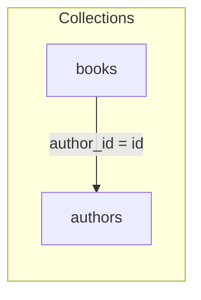

Related: <a href="/projects/search-engine-for-typesense/joins">Joins</a>, <a href="/projects/search-engine-for-typesense/relation-reference">Relation Guide</a>, <a href="/projects/search-engine-for-typesense/grouping">Grouping</a>, <a href="/projects/search-engine-for-typesense/field-selection">Field Selection</a>

Use JOINs to enrich a base collection with associated data, apply nested field selection to control payload size, and group results to present one or a few representatives per key. This page ties them together with a single running example and calls out guardrails, DX tools, and performance implications.

## Overview

- Use JOINs + nested selection for author pages, listings with badges, and catalogs where denormalized snippets from related entities improve recall/UX
- Add grouping to show a single representative per logical key (e.g., one book per author, one variant per product)
- Trade‑offs:
  - Payload size vs clarity: include only fields you render; nested selection reduces bloat
  - Grouping changes pagination semantics (per_page applies to groups, not hits)
  - Sorting applies before grouping; within‑group order follows backend order

Running example (verbatim; used throughout):

```ruby
SearchEngine::Book
  .joins(:authors)
  .include_fields(:id, :title, authors: [:first_name, :last_name])
  .where(authors: { last_name: "Rowling" })
  .group_by(:author_id, limit: 1)
```

## Association DSL & `joins`

- Declare associations on the model: <code>belongs_to :author</code> and <code>has_many :books</code> (override <code>collection:</code>, <code>local_key:</code>, <code>foreign_key:</code> when needed).
- Select associations on the relation with <code>joins(:association)</code>; names are validated against the model registry
- Nested associations: only single‑hop paths are supported (<code>$assoc.field</code>); multi‑hop is not supported
- Keys auto‑resolve by default (see <a href="/projects/search-engine-for-typesense/joins">Joins → Auto‑resolution</a>). Override for non‑standard schemas.
- Supported join usage: selection, filtering, and ordering on joined fields; grouping must target base fields only

See <a href="/projects/search-engine-for-typesense/joins">Joins</a> and <a href="/projects/search-engine-for-typesense/relation-reference">Relation Guide</a> for details.

## Nested field selection with `include_fields`

Use a nested Ruby shape to select fields from joined entities. This compiles to Typesense <code>include_fields</code> with <code>$assoc(field,...)</code> segments.

- Reduces payload size and hydration work
- Keeps templates/view models explicit about data they require
- Unknown fields trigger guardrails with suggestions

Example (verbatim; same relation as above):

```ruby
SearchEngine::Book
  .joins(:authors)
  .include_fields(:id, :title, authors: [:first_name, :last_name])
  .where(authors: { last_name: "Rowling" })
  .group_by(:author_id, limit: 1)
```

Notes:

- Multiple <code>include_fields</code> calls merge and dedupe; first mention preserves order
- Excludes win when present; effective selection is <code>include − exclude</code> per path
- Guardrails: unknown association → <code>InvalidJoin</code>; unknown nested field → <code>UnknownJoinField</code> with “did you mean …” hints

See: <a href="/projects/search-engine-for-typesense/field-selection">Field Selection</a>, <a href="/projects/search-engine-for-typesense/relation-reference">Relation Guide</a>.

## Filtering & ordering on joined fields

- Filters: `where(authors: { last_name: "Rowling" })` → <code>$authors.last_name:="Rowling"</code>
- Sorts: `order(authors: { last_name: :asc })` → <code>$authors.last_name:asc</code>
- Quoting and reserved characters are handled by the sanitizer; booleans become <code>true/false</code>, <code>nil</code> becomes <code>null</code>
- Schema expectations: joined fields must exist in the target collection; base fields continue to work unchanged

See: <a href="/projects/search-engine-for-typesense/joins">Joins</a>, <a href="/projects/search-engine-for-typesense/compiler">Compiler</a>, and <a href="/projects/search-engine-for-typesense/relation-reference">Relation Guide</a>.

## Grouping semantics & `groups` API

<code>group_by(:field, limit:, missing_values:)</code> groups results and caps hits per group. Group order and within‑group order are preserved as returned by the backend. Sorting is applied before grouping, so it influences which hits become representatives within each group.

- Syntax: <code>.group_by(:author_id, limit: 1)</code>
- Difference between grouping order and result order:
  - Group order is preserved in <code>Result#groups</code>
  - <code>Result#hits</code> / <code>to_a</code> return the first hit per group (representatives) in group order
  - Changing <code>order(...)</code> changes which hit is the representative, not the group order
- Access API:

```ruby
res = SearchEngine::Book.joins(:authors)
       .group_by(:author_id, limit: 2)
       .execute

res.grouped?           #=> true
res.groups_count       #=> number of groups on this page
res.total_groups       #=> global groups when exposed by backend, else groups_count

res.groups.each do |group|
  group.key    #=> { "author_id" => 123 }
  group.hits   #=> [<Book ...>, <Book ...>] # hydrated in backend order
end

res.to_a               #=> [first_hit_per_group, ...]
```

<Info>
  Caveats:
  <ul>
    <li>Grouping supports base fields only; joined paths like <code>$authors.last_name</code> are rejected</li>
    <li>Large <code>group_limit</code> can increase memory use during hydration</li>
  </ul>
</Info>

See: <a href="/projects/search-engine-for-typesense/grouping">Grouping</a>, <a href="/projects/search-engine-for-typesense/relation-reference">Relation Guide</a>, <a href="/projects/search-engine-for-typesense/field-selection">Field Selection</a>.

## Guardrails & errors

Common issues and actionable hints (messages include doc anchors; errors respond to <code>#to_h</code> for structured logging):

- Unknown association (e.g., <code>joins(:authrs)</code>): raises <code>InvalidJoin</code>
  - Hint: “Declare it via <code>join :authors, ...</code> or check spelling”
  - See: <a href="/projects/search-engine-for-typesense/joins">Joins</a>
- Join not applied (filter/order/select on joined fields without <code>.joins(:authors)</code>): raises <code>JoinNotApplied</code>
  - Hint: “Call <code>.joins(:authors)</code> before filtering/sorting/selecting nested fields”
  - See: <a href="/projects/search-engine-for-typesense/joins">Joins</a>
- Unknown joined field (e.g., <code>authors: [:middle_name]</code>): raises <code>UnknownJoinField</code>
  - Hint: “Did you mean <code>:first_name</code>?” (suggestions provided)
  - See: <a href="/projects/search-engine-for-typesense/joins">Joins</a>
- Invalid grouping limit (e.g., <code>limit: 0</code>): raises <code>InvalidGroup</code>
  - Hint: “Provide a positive integer; omit to use server default”
  - See: <a href="/projects/search-engine-for-typesense/grouping">Grouping</a>
- Non‑boolean <code>missing_values</code> (e.g., <code>"yes"</code>): raises <code>InvalidGroup</code>
  - Hint: “Use <code>true</code>/<code>false</code>; <code>nil</code> omits the parameter”
  - See: <a href="/projects/search-engine-for-typesense/grouping">Grouping</a>
- Grouping on joined path (e.g., <code>$authors.last_name</code>): raises <code>UnsupportedGroupField</code>
  - Hint: “Group by a base field (e.g., <code>:author_id</code>)”
  - See: <a href="/projects/search-engine-for-typesense/grouping">Grouping</a>
- “Conflicting” order with grouping (surprising results): compiles, but remember sort is applied before grouping; it selects the representatives, not the group order
  - Hint: “Adjust sort to pick desired representatives; group order is preserved”
  - See: <a href="/projects/search-engine-for-typesense/grouping">Grouping</a>

## Debugging & DX

Inspect without network I/O; all outputs are redacted and copy‑pastable.

```ruby
rel = SearchEngine::Book
        .joins(:authors)
        .include_fields(:id, :title, authors: [:first_name, :last_name])
        .where(authors: { last_name: "Rowling" })
        .group_by(:author_id, limit: 1)

rel.explain           # concise summary (grouping, joins, selection, order)
rel.dry_run!          # => { url:, body:, url_opts: } (no HTTP)
rel.to_curl           # single‑line curl (see DX for context)
```

Offline tests: enable the stub client and queue responses to exercise relations end‑to‑end with no external calls. See <a href="/projects/search-engine-for-typesense/testing">Testing</a>.

See also: <a href="/projects/search-engine-for-typesense/joins">Joins</a>, <a href="/projects/search-engine-for-typesense/grouping">Grouping</a>.

## Multi‑diagram story

### Association map (Book ↔ Author)



### State → Params mapping (running example)

```mermaid
flowchart LR
  subgraph R[Relation state]
    J[joins(:authors)]
    S[include_fields(:id,:title, authors: [:first_name,:last_name])]
    W[where(authors: { last_name: "Rowling" })]
    G[group_by(:author_id, limit: 1)]
  end
  R --> C[Compiler]
  C --> P[Typesense params
  { include_fields: "$authors(...)",
    filter_by: "$authors.last_name:=\"Rowling\"",
    group_by: "author_id",
    group_limit: 1 }]
```

### Grouped response shaping (representatives per author)

```mermaid
flowchart TD
  A[Typesense grouped response] -->|grouped_hits| B[Result shaping]
  B --> C[Groups (Result::Group[])]
  C --> D[Representative hits (to_a/hits)]
  C --> E[Per-group hits (group.hits)]
```

## Performance notes

- Prefer minimal nested <code>include_fields</code> to avoid payload bloat and faster hydration
- Grouping affects pagination: <code>per_page</code> applies to number of groups; <code>group_limit</code> caps hits per group
- Sorting before grouping determines representatives; be explicit about sort fields and directions
- Use compact logging with sampling to diagnose:

```ruby
SearchEngine.configure do |c|
  c.logging = OpenStruct.new(mode: :compact, sample: 1.0)
end
```

See <a href="/projects/search-engine-for-typesense/observability">Observability</a> for payload redaction and event payloads.


