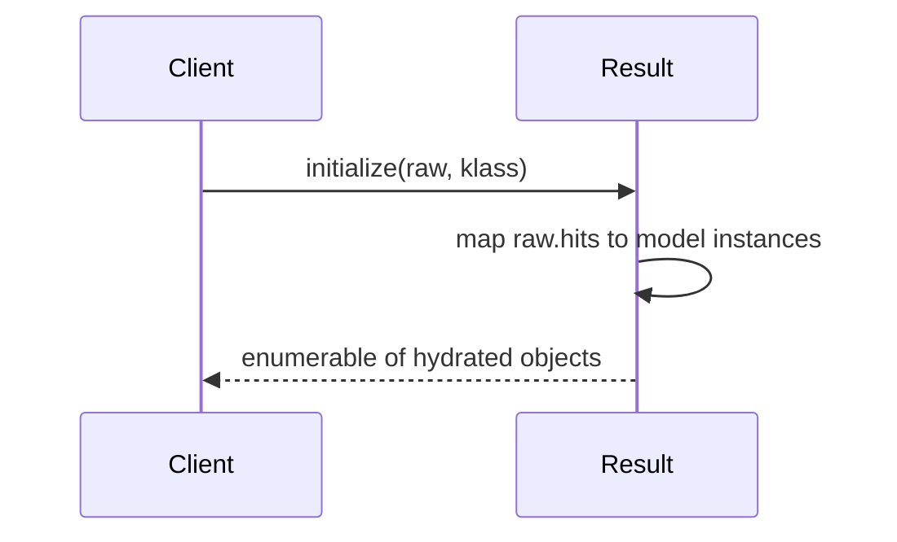
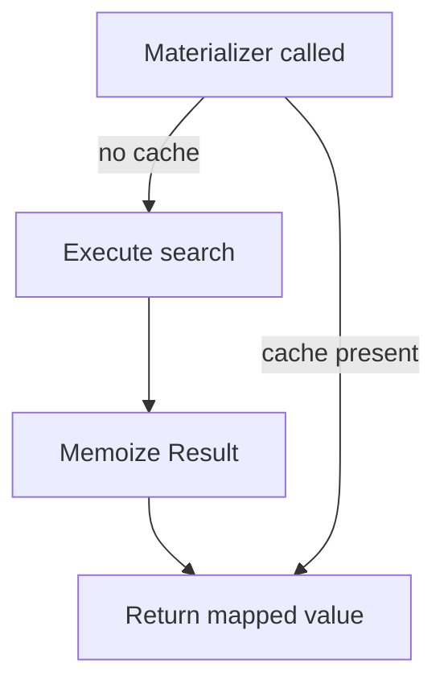
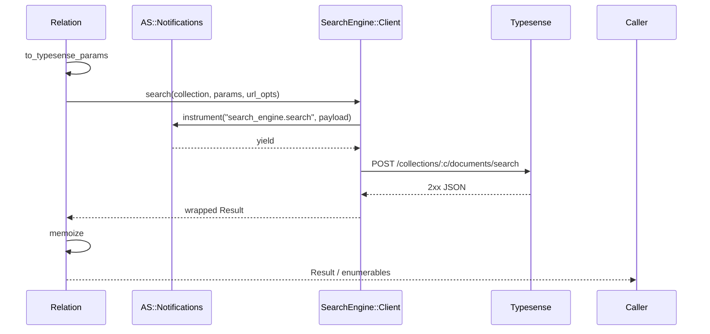

Related: <a href="/projects/search-engine-for-typesense/client">Client</a>,
<a href="/projects/search-engine-for-typesense/field-selection">Field selection</a>,
<a href="/projects/search-engine-for-typesense/models">Models</a>,
<a href="/projects/search-engine-for-typesense/observability">Observability</a>

## Result materialization and hydration

<code>SearchEngine::Result</code> wraps the raw Typesense response and hydrates each hit into a Ruby object. When a model class is known for the collection, hydrated hits are instances of that class; otherwise, a plain <code>OpenStruct</code> is used.

### Why

- Normalize access to metadata: <code>found</code>, <code>out_of</code>, <code>facets</code>, and <code>raw</code>.
- Provide <code>Enumerable</code> over hydrated hits.
- Respect field selection (<code>include_fields</code>) by hydrating only keys present in the returned document.

### Hydration flow



### API

- <code>Result#found</code> → number of matching documents
- <code>Result#out_of</code> → number of documents searched
- <code>Result#facets</code> → facet counts (if present)
- <code>Result#raw</code> → original parsed response (Hash)
- <code>Enumerable</code> → iterate hydrated results (<code>each</code>, <code>map</code>, ...)
- <code>to_a</code> → duplicate Array of hydrated hits; internal array is frozen
- <code>size</code>, <code>empty?</code>

### Hydration rules

- If a model class is provided, each hit document is assigned to an instance of that class via instance variables named after the document keys. Unknown keys are permitted.
- If no class is provided or collection is unknown, an <code>OpenStruct</code> is created per hit.
- Selection is respected implicitly: only keys present in the returned document are set. Missing attributes are not synthesized.

### Examples

```ruby
client = SearchEngine::Client.new
result = client.search(collection: "books", params: { q: "milk", query_by: "name" })
result.found  # => 10
result.out_of # => 1000

result.each do |obj|
  # obj is SearchEngine::Book if the collection is registered,
  # otherwise an OpenStruct with the document keys.
end

result.to_a # => [#<SearchEngine::Book ...>, ...]
```

Tip: When using Typesense <code>include_fields</code>, only included fields will be hydrated on each object.

---

## Pluck & selection

<code>pluck(*fields)</code> validates requested fields against the effective selection (include − exclude; exclude wins) before executing. When a requested field is not permitted, it fails fast with an actionable error.

Example:

```ruby
SearchEngine::Book.select(:id).pluck(:name)
# raises InvalidSelection: field :name not in effective selection. Use `reselect(:id,:name)`.
```

Hints:

- When a field is explicitly excluded, the error suggests removing the exclude.
- When includes are present but missing the field, the error suggests <code>reselect(...)</code> with the current includes plus the requested fields.

<code>ids</code> delegates to <code>pluck(:id)</code>. It succeeds when <code>:id</code> is permitted by the effective selection. If <code>:id</code> is explicitly excluded or not part of an include list (when includes are present), it raises <code>InvalidSelection</code> and suggests how to fix it. When includes are empty, all fields are allowed except explicit excludes, so <code>ids</code> works by default.

### Pick

<code>pick(*fields)</code> returns the first matching record’s value(s) with the
same selection guardrails as <code>pluck</code>. It returns <code>nil</code> when
no records match.

Example:

```ruby
SearchEngine::Book.pick(:name)
# => "A Song of Ice and Fire"
```

Multiple fields:

```ruby
SearchEngine::Book.pick(:id, :name)
# => [123, "A Song of Ice and Fire"]
```

See also: <a href="/projects/search-engine-for-typesense/field-selection">Field Selection DSL</a>.

---

## Relation materializers and single-request memoization

Materializers on <code>SearchEngine::Relation</code> trigger execution and cache a single <code>SearchEngine::Result</code> per relation instance. The first materializer issues exactly one search; subsequent materializers reuse the cached result. Relation immutability is preserved: chainers return new relations; materializers only populate an internal memo that is invisible to <code>inspect</code> and equality.



### API

- <code>to_a</code> → triggers fetch and memoizes; returns hydrated hits
- <code>each</code> → enumerates hydrated hits
- <code>first(n = nil)</code> → from the loaded page; <code>n</code> optional
- <code>last(n = nil)</code> → from the loaded page tail; no extra HTTP
- <code>take(n = 1)</code> → head items; when <code>n == 1</code> returns a single object
- <code>pluck(*fields)</code> → for one field returns a flat array; for many returns array-of-arrays. Falls back to raw documents when model readers are absent
- <code>pick(*fields)</code> → returns the first row’s values; <code>nil</code> when no matches
- <code>ids</code> → convenience for <code>pluck(:id)</code>
- <code>count</code> → if loaded, uses memoized <code>found</code>; otherwise performs a minimal request
- <code>exists?</code> → if loaded, uses memoized <code>found</code>; otherwise performs a minimal request
- <code>pages_count</code> → returns total pages based on memoized totals and the effective per-page size; respects curated counts and falls back to Typesense defaults when neither state nor response metadata provide a value

Concurrency: first load is synchronized across threads; subsequent materializer calls reuse the memo without locking.

### Minimal request for `count` / `exists?`

When the relation has no memo yet, <code>count</code>/<code>exists?</code> issue a minimal search using the same compiled filters/sort and query defaults, but forcing:

- <code>per_page = 1</code>, <code>page = 1</code>
- <code>include_fields = "id"</code>

The response’s <code>found</code> is returned and no full <code>Result</code> is memoized.

## Examples

```ruby
rel = SearchEngine::Book.where(active: true).limit(10)
rel.to_a         # triggers fetch and memoizes
rel.count        # uses memoized found
rel.ids          # plucks id from cached hits
rel.pluck(:name) # plucks a single field
rel.pick(:name)  # picks the first record's name
```

Callouts:

- <code>last</code> operates on the currently fetched page. For dataset tail, use explicit sorting/pagination.
- <code>pluck</code> prefers model readers when available, otherwise reads raw documents for robustness.
- <code>count</code>/<code>exists?</code> perform a minimal request only when there is no memo; once loaded, they reuse the cached <code>found</code>.

---

## Execution & memoization

Materializers call into relation execution, which compiles Typesense body params, merges URL-level cache knobs (config defaults with optional relation overrides), and performs a single client call per relation instance. The raw response is wrapped as <code>SearchEngine::Result</code> and memoized for reuse.



- <strong>URL options</strong>: `{ use_cache, cache_ttl }` originate from <code>SearchEngine.config</code> and may be overridden per relation via <code>relation.options(use_cache: ..., cache_ttl: ...)</code>.
- <strong>Redaction</strong>: Event payload params are redacted via <code>SearchEngine::Observability.redact</code>.

See also: <a href="/projects/search-engine-for-typesense/observability">Observability</a> and <a href="/projects/search-engine-for-typesense/client">Client</a>.


