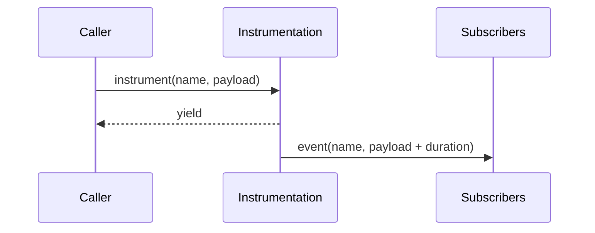
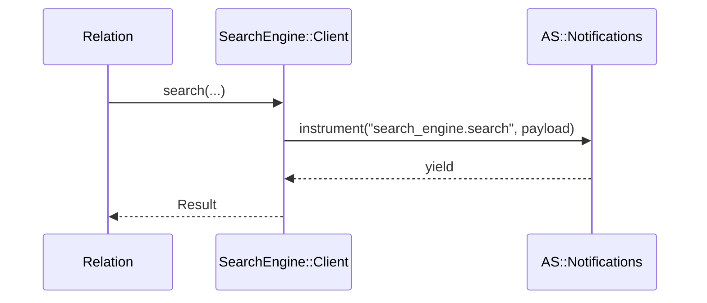
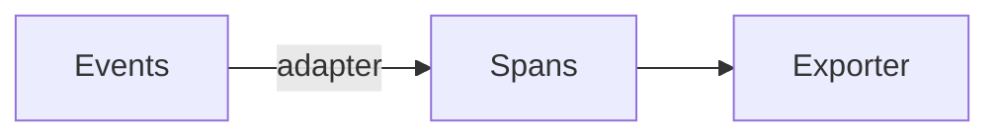

Related: <a href="/projects/search-engine-for-typesense/dx">DX</a>, <a href="/projects/search-engine-for-typesense/troubleshooting">Troubleshooting</a>

This engine emits lightweight ActiveSupport::Notifications events around client calls and provides an opt-in compact logging subscriber. Events are redacted and stable to keep logs useful without leaking secrets.

## Events

- <strong>Events</strong>
  - <code>search_engine.search</code> — wraps <code>SearchEngine::Client#search</code>
  - <code>search_engine.multi_search</code> — wraps the top-level helper around <code>Client#multi_search</code>
  - <code>search_engine.schema.diff</code> — around schema diffing
  - <code>search_engine.schema.apply</code> — around schema apply lifecycle (create → reindex → swap → retention)
  - <code>search_engine.preset.apply</code> — emitted during compile when a preset is applied (keys-only payload)
  - <code>search_engine.indexer.partition_start</code> — partition processing started (inline or ActiveJob)
  - <code>search_engine.indexer.partition_finish</code> — partition processing finished with summary
  - <code>search_engine.indexer.batch_import</code> — each bulk import attempt
  - <code>search_engine.indexer.delete_stale</code> — stale delete lifecycle (started/ok/failed/skipped)
  - <code>search_engine.bulk.run</code> — bulk indexing/reindexing run (multi-collection orchestration)
  - <code>search_engine.joins.compile</code> — compile-time summary of JOINs usage
  - <code>search_engine.grouping.compile</code> — compile-time summary of grouping (field/limit/missing_values)
  - <code>search_engine.selection.compile</code> — compile-time summary of selection counts (include/exclude/nested)
  - <code>search_engine.facet.compile</code> — compile-time summary of facets (fields/queries/cap)
  - <code>search_engine.highlight.compile</code> — compile-time summary of highlight options (fields/full/affix/tag)
  - <code>search_engine.synonyms.apply</code> — compile-time resolution of relation-level synonyms/stopwords flags
  - <code>search_engine.geo.compile</code> — compile-time summary of geo filters/sorts (counts and buckets)
  - <code>search_engine.vector.compile</code> — compile-time summary of vector/hybrid plan (no raw vectors)
  - <code>search_engine.hits.limit</code> — compile- or validate-stage hits limit summary

Duration is available via the event (<code>ev.duration</code>).

#### Unified helper (example)

```ruby
SearchEngine::Instrumentation.instrument("search_engine.search", collection: col) do |ctx|
  ctx[:params_preview] = SearchEngine::Instrumentation.redact(params)
  client.search(...)
end
```

#### Event flow (unified)



## Payload reference

- <strong>collection/collections</strong>: String or `Array<String>` of collections involved
- <strong>params_preview</strong>: Redacted params excerpt (single: Hash, multi: `Array<Hash>`)
- <strong>url_opts</strong>: `{ use_cache: Boolean, cache_ttl: Integer|nil }`
- <strong>status/http_status</strong>: Integer when available, otherwise <code>:ok</code>/<code>:error</code>
- <strong>error_class/error_message</strong>: Short error metadata when status is error
- <strong>correlation_id</strong>: Short token propagated across a request/thread
- <strong>retries</strong>: Attempts used (reserved; nil by default)
- <strong>partition/partition_hash</strong>: Numeric raw key or short hash for strings
- <strong>into</strong>: Physical collection name
- <strong>duration_ms</strong>: Float measured duration in milliseconds
- <strong>grouping.compile</strong>: `{ field, limit, missing_values, collection?, duration_ms? }`
- <strong>selection.compile</strong>: `{ include_count, exclude_count, nested_assoc_count }`
- <strong>facet.compile</strong>: `{ collection, fields_count, queries_count, max_facet_values, sort_flags, conflicts, duration_ms }`
- <strong>highlight.compile</strong>: `{ collection, fields_count, full_fields_count, affix_tokens, snippet_threshold, tag_kind, duration_ms }`
- <strong>synonyms.apply</strong>: `{ collection, use_synonyms, use_stopwords, source, duration_ms }`
- <strong>geo.compile</strong>: `{ collection, filters_count, shapes, sort_mode, radius_bucket, duration_ms }`
- <strong>vector.compile</strong>: `{ collection, query_vector_present, dims, hybrid_weight, ann_params_present, duration_ms }`
- <strong>hits.limit</strong>: `{ collection, early_limit, validate_max, applied_strategy, triggered, total_hits, duration_ms }`
- <strong>bulk.run</strong>: `{ mode, inputs, stage_1, cascade, inputs_count, stage_1_count, cascade_count, failed_collections_total }`

Redaction rules:
- Sensitive keys matching <code>/key|token|secret|password/i</code> are redacted
- Only whitelisted param keys are preserved: <code>q</code>, <code>query_by</code>, <code>per_page</code>, <code>page</code>, <code>infix</code>, <code>filter_by</code>, <code>group_by</code>, <code>group_limit</code>, <code>group_missing_values</code>
- <code>q</code> is truncated when longer than 128 chars
- <code>filter_by</code> literals are masked while preserving structure (e.g., <code>price:>10</code> → <code>price:>***</code>)
- <code>filter_by</code> is never logged as-is; a <code>filter_hash</code> (sha1) is provided instead for stale deletes

| Key            | Type                 | Redaction |
|----------------|----------------------|-----------|
| `collection`   | String               | N/A |
| `collections`  | `Array<String>`        | N/A |
| `labels`       | `Array<String>`        | N/A |
| `searches_count` | Integer            | N/A |
| `params_preview` | `Hash`/`Array<Hash>`   | Whitelisted keys only; `q` truncated; `filter_by` masked |
| `url_opts`     | Hash                 | Includes only `use_cache` and `cache_ttl` |
| `status`/`http_status` | Integer or Symbol | N/A |
| `error_class`/`error_message` | String, nil | Truncated to config max |
| `correlation_id` | String             | N/A |
| `duration`     | Float (ms) via event | N/A |
| `partition`    | Numeric or hidden    | Hidden for strings; use `partition_hash` |
| `partition_hash` | String (sha1 prefix) | N/A |
| `filter_hash`  | String (sha1)        | Raw filter never logged |
| `group_by`     | String               | N/A |
| `group_limit`  | Integer, nil         | N/A |
| `group_missing_values` | Boolean      | N/A |
| `selection_include_count` | Integer   | Counts only |
| `selection_exclude_count` | Integer   | Counts only |
| `selection_nested_assoc_count` | Integer | Counts only |

For URL/cache knobs, see <a href="/projects/search-engine-for-typesense/configuration">Configuration</a>.

## Logging

Default behavior is quiet: no <code>[se.*]</code> lines are emitted unless enabled.

Enable the structured LoggingSubscriber and choose an output mode and sampling rate:

```ruby
SearchEngine.configure do |c|
  c.logging.mode   = :compact   # Default: nil (OFF). Use :json for structured JSON lines
  c.logging.level  = :info      # :debug | :info | :warn | :error
  c.logging.sample = 1.0        # e.g., 0.1 to sample 10%
  c.logging.logger = Rails.logger
end
```

- <strong>Modes</strong>: <code>:compact</code> or <code>:json</code>
- <strong>Sampling</strong>: <code>sample</code> in 0.0..1.0; set <code>0.0</code> to disable emission
- <strong>Redaction</strong>: never logs raw filters or secrets; uses <code>Instrumentation.redact</code> and <code>params_preview</code>
- <strong>Correlation ID</strong>: included as a short token per line/object

Examples:

```text
[se.search] id=2a1f coll=products status=200 dur=32.1ms groups=— preset=— cur=0/0
```

```json
{"event":"search_engine.search","cid":"2a1f","collection":"books","status":200,"duration_ms":32.1}
```

## Relation execution events

Execution initiated by <code>SearchEngine::Relation</code> results in a single client call and emits <code>search_engine.search</code> with a compact, redacted payload. When a preset is applied, compile also emits <code>search_engine.preset.apply</code>. See <a href="/projects/search-engine-for-typesense/presets">Presets</a>.

- <strong>Event</strong>: <code>search_engine.search</code>
- <strong>Payload</strong>: `{ collection, params_preview: Instrumentation.redact(params), url_opts: { use_cache, cache_ttl }, status, error_class }`
- <strong>Source</strong>: <code>SearchEngine::Client#search</code> (Relation delegates execution to the client)



Backlinks: <a href="/projects/search-engine-for-typesense/dx">DX</a>, <a href="/projects/search-engine-for-typesense/client">Client</a>, <a href="/projects/search-engine-for-typesense/relation">Relation</a>, <a href="/projects/search-engine-for-typesense/cli">CLI</a>, <a href="/projects/search-engine-for-typesense/testing">Testing</a>

## OpenTelemetry

This adapter translates unified events into OpenTelemetry spans when enabled and when the <code>opentelemetry-sdk</code> gem is present. It is disabled by default and adds ~zero overhead when disabled.

Enable via configuration:

```ruby
SearchEngine.configure do |c|
  c.opentelemetry = OpenStruct.new(enabled: false, service_name: "search_engine")
end
```

Event flow:



Notes:

- Activation is gated by SDK presence and <code>config.opentelemetry.enabled</code>.
- Spans are named after events (e.g., <code>search_engine.search</code>, <code>search_engine.compile</code>).
- Attributes are minimal and redacted; no raw query/filter strings are recorded.
- Correlation ID is attached as <code>se.cid</code> when present.
- Span status is set to ERROR when payload <code>status=:error</code> or <code>http_status>=400</code>.

Backlinks: <a href="/projects/search-engine-for-typesense/dx">DX</a>, <a href="/projects/search-engine-for-typesense/observability-dx-testing">Observability DX Testing</a>, <a href="/projects/search-engine-for-typesense/client">Client</a>


