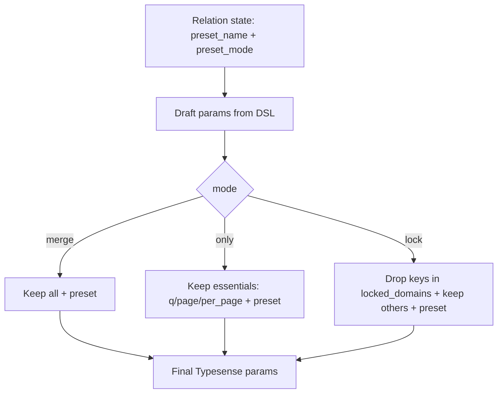
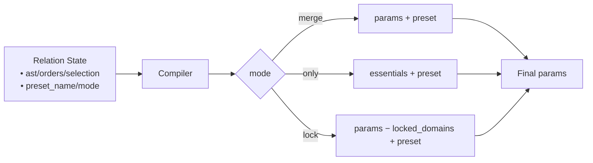
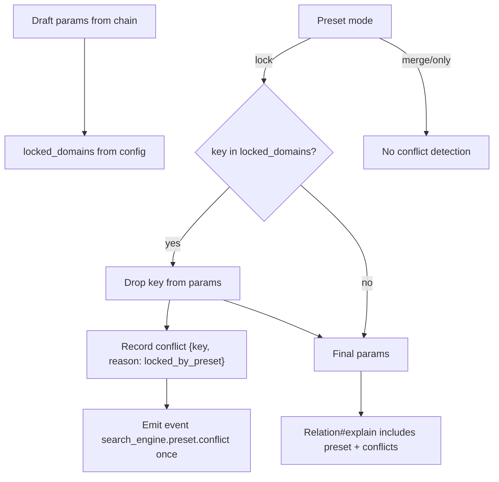

Related: <a href="/projects/search-engine-for-typesense/observability">Observability</a>, <a href="/projects/search-engine-for-typesense/troubleshooting#presets">Troubleshooting → Presets</a>

## Overview

Presets are server-side bundles of query options that you can attach to a relation to enforce consistent filters, sorts, or selections. They provide a global config (optional namespace and enablement), per‑collection defaults, and a per‑relation <code>preset(name, mode:)</code> DSL.

- <strong>Why</strong>: enforce consistent defaults, reuse across surfaces, and keep chains concise.
- <strong>Where</strong>: global config under <code>SearchEngine.config.presets</code>; model-level <code>default_preset</code>; relation-level <code>Relation#preset</code>.

## Config & Default preset

Presets are namespaced when enabled. The effective name is computed as <code>"#{namespace}_#{token}"</code> when both <code>enabled</code> and <code>namespace</code> are set; otherwise the bare token is used.

- <strong>Global config</strong>: <code>enabled</code>, <code>namespace</code>, and <code>locked_domains</code> (used by <code>:lock</code> mode)
- <strong>Model default</strong>: declare <code>default_preset :token</code> on a <code>SearchEngine::Base</code> subclass
- <strong>Reader</strong>: <code>YourModel.default_preset_name</code> returns the effective name (or <code>nil</code> if none)

```ruby
# Initializer
SearchEngine.configure do |c|
  c.presets.enabled   = true
  c.presets.namespace = "prod"
  # Optional: customize locked domains for :lock mode
  # c.presets.locked_domains = %i[filter_by sort_by include_fields exclude_fields]
end

class SearchEngine::Book < SearchEngine::Base
  default_preset :popular_products
end

SearchEngine::Book.default_preset_name
# => "prod_popular_products"
```

Notes:

- Namespacing is ignored when <code>enabled</code> is false; tokens remain usable as declared.
- <code>locked_domains</code> is normalized to Symbols and used by the compiler to prune keys in <code>:lock</code> mode.

## Relation DSL

Apply a preset with copy‑on‑write semantics, validate inputs, and keep chaining ergonomics:

```ruby
# Merge (default)
SearchEngine::Book.preset(:popular_products)
  .where(active: true)
  .order(updated_at: :asc)

# Only preset
SearchEngine::Book.preset(:aggressive_sale, mode: :only).page(1).per(24)

# Locked preset (chain cannot override preset filters/sorts)
SearchEngine::Book.preset(:brand_curated, mode: :lock).order(price: :asc) # order will be dropped
```

- <code>Relation#preset(name, mode: :merge)</code> validates the name and mode
- Readers: <code>rel.preset_name</code> and <code>rel.preset_mode</code> (defaults to <code>:merge</code>)
- <code>inspect</code>/<code>explain</code> show the preset and, for <code>:lock</code>, any dropped keys
- Presets affect the compiler stage only; no global config is mutated

## Strategies (<code>:merge</code>, <code>:only</code>, <code>:lock</code>)

| Mode  | What is sent | Who wins on overlaps | Conflicts recorded |
|------|---------------|----------------------|--------------------|
| merge | preset + all chain params | chain | no |
| only  | preset + essentials (`q`, `page`, `per_page`) | n/a (others dropped) | no |
| lock  | preset + chain minus locked domains | preset | yes (dropped keys) |

- <strong>merge</strong>: Send preset and all compiled params. When Typesense sees overlapping knobs, the later param wins; here the chain wins. No conflicts are recorded.
- <strong>only</strong>: Keep only essentials from the chain (<code>q</code>, <code>page</code>, <code>per_page</code>) and send the preset. Use for strict server‑defined queries with local pagination.
- <strong>lock</strong>: Drop chain keys that belong to <code>SearchEngine.config.presets.locked_domains</code> (default: <code>filter_by</code>, <code>sort_by</code>, <code>include_fields</code>, <code>exclude_fields</code>), record dropped keys, and include them in <code>explain</code>.

### Mermaid — Strategy flow



## Compiler mapping & pruning

The compiler injects <code>preset: &lt;effective_name&gt;</code> into the params and prunes keys according to the chosen strategy.

- <strong>only</strong>: keep <code>q</code>, <code>page</code>, <code>per_page</code>; drop the rest
- <strong>lock</strong>: drop keys in <code>SearchEngine.config.presets.locked_domains</code> and record them
- <strong>merge</strong>: no pruning

Compact mapping:

| Relation state               | Compiler output              |
|-----------------------------|------------------------------|
| `preset_name`, `preset_mode`| `preset`, `_preset_mode`     |
| state → params              | `q`, `filter_by`, `sort_by`, `include_fields`, `page`, `per_page`, ... |
| pruning (only)              | keep essentials only         |
| pruning (lock)              | drop `locked_domains` keys   |

### Mermaid — State → params mapping



Example (reused):

```ruby
rel = SearchEngine::Book
        .preset(:popular_products, mode: :only)
        .where(active: true)
rel.to_typesense_params
# => { q: "*", page: 1, per_page: 10, preset: "prod_popular_products" }
```

## Conflicts

Conflicts are detected only in <code>mode: :lock</code> and occur when a compiled chain key belongs to <code>SearchEngine.config.presets.locked_domains</code>. Such keys are dropped from the final params and recorded.

- Accessor: <code>Relation#preset_conflicts</code> → `[{ key: :filter_by, reason: :locked_by_preset }, ...]` (deterministic, frozen)
- Explain: lists the effective preset and a line per dropped key with a humanized reason
- Inspect: appends a compact token: <code>preset=prod_brand_curated(mode=lock; conflicts=filter_by,sort_by)</code>
- Redaction: keys only; no raw values

Example snippet:

```text
Preset: prod_brand_curated (mode: lock)
Dropped: sort_by (locked by preset)
```

### Mermaid — Conflict resolution



## Multi‑search

Presets are applied per search entry. Each <code>searches[]</code> item carries its own <code>preset</code> and respects that relation’s mode.

- <code>:merge</code>: pass through compiled params (includes <code>preset</code>)
- <code>:only</code>: keep only <code>collection</code>, <code>q</code>, <code>page</code>, <code>per_page</code>, and <code>preset</code>
- <code>:lock</code>: drop keys listed in <code>SearchEngine.config.presets.locked_domains</code>

Example (reused):

```ruby
res = SearchEngine.multi_search do |m|
  m.add :books, SearchEngine::Book.preset(:popular_products).per(5)
  m.add :publishers,   SearchEngine::Publisher.preset(:brand_popularity, mode: :only).per(3)
end
```

## Observability & troubleshooting

Events (keys and counts only; values redacted elsewhere):

- <code>search_engine.preset.apply</code> — emitted once per compile when a preset is present
  - Payload: <code>preset_name</code>, <code>mode</code>, <code>locked_domains</code>, <code>pruned_keys</code>
- <code>search_engine.preset.conflict</code> — emitted once per compile in <code>:lock</code> mode when keys were dropped
  - Payload: <code>keys</code>, <code>count</code>, <code>mode</code>, <code>preset_name</code>

Logging subscriber (compact):

- Text: appends <code>pz=&lt;name&gt;|m=&lt;mode&gt;|pk=&lt;count&gt;|ld=&lt;count&gt;</code>; when <code>pruned_keys.size &lt;= 3</code>, includes <code>pk=[k1,k2]</code>
- JSON: adds <code>preset_name</code>, <code>preset_mode</code>, <code>preset_pruned_keys_count</code>, <code>preset_locked_domains_count</code>, and optionally <code>preset_pruned_keys</code>

## FAQ

- <strong>How does namespacing interact with <code>enabled: false</code>?</strong> Namespacing is ignored when disabled; tokens are used as declared.
- <strong>Can I customize <code>locked_domains</code>?</strong> Yes: <code>SearchEngine.config.presets.locked_domains = %i[filter_by sort_by include_fields exclude_fields]</code> (Array/Set/single value accepted; normalized to Symbols).
- <strong>What happens if a preset is missing on the server?</strong> Typesense returns an error at request time; handle it like any search error. The client surfaces it via <code>SearchEngine::Errors</code>.
- <strong>How do presets interact with field selection?</strong> In <code>:lock</code>, selection keys (<code>include_fields</code>, <code>exclude_fields</code>) belong to <code>locked_domains</code> by default and are dropped from the chain; the preset governs them.
- <strong>How does multi‑search resolve conflicting modes across entries?</strong> Modes are per entry. Each relation’s <code>preset_mode</code> is applied independently when compiling <code>searches[]</code>.

Backlinks: <a href="/projects/search-engine-for-typesense/index">Index</a> · <a href="/projects/search-engine-for-typesense/relation">Relation</a> · <a href="/projects/search-engine-for-typesense/compiler">Compiler</a> · <a href="/projects/search-engine-for-typesense/multi-search">Multi‑search</a> · <a href="/projects/search-engine-for-typesense/observability">Observability</a>


