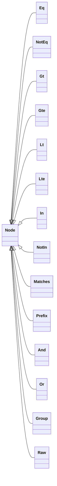
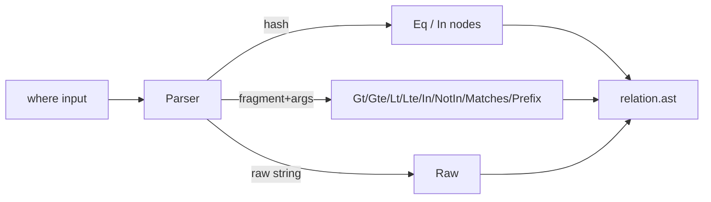

Related: <a href="/projects/search-engine-for-typesense/relation">Relation</a>, <a href="/projects/search-engine-for-typesense/compiler">Compiler</a>

The Predicate AST models query predicates in a compiler‑agnostic, immutable structure under <code>SearchEngine::AST</code>. It separates predicate construction from compilation to Typesense <code>filter_by</code>, enabling safer composition, inspection, and future optimizations.

## Overview

- <strong>Safety</strong>: Values are carried as plain Ruby data; quoting/escaping is handled later by the compiler/sanitizer.
- <strong>Immutability</strong>: All nodes are frozen on construction; arrays are deep‑frozen to avoid accidental mutation.
- <strong>Uniform interface</strong>: Nodes expose <code>#type</code> and consistent accessors (<code>#field</code>, <code>#value</code>, <code>#values</code>, <code>#children</code>, etc.).
- <strong>Debuggable</strong>: Stable <code>#to_s</code> and compact <code>#inspect</code> shapes for logging.

## Node catalog

- <strong>Comparison</strong>: <code>Eq</code>, <code>NotEq</code>, <code>Gt</code>, <code>Gte</code>, <code>Lt</code>, <code>Lte</code> — binary nodes with <code>field</code>, <code>value</code>.
- <strong>Membership</strong>: <code>In</code>, <code>NotIn</code> — binary nodes with <code>field</code>, <code>values</code> (non‑empty Array).
- <strong>Pattern</strong>: <code>Matches</code> (regex‑like; stores pattern source), <code>Prefix</code> (string begins‑with) — binary nodes with <code>field</code>, <code>pattern/prefix</code>.
- <strong>Boolean</strong>: <code>And</code>, <code>Or</code> — N‑ary nodes over one or more children; <code>nil</code> dropped; same‑type nodes flattened.
- <strong>Grouping</strong>: <code>Group</code> — wraps a single child to preserve explicit precedence.
- <strong>Escape hatch</strong>: <code>Raw</code> — raw string fragment passed through by the compiler.



## Builders

Ergonomic constructors are exposed as module functions on <code>SearchEngine::AST</code>:

- <code>eq(field, value)</code> / <code>not_eq(field, value)</code>
- <code>gt(field, value)</code> / <code>gte(field, value)</code> / <code>lt(field, value)</code> / <code>lte(field, value)</code>
- <code>in_(field, values)</code> / <code>not_in(field, values)</code>
- <code>matches(field, pattern)</code> (accepts <code>String</code> or <code>Regexp</code>; stores <code>source</code> only)
- <code>prefix(field, prefix)</code>
- <code>and_(*nodes)</code> / <code>or_(*nodes)</code>
- <code>group(node)</code>
- <code>raw(fragment)</code>

### Validations

- <code>field</code> must be non‑blank <code>String</code>/<code>Symbol</code>.
- <code>values</code> must be a non‑empty <code>Array</code> (for membership nodes).
- <code>pattern</code> must be <code>String</code>/<code>Regexp</code>; only the regex source is stored.
- Boolean nodes require ≥ 1 child after dropping <code>nil</code>; nested same‑type nodes are flattened.

## Immutability & equality

- All nodes <code>freeze</code> on construction; internal arrays are deep‑frozen.
- Nodes compare by value (<code>#==</code>, <code>#eql?</code>) and have stable <code>#hash</code>, so they can be used as Hash keys or in Sets.

## Debugging

- <code>to_s</code> emits a human‑friendly outline, e.g., <code>and(eq(:active, true), in(:brand_id, [1, 2]))</code>.
- <code>inspect</code> uses a compact <code>#&lt;AST ...&gt;</code> shape with truncated payloads.
- No quoting/escaping occurs here; the compiler performs adapter‑specific formatting.

## Where it fits

<a href="/projects/search-engine-for-typesense/relation">Relation</a>#where accepts Hash, raw String, and SQL‑ish fragment+args. The parser converts these inputs into AST nodes and stores them alongside legacy string filters. A later compiler pass will prefer AST when present.

### Parsing examples

```ruby
Parser.parse({ id: 1 }, klass: Product)              # => AST.eq(:id, 1)
Parser.parse(["price > ?", 100], klass: Product)    # => AST.gt(:price, 100)
Parser.parse("brand_id:=[1,2,3]", klass: Product)   # => AST::Raw("brand_id:=[1,2,3]")
```

### Input → AST flow



<Info>
  Field names are validated against the model's declared <code>attributes</code>. Raw strings are accepted as an escape hatch and bypass validation.
</Info>

### Integration with Relation

- <code>Relation#where</code> parses inputs into AST and appends to <code>relation.ast</code>.
- <code>Relation#to_typesense_params</code> compiles <code>relation.ast</code> via the <a href="/projects/search-engine-for-typesense/compiler">Compiler</a> when present; otherwise falls back to legacy string <code>filters</code>.

See also: <a href="/projects/search-engine-for-typesense/relation">Relation</a> · <a href="/projects/search-engine-for-typesense/compiler">Compiler</a>

## Re‑chainers (reselect / rewhere / unscope)

See also: <a href="/projects/search-engine-for-typesense/relation-reference">Relation Guide</a> · <a href="/projects/search-engine-for-typesense/relation">Relation</a> · <a href="/projects/search-engine-for-typesense/dx">DX</a>

AR‑style helpers to adjust a built relation immutably:

- <code>reselect(*fields)</code> — replace the selected fields (Typesense <code>include_fields</code>).
- <code>rewhere(input, *args)</code> — clear previous predicates, parse new input into AST.
- <code>unscope(:order, :where, :select, :limit, :offset, :page, :per)</code> — remove parts of state.

```ruby
rel.reselect(:id, :name)
rel.rewhere(active: true)
rel.unscope(:order)
```

Behavior notes:

- <code>reselect</code> flattens, strips, stringifies, drops blanks, and de‑duplicates preserving first occurrence. Raises when empty or unknown fields (when attributes are declared).
- <code>rewhere</code> clears both AST and legacy string <code>filters</code>, then parses the new input via the Parser. Parser errors surface as‑is.
- <code>unscope(:where)</code> clears all predicates; <code>:order</code> clears orders; <code>:select</code> clears field selection; <code>:limit/:offset/:page/:per</code> clear their counterparts (<code>per</code> clears <code>per_page</code>).

The compiled params reflect these changes: <code>include_fields</code> mirrors <code>reselect</code>; <code>filter_by</code> is rebuilt from the new AST after <code>rewhere</code>; <code>unscope(:where)</code> removes <code>filter_by</code> entirely until new predicates are added.

```mermaid
flowchart LR
  A[Relation State] -->|reselect| B[Replace select]
  A -->|rewhere| C[Clear AST -> Parse -> New AST]
  A -->|unscope(:where)| D[Clear AST]
  A -->|unscope(:order)| E[Clear orders]
  A -->|unscope(:page/per)| F[Clear pagination]
```

## Error reference

See also: <a href="/projects/search-engine-for-typesense/troubleshooting">Troubleshooting</a> · <a href="/projects/search-engine-for-typesense/relation-reference">Relation Guide</a> · <a href="/projects/search-engine-for-typesense/compiler">Compiler</a>

Validation happens primarily in the Parser, with light shape checks in the Compiler. <code>AST::Raw</code> deliberately bypasses validation.

| Error | Cause | Typical fix |
|------|-------|-------------|
| `SearchEngine::Errors::InvalidField` | Unknown/disallowed field for the model | Fix the field name or declare it with `attribute`; use `raw` to bypass if necessary |
| `SearchEngine::Errors::InvalidOperator` | Unrecognized operator, or placeholder/arity mismatch | Use one of: `=`, `!=`, `>`, `>=`, `<`, `<=`, `IN`, `NOT IN`, `MATCHES`, `PREFIX`; fix `?` count |
| `SearchEngine::Errors::InvalidType` | Value cannot be coerced to the declared type; empty array for membership | Coerce inputs (e.g., strings to integers), supply a non‑empty array |

- <code>SearchEngine.config.strict_fields</code> controls field validation only:
  - When <code>true</code> (default in development/test), unknown fields raise <code>InvalidField</code>.
  - When <code>false</code>, unknown fields are allowed; operator/shape/type errors are still enforced.
- <code>AST::Raw</code> nodes bypass all field/type checks by design; use sparingly and preferably behind tests.

Allowed example message:

```text
InvalidField: unknown field :colour for SearchEngine::Book (did you mean :color?)
```

## Troubleshooting

- <strong>Unknown field</strong>: Ensure the field exists on your model via <code>attribute</code>. Did you mean a nearby name? See suggestions in the error.
- <strong>Operators</strong>: Use only supported operators; for template fragments, ensure the number of <code>?</code> matches the provided args.
- <strong>Type errors</strong>: Coercions follow attribute types; strings like "true"/"false" only coerce for boolean fields.

### Filtering by id

- When your model declares <code>identify_by :id</code>, <code>id</code> is treated as an integer in filters, so <code>where(id: 42)</code> and <code>['id = ?', '42']</code> coerce to 42.
- When <code>identify_by</code> is anything else (e.g., a composed value), <code>id</code> is treated as a string in filters. Use string values: <code>where(id: '136981-1155')</code> or <code>['id = ?', '136981-1155']</code>.
- Reminder: Typesense can only filter on <code>id</code>; it is not searchable via <code>query_by</code>.


