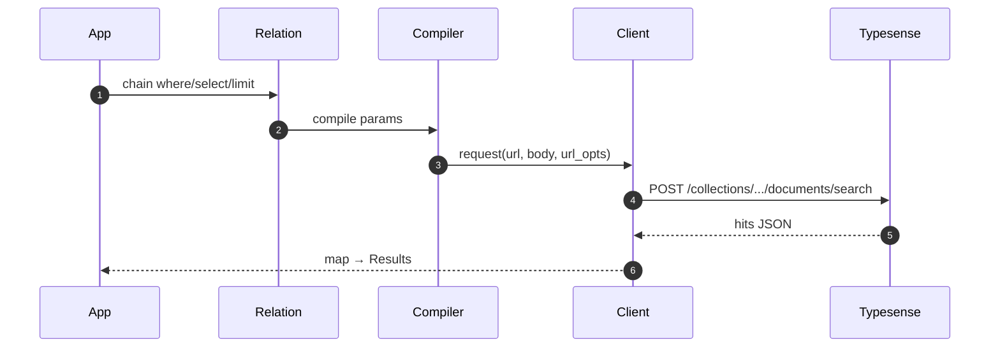

<Info>
  <strong>Prerequisites</strong>
  <ul>
    <li>Ruby 3.1+ and Rails 6.1+ in your host app</li>
    <li>A reachable Typesense node (host/port/protocol); default port is 8108</li>
    <li><code>TYPESENSE_API_KEY</code> set in your environment (never commit secrets)</li>
    <li>An existing Typesense collection and schema; see <a href="/projects/search-engine-for-typesense/schema">Schema</a></li>
  </ul>
</Info>

<Steps>
  <Step title="Add gem to Gemfile">
    ```ruby
    # Gemfile
    gem "search-engine-for-typesense"
    ```

    Then run Bundler to install dependencies in your host app.
  </Step>

  <Step title="Run installer">
    ```bash
    rails g search_engine:install
    ```

    This will create a new initializer in `config/initializers/search_engine.rb`.

    See <a href="/projects/search-engine-for-typesense/dx#generators-%26-console-helpers">Generators & Console helpers</a> for more details.
  </Step>

  <Step title="Configure the initializer">
    ```ruby
    # config/initializers/search_engine.rb
    SearchEngine.configure do |c|
      c.host = ENV.fetch("TYPESENSE_HOST", "localhost")
      c.port = 8108
      c.protocol = "http"
      c.api_key = ENV.fetch("TYPESENSE_API_KEY")
      c.default_query_by = "name, description"
    end
    ```

    - <code>host</code>/<code>port</code>/<code>protocol</code>: where your Typesense node is reachable; defaults are safe for localhost.
    - <code>api_key</code>: read from <code>ENV.fetch("TYPESENSE_API_KEY")</code> so secrets never live in code.
    - <code>default_query_by</code>: default fields used when you do not pass <code>query_by</code> explicitly.

    See <a href="/projects/search-engine-for-typesense/configuration">Configuration</a> for all options and ENV mapping.
  </Step>

  <Step title="Define a minimal model">
    ```ruby
    class SearchEngine::Book < SearchEngine::Base
      collection "books"
      attribute :id, :integer
      attribute :title, :string
    end

    SearchEngine::Book.where(title: "ruby").select(:id, :title).limit(5).to_a
    ```

    Ensure your Typesense <code>books</code> collection exists with at least <code>id</code> (int64) and <code>title</code> (string).

    You can also use a <a href="/projects/search-engine-for-typesense/dx#generators-%26-console-helpers">Generator</a> to create a new model:

    ```bash
    rails g search_engine:model Book --collection books --attrs id:integer title:string
    ```

    This will create a new model in `app/models/search_engine/book.rb`.
  </Step>

  <Step title="Index data (optional convenience)">
    You can let the model orchestrate schema and indexing:

    ```ruby
    # Create collection + apply schema if needed, reindex, retention cleanup
    SearchEngine::Book.index_collection

    # Index a specific partition (collection must exist and be in-sync)
    SearchEngine::Book.index_collection(partition: publisher_id)
    ```

    See <a href="/projects/search-engine-for-typesense/indexer#model-indexation-index_collection">Indexer</a> for details.
  </Step>

  <Step title="Rebuild a partition directly (optional)">
    For one-off reindexing by key, call the model-level helper:

    ```ruby
    SearchEngine::Book.rebuild_partition!(partition: publisher_id)
    SearchEngine::Book.rebuild_partition!(partition: publisher_id, into: "optional_physical_collection")
    ```

    See <a href="/projects/search-engine-for-typesense/indexer#partitioning">Indexer → Partitioning</a> for the partitioning DSL.
  </Step>

  <Step title="First query (curl-free)">
    Open <code>rails console</code> and paste the trailing line from the snippet above. It runs against Typesense
    and returns up to 5 <code>Book</code> records with only <code>id</code> and <code>title</code> hydrated. This uses the Relation → Client stack under the hood.
  </Step>
</Steps>

## Request flow



## Next steps

- <a href="/projects/search-engine-for-typesense/multi-search">Multi‑search</a>: run multiple searches in one network call.
- <a href="/projects/search-engine-for-typesense/joins">JOINs</a>: join related collections and select nested fields.
- <a href="/projects/search-engine-for-typesense/grouping">Grouping</a>: group results and aggregate with counts.

## Troubleshooting

- Missing <code>TYPESENSE_API_KEY</code>: set the ENV var before boot; see
  <a href="/projects/search-engine-for-typesense/configuration#env-mapping">Configuration → ENV mapping</a>. Tip: the CLI doctor checks this.
- Connection refused or timeout: verify <code>host</code>/<code>port</code>/<code>protocol</code>; see the
  <a href="/projects/search-engine-for-typesense/cli#doctor-flow">CLI → Doctor</a>.
- Unknown field errors: declare attributes on the model or adjust selection; see
  <a href="/projects/search-engine-for-typesense/field-selection#guardrails-errors">Field selection → Guardrails</a>.

## Related links

- <a href="/projects/search-engine-for-typesense/installation">Installation</a>
- <a href="/projects/search-engine-for-typesense/configuration">Configuration</a>
- <a href="/projects/search-engine-for-typesense/client">Client</a>
- <a href="/projects/search-engine-for-typesense/observability">Observability</a> — events, logging subscriber, OpenTelemetry
- <a href="/projects/search-engine-for-typesense/dx">DX</a> — helpers: <code>dry_run!</code>, <code>to_params_json</code>, <code>to_curl</code>
- <a href="/projects/search-engine-for-typesense/relation">Relation</a> — chaining DSL used above


