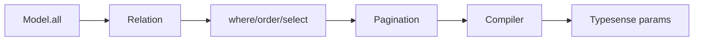
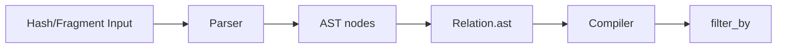

Related: <a href="/projects/search-engine-for-typesense/client">Client</a>, <a href="/projects/search-engine-for-typesense/compiler">Compiler</a>, <a href="/projects/search-engine-for-typesense/observability">Observability</a>, <a href="/projects/search-engine-for-typesense/dx">DX</a>

<Info>
  See also: <a href="/projects/search-engine-for-typesense/debugging">Debugging & Explain</a> and <a href="/projects/search-engine-for-typesense/dx">DX helpers</a>
</Info>

Relation is an immutable, chainable query object bound to a model class. It accumulates normalized query state without mutating previous instances.

## Quick start

```ruby
class SearchEngine::Book < SearchEngine::Base; end

r_1 = SearchEngine::Book.all
r_2 = r_1.where(category: 'fiction').order(:title).select(:id, :title).page(2).per(10)
# r_1 is unchanged
r_1.object_id != r_2.object_id #=> true
r_1.empty?                    #=> true
```

## Immutability

Every chainer creates a new instance via copy-on-write. The original relation remains unchanged.

```ruby
r_1 = SearchEngine::Book.all
r_2 = r_1.where(price: 10)
r_1.object_id #=> 701...
r_2.object_id #=> 702...
r_1.empty?     #=> true
r_2.empty?     #=> false
```

## API

- <strong>all</strong>: returns the relation itself (parity with AR).
- <strong>where(*args)</strong>: add filters. Accepts Hash, String/Symbol, arrays thereof.
- <strong>order(value)</strong>: add order expressions. Accepts Hash or String.
- <strong>select(*fields)</strong> / <strong>exclude(*fields)</strong> / <strong>reselect(*fields)</strong>: field selection DSL. See <a href="/projects/search-engine-for-typesense/field-selection">Field Selection</a> and <a href="/projects/search-engine-for-typesense/joins#nested-field-selection-for-joined-collections">JOINs</a>.
- <strong>limit(n)</strong>, <strong>offset(n)</strong>, <strong>page(n)</strong>, <strong>per(n)</strong>: numeric setters; coerced with validation (see below).
- <strong>options(opts = {})</strong>: shallow-merge additional options for future adapters.
- <strong>empty?</strong>: true when state equals the default empty state.
- <strong>inspect</strong>: AR-style preview that materializes up to 11 hydrated records and renders <code>#&lt;SearchEngine::Relation [ … ]&gt;</code>. The 11th slot is rendered as <code>...</code> when there are more than 10 records. To restore the previous zero‑I/O concise summary, set <code>SearchEngine.config.relation_print_materializes = false</code>.

See <a href="/projects/search-engine-for-typesense/materializers">Materializers</a> for execution methods (<code>to_a</code>, <code>each</code>, <code>first</code>, <code>last</code>, <code>take</code>, <code>pluck</code>, <code>ids</code>, <code>count</code>, <code>exists?</code>).

<Info>
  Note: <code>.find(id)</code> exists only on the model class as a convenience alias for <code>find_by(id: id)</code>. It is intentionally not available on relations.
</Info>

## Lifecycle



See also: <a href="/projects/search-engine-for-typesense/compiler">Compiler</a>. See <a href="/projects/search-engine-for-typesense/client">Client</a> for execution context.

---

## Predicates as AST

<a href="/projects/search-engine-for-typesense/relation">Relation</a>#where parses inputs into a Predicate AST via the <a href="/projects/search-engine-for-typesense/query-dsl">Query DSL</a> and stores nodes in <code>ast</code> (authoritative). Legacy string fragments are preserved for backward compatibility, but compilation prefers AST when present.

```ruby
rel = SearchEngine::Book.where(id: 1).where(["price > ?", 100])
rel.ast # => [#<AST::Eq field=:id ...>, #<AST::Gt field=:price ...>]
rel.to_typesense_params[:filter_by] # compiled string via Compiler
```

- <strong>Read-only</strong>: <code>rel.ast</code> returns a frozen Array.
- <strong>Composition</strong>: multiple <code>where</code> calls append with AND semantics (compiled as <code>AST.and_</code>).
- <strong>Back-compat</strong>: legacy relations with <code>filters</code> are migrated once into <code>AST::Raw</code> nodes.

---

## where DSL

The <code>where</code> chainer accepts three forms. Each call appends fragments with AND semantics. The relation is immutable and returns a new instance.

```ruby
SearchEngine::Book
  .where(id: 5)
  .where("author_id:=[1,2,3]")
  .where("price > ?", 100)
```

- <strong>Hash form</strong>: keys must match the model’s declared <code>attributes</code>.
  - Scalars become <code>field:=&lt;quoted&gt;</code>
  - Arrays become <code>field:=[&lt;quoted, ...&gt;]</code>
- <strong>Raw string</strong>: passed through untouched (escape hatch); no validation.
- <strong>Placeholders</strong>: <code>?</code> are replaced by safely quoted values. Placeholder count must match args.



Notes:

- Hash keys are validated against model attributes.
- Raw string form is passed through as <code>AST::Raw</code>; use with care.
- Placeholder form is sanitized; <code>?</code> args are quoted/escaped.

---

## order / select / pagination

```ruby
SearchEngine::Book
  .order(updated_at: :desc)
  .select(:id, :title)
  .page(2).per(20)
```

- <strong>order(value)</strong>: accepts a Hash like `{ field: :asc, other: :desc }` or a String like <code>"field:asc,other:desc"</code>. Directions are case-insensitive and normalized to <code>asc</code>/<code>desc</code>. Duplicate fields are de-duplicated with last-wins semantics.
- <strong>select(*fields)</strong>: accepts symbols/strings or arrays; trims and de-duplicates preserving first occurrence. If the model declares attributes, unknown fields raise. See <a href="/projects/search-engine-for-typesense/field-selection">Field Selection</a>.
- <strong>limit(n) / offset(n)</strong>: numeric. <code>limit >= 1</code>, <code>offset >= 0</code>.
- <strong>page(n) / per(n)</strong>: numeric. <code>page >= 1</code>, <code>per >= 1</code>. The <code>per(n)</code> method writes to <code>per_page</code> internally.

### Mapping to Typesense parameters (performed by a compiler)

- <code>order(updated_at: :desc)</code> → <code>sort_by=updated_at:desc</code>
- <code>order(name: :asc, updated_at: :desc)</code> → <code>sort_by=name:asc,updated_at:desc</code>
- <code>order(text_match: :desc)</code> → <code>sort_by=_text_match:desc</code>
- <code>select(:id, :name)</code> → <code>include_fields=id,name</code>
- <code>limit(50)</code> → <code>per_page=50</code> when <code>page/per</code> are not set
- <code>offset(200)</code> → <code>page = (offset / per_page) + 1</code> when <code>page/per</code> are not set
- <code>page(2).per(20)</code> → <code>page=2&amp;per_page=20</code> (wins over <code>limit/offset</code>)

Dedupe behavior: <strong>order last-wins by field</strong>, <strong>select first-wins</strong>.

---

## Compiler and debug helpers

- <strong>Relation#to_typesense_params</strong>: compile immutable state to a Typesense body params object. Pure and deterministic. Omits URL-level options (cache knobs are handled by the client).
- <strong>Relation#to_h</strong>: returns the compiled params as a Hash (deterministic order).
- <strong>Relation#inspect</strong>: AR-style container with hydrated preview, e.g. <code>#&lt;SearchEngine::Relation [#&lt;SearchEngine::Book ...&gt;, #&lt;SearchEngine::Book ...&gt;, ...]&gt;</code>. Toggle via <code>SearchEngine.config.relation_print_materializes</code>.

### Defaults merged

- <strong>q</strong>: `"*"` unless overridden via <code>relation.options(q: ...)</code>.
- <strong>query_by precedence</strong>:
  1. explicit <code>relation.options(query_by: ...)</code>
  2. model-level default via <code>SearchEngine::Model.query_by 'field1, field2'</code> (accepts String/Symbol/Array; normalized to a canonical String)
  3. global <code>SearchEngine.config.default_query_by</code>
- Other body params (e.g., <code>infix</code>) follow config defaults.
- URL-level options like <strong>use_cache</strong> and <strong>cache_ttl</strong> are excluded from the compiled body and handled by the client.

### Key order and omission

- Insertion order for stability: <code>q</code>, <code>query_by</code>, <code>filter_by</code>, <code>sort_by</code>, <code>include_fields</code>, <code>page</code>, <code>per_page</code> (then any remaining supported keys, e.g., <code>infix</code>).
- Keys with empty/nil values are omitted.

### Mapping table

| Relation state                  | Typesense param    | Notes |
| ---                             | ---                | ---   |
| `ast: [..]`                     | `filter_by`        | compiled via Compiler; preferred |
| `filters: [..]`                 | `filter_by`        | joined with ` && ` (fallback) |
| `orders: [..]`                  | `sort_by`          | comma-joined |
| `select: [..]` + `exclude: [..]`| `include_fields`/`exclude_fields` | precedence rules apply |
| `page` / `per_page`             | `page`, `per_page` | if present, they win |
| `limit` / `offset`              | `page`, `per_page` | fallback: `per_page = limit`; `page = (offset / limit).floor + 1` |
| `options[:q]` or default "*"    | `q`                | always present |
| `relation.options[:query_by]`   | `query_by`         | wins over model/global defaults |
| `model.query_by`                | `query_by`         | when set; normalized canonical String |
| `config.default_query_by`       | `query_by`         | fallback; omitted when nil |


### Examples

```ruby
rel = SearchEngine::Book
        .where(published: true, author_id: [1,2])
        .order(updated_at: :desc)
        .select(:id, :title)
        .page(2).per(20)

rel.to_typesense_params.to_h
# => { q: "*", query_by: "title,description", filter_by: "author_id:=[1,2] && published:=true", sort_by: "updated_at:desc", include_fields: "id,title", page: 2, per_page: 20 }
```

<Info>
  URL options (e.g., caching knobs) are handled by the <a href="/projects/search-engine-for-typesense/client">Client</a> via common params, not by the compiler.
</Info>


