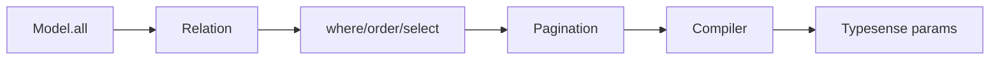

Related: <a href="/projects/search-engine-for-typesense/client">Client</a>, <a href="/projects/search-engine-for-typesense/compiler">Compiler</a>, <a href="/projects/search-engine-for-typesense/observability">Observability</a>, <a href="/projects/search-engine-for-typesense/dx">DX</a>

<Info>
  See also: <a href="/projects/search-engine-for-typesense/debugging">Debugging & Explain</a> and <a href="/projects/search-engine-for-typesense/dx">DX helpers</a>
</Info>

Relation is an immutable, chainable query object bound to a model class. It accumulates normalized query state without mutating previous instances.

## Quick start

```ruby
class SearchEngine::Book < SearchEngine::Base; end

r_1 = SearchEngine::Book.all
r_2 = r_1.where(category: 'fiction').order(:title).select(:id, :title).page(2).per(10)
# r_1 is unchanged
r_1.object_id != r_2.object_id #=> true
r_1.empty?                    #=> true
```

## Immutability

Every chainer creates a new instance via copy-on-write. The original relation remains unchanged.

```ruby
r_1 = SearchEngine::Book.all
r_2 = r_1.where(price: 10)
r_1.object_id #=> 701...
r_2.object_id #=> 702...
r_1.empty?     #=> true
r_2.empty?     #=> false
```

## API

- <strong>all</strong>: returns the relation itself (parity with AR).
- <strong>where(*args)</strong>: add filters. Accepts Hash, String/Symbol, arrays thereof.
- <strong>order(value)</strong>: add order expressions. Accepts Hash or String.
- <strong>select(*fields)</strong> / <strong>exclude(*fields)</strong> / <strong>reselect(*fields)</strong>: field selection DSL. See <a href="/projects/search-engine-for-typesense/field-selection">Field Selection</a> and <a href="/projects/search-engine-for-typesense/joins#nested-field-selection-for-joined-collections">JOINs</a>.
- <strong>limit(n)</strong>, <strong>offset(n)</strong>, <strong>page(n)</strong>, <strong>per(n)</strong>: numeric setters; coerced with validation (see below).
- <strong>options(opts = {})</strong>: shallow-merge additional options for future adapters.
- <strong>empty?</strong>: true when state equals the default empty state.
- <strong>inspect</strong>: AR-style preview that materializes up to 11 hydrated records and renders <code>#&lt;SearchEngine::Relation [ … ]&gt;</code>. The 11th slot is rendered as <code>...</code> when there are more than 10 records. To restore the previous zero‑I/O concise summary, set <code>SearchEngine.config.relation_print_materializes = false</code>.

See <a href="/projects/search-engine-for-typesense/materializers">Materializers</a> for execution methods (<code>to_a</code>, <code>each</code>, <code>first</code>, <code>last</code>, <code>take</code>, <code>pluck</code>, <code>ids</code>, <code>count</code>, <code>exists?</code>).

<Info>
  Note: <code>.find(id)</code> exists only on the model class as a convenience alias for <code>find_by(id: id)</code>. It is intentionally not available on relations.
</Info>

## Lifecycle



See also: <a href="/projects/search-engine-for-typesense/compiler">Compiler</a>. See <a href="/projects/search-engine-for-typesense/client">Client</a> for execution context.

---

## Filtering with where

Use <code>where</code> with hash input, a template, or a raw fragment. Each call ANDs predicates.

```ruby
SearchEngine::Book
  .where(published: true)
  .where(["price >= ?", 100])
  .where("category_id:=[1,2,3]")
```

- Hash form validates fields when attributes are declared.
- Template form uses <code>?</code> placeholders and safe quoting.
- Raw strings are passed through as an escape hatch.
- Call <code>.joins(:assoc)</code> before filtering on joined fields.
- Use <code>.where.not(...)</code> to negate predicates.

<Note>
  For predicate parsing rules and AST details, see <a href="/projects/search-engine-for-typesense/query-dsl">Query DSL</a>.
</Note>

## order / select / pagination

```ruby
SearchEngine::Book
  .order(updated_at: :desc)
  .select(:id, :title)
  .page(2).per(20)
```

- <strong>order(value)</strong>: accepts a Hash like `{ field: :asc, other: :desc }` or a String like <code>"field:asc,other:desc"</code>. Directions are case-insensitive and normalized to <code>asc</code>/<code>desc</code>. Duplicate fields are de-duplicated with last-wins semantics.
- <strong>select(*fields)</strong>: accepts symbols/strings or arrays; trims and de-duplicates preserving first occurrence. If the model declares attributes, unknown fields raise. See <a href="/projects/search-engine-for-typesense/field-selection">Field Selection</a>.
- <strong>limit(n) / offset(n)</strong>: numeric. <code>limit >= 1</code>, <code>offset >= 0</code>.
- <strong>page(n) / per(n)</strong>: numeric. <code>page >= 1</code>, <code>per >= 1</code>. The <code>per(n)</code> method writes to <code>per_page</code> internally.

### Compiled params and debugging

- <strong>Relation#to_typesense_params</strong>: compile immutable state to a Typesense body params object.
- <strong>Relation#to_h</strong>: return the compiled params as a Hash (deterministic order).
- <strong>Relation#inspect</strong>: preview hydrated results; control with <code>SearchEngine.config.relation_print_materializes</code>.

<Note>
  For compilation rules and parameter mapping, see <a href="/projects/search-engine-for-typesense/compiler">Compiler</a> and <a href="/projects/search-engine-for-typesense/debugging">Debugging</a>.
</Note>
