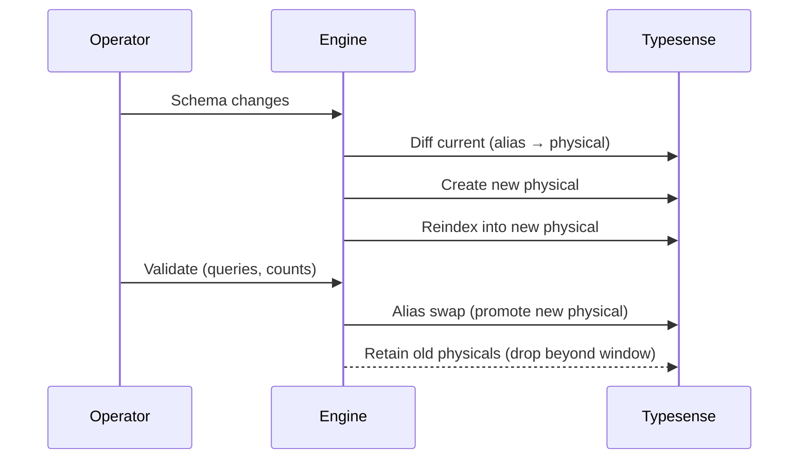

This guide describes an operational workflow for blue/green schema apply, full and partitioned reindex, retention management, and safe delete‑stale.

- Audience: operators and engineers running indexing in production
- Scope: engine APIs and CLI tasks; network‑safe, redaction‑aware

Related: <a href="/projects/search-engine-for-typesense/schema">Schema</a>, <a href="/projects/search-engine-for-typesense/indexer">Indexer</a>, <a href="/projects/search-engine-for-typesense/cli">CLI</a>, <a href="/projects/search-engine-for-typesense/observability">Observability</a>, <a href="/projects/search-engine-for-typesense/dx">DX</a>, <a href="/projects/search-engine-for-typesense/troubleshooting">Troubleshooting</a>

---

## Overview

Blue/green keeps downtime minimal and rollbacks safe:

- Apply schema changes to a new physical collection (versioned name)
- Rebuild data (full or partitioned) into that new physical
- Validate correctness and performance
- Atomically swap the alias to promote the new physical
- Retain prior physicals for a short window; drop beyond retention

<Info>
  If you create a physical, import into it, and call <code>Client#upsert_alias</code> directly, retention cleanup will NOT run. Old physicals remain until explicitly deleted. Use <code>Schema.apply!</code> (or <code>search_engine:schema:apply[...]</code>) to run the full blue/green lifecycle including retention.
</Info>

See: <a href="/projects/search-engine-for-typesense/schema">Schema</a>, <a href="/projects/search-engine-for-typesense/indexer">Indexer</a>, <a href="/projects/search-engine-for-typesense/cli">CLI</a>

---

## Schema lifecycle: diff → apply → validate → swap → rollback

- Physical naming: "&lt;logical&gt;_YYYYMMDD_HHMMSS_###" (timestamp + sequence). Logical name is stable and exposed via alias (e.g., <code>products</code>).
- Diff compares compiled vs live (aliased physical): fields, types, and selected options. Intentionally immutable aspects (e.g., field type narrowing) are flagged for safe migration.
- Apply creates a new physical collection; reindex populates it; failures leave the alias untouched for inspection.
- Validation before swap: sample queries, mapping sanity, counts/order checks on key paths. Prefer <code>dry_run!</code> and the offline stub client for exploratory checks.
- Alias swap: traffic moves atomically to the new physical via an upsert; old physicals remain per retention.
- Rollback: re‑point alias to prior retained physical if available; consider documents indexed after the swap window.
- Observability hooks (predictive): <code>search_engine.schema.diff</code>, <code>search_engine.schema.apply</code>, <code>search_engine.alias.swap</code> (swap often occurs within <code>schema.apply</code>). See <a href="/projects/search-engine-for-typesense/observability">Observability</a>.

---

## Indexer overview: sources, Mapper DSL, partitions, hooks, dispatcher

- Sources: feed batched rows
  - ActiveRecord (ORM) for in‑app queries and scopes
  - SQL for tuned reads and keyset iteration
  - Lambda/stream for external APIs and services
- Mapper DSL: transforms rows to documents (field renames, coercions, joins lookups, defaults), validates required fields, and emits mapping metrics.
- Partitions: choose a stable key (e.g., shop, shard, <code>updated_at</code> bucket). Full rebuild runs once over all data. Partitioned rebuild reduces risk and isolates failures.
- Hooks: <code>before_partition</code>/<code>after_partition</code> for enrichment, throttling, metrics; must be idempotent.
- Dispatcher: fans out partitions inline or via background jobs, with back‑pressure and retries; batch size and timeouts are tunable.
- Events (predictive): <code>search_engine.indexer.enqueue</code>, <code>search_engine.indexer.batch_import</code>, <code>search_engine.indexer.retry</code>, <code>search_engine.indexer.complete</code>. Also see existing events <code>indexer.partition_start</code>, <code>indexer.partition_finish</code>, <code>indexer.batch_import</code>.

See: <a href="/projects/search-engine-for-typesense/indexer">Indexer</a>, <a href="/projects/search-engine-for-typesense/cli">CLI</a>, <a href="/projects/search-engine-for-typesense/observability">Observability</a>

---

## CLI tasks & expected outcomes

Use these tasks to drive the lifecycle. They respect configured timeouts, batch sizes, redaction, and dispatch mode. See <a href="/projects/search-engine-for-typesense/cli">CLI</a>.

```bash
rails 'search_engine:schema:apply[products]'
rails 'search_engine:index:rebuild[products]'
rails 'search_engine:index:delete_stale[products]'
```

- <strong>schema:apply[products]</strong>
  - What: create new physical → reindex → alias swap → retention cleanup
  - Preconditions: collection registered; API key valid; network reachable
  - Expected: summary with created/updated fields, new/previous physical, retention results
- <strong>index:rebuild[products]</strong>
  - What: full rebuild or partition fan‑out via dispatcher; batches streamed with retries
  - Preconditions: schema exists and alias resolves; sources accessible
  - Expected: summary of batches/partitions processed; retry counts, durations
  - Tip: model API supports optional dependency preflight
    - <code>SearchEngine::Book.index_collection(pre: :ensure)</code> (ensure presence only)
    - <code>SearchEngine::Book.index_collection(pre: :index)</code> (ensure + fix drift)
- <strong>index:delete_stale[products]</strong>
  - What: delete documents not in the current source‑of‑truth snapshot via your <code>stale</code> rules (declared inside <code>index</code> and OR‑merged into a <code>filter_by</code>)
  - Preconditions: at least one <code>stale</code> rule resolves to a non‑empty filter; strict mode or dry‑run configured as needed
  - Expected: summary of candidates and deletions (or preview in dry‑run)

---

## Apply flow



---

## Partitioned rebuild flow

```mermaid
sequenceDiagram
  participant Disp as Dispatcher
  participant Plan as Partition planner
  participant W as Workers
  participant Map as Mapper
  participant Obs as Observability
  Disp->>Plan: Enumerate partitions
  Plan-->>Disp: Keys
  Disp->>W: Fan‑out per partition
  W->>Map: Map rows → docs (per batch)
  W->>W: Batch import with retries/back‑pressure
  W->>Obs: Metrics and events
  W-->>Disp: Results; errors rerouted to retries
  Disp-->>Obs: Finalize summary
```

---

## Retention & delete‑stale

- <strong>Retention</strong>: keep a limited number of recent physicals (configurable globally and per collection) for debug/rollback. Old physicals beyond the window are dropped; the alias target is never dropped. See <a href="/projects/search-engine-for-typesense/schema">Schema</a>.
- <strong>Delete‑stale</strong>: identify documents that should no longer exist based on a source‑of‑truth snapshot. Declare <code>stale</code> rules that compile into a <code>filter_by</code> string (e.g., archived flag, partition + archived, date thresholds). Strict mode prevents catch‑alls.
- <strong>Guardrails</strong>: dry‑run preview, maximum delete thresholds, and sampling pre‑checks before destructive steps. Logs are redacted and include a short filter hash.

See: <a href="/projects/search-engine-for-typesense/indexer">Indexer</a>, <a href="/projects/search-engine-for-typesense/cli">CLI</a>

### Safety thresholds

Configure strict mode and optional estimation to avoid large, accidental purges. Exits with non‑success when thresholds are violated under strict settings.

---

## Safety, performance & tuning

- Idempotency: imports and hooks must tolerate retries and duplicate batches.
- Retries & back‑pressure: transient failures back off; 413 splits batches; timeouts are configurable. Avoid hot partitions by balancing partition keys.
- Tuning knobs: batch size, concurrency, dispatch mode, and request timeouts.
- Query behavior: schema changes can alter ranking/filtering; coordinate with presets and curation for consistent results.

See: <a href="/projects/search-engine-for-typesense/deferred-typesense-features">Deferred Typesense Features</a>, <a href="/projects/search-engine-for-typesense/observability">Observability</a>

---

## Debugging & DX

- Use <code>dry_run!</code> on representative relations to validate mapping and query readiness against the new schema without I/O.
- Use <code>explain</code> to surface selection, grouping, joins, and potential conflicts; use <code>to_curl</code> to reproduce requests (redacted).
- Doctor task: <code>search_engine:doctor</code> validates environment and connectivity.

See: <a href="/projects/search-engine-for-typesense/dx">DX</a>, <a href="/projects/search-engine-for-typesense/observability">Observability</a>, <a href="/projects/search-engine-for-typesense/cli">CLI</a>

---

## Troubleshooting

- Insufficient privileges for schema tasks → see <a href="#schema-permissions">Schema permissions</a>
- Alias not found or mispointed → see <a href="#alias-swap">Alias swap</a>
- Indexer job failure (batch too large, timeout) → see <a href="/projects/search-engine-for-typesense/indexer">Indexer</a> and <a href="/projects/search-engine-for-typesense/cli">CLI</a>
- Delete‑stale threshold exceeded → see <a href="#safety-thresholds">Safety thresholds</a>

### Schema permissions

Ensure the API key can create collections, update aliases, and delete collections. Validate with <code>search_engine:doctor</code>; confirm host/port/protocol and timeouts. For CI, inject keys via ENV. See <a href="/projects/search-engine-for-typesense/cli">CLI</a> and <a href="/projects/search-engine-for-typesense/troubleshooting">Troubleshooting</a>.

---

Related links: <a href="/projects/search-engine-for-typesense/schema">Schema</a>, <a href="/projects/search-engine-for-typesense/indexer">Indexer</a>, <a href="/projects/search-engine-for-typesense/cli">CLI</a>, <a href="/projects/search-engine-for-typesense/observability">Observability</a>, <a href="/projects/search-engine-for-typesense/dx">DX</a>, <a href="/projects/search-engine-for-typesense/troubleshooting">Troubleshooting</a>, <a href="/projects/search-engine-for-typesense/deferred-typesense-features">Deferred Typesense Features</a>


