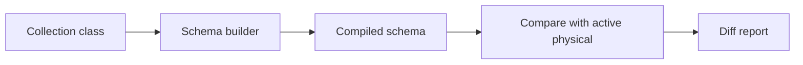
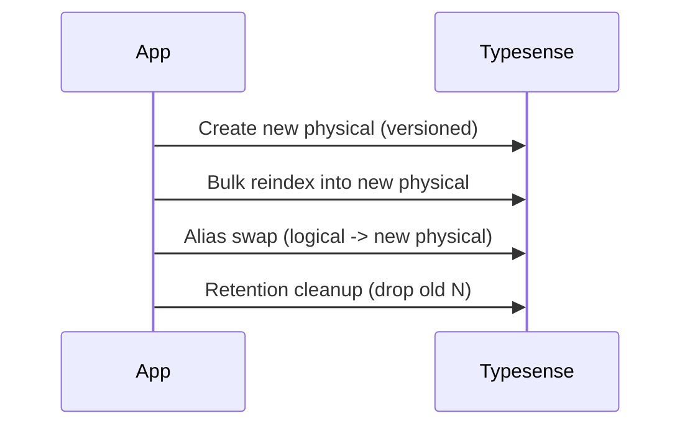

Related: <a href="/projects/search-engine-for-typesense/cli">CLI</a>, <a href="/projects/search-engine-for-typesense/troubleshooting#schema">Troubleshooting → Schema</a>

The schema layer turns a model class (our DSL) into a Typesense-compatible schema hash and compares it to the live, currently aliased physical collection to surface drift.



## API

- <code>SearchEngine::Schema.compile(klass)</code> → returns a Typesense-compatible schema hash built from the DSL. Pure and deterministic (no network I/O).
- <code>SearchEngine::Schema.diff(klass)</code> → resolves alias → physical, fetches the live schema, and returns a structured diff plus a compact human summary.
- <code>SearchEngine::Schema.update!(klass)</code> → attempts an in-place schema patch (Typesense <code>PATCH /collections/:name</code>) when the diff only contains field additions/drops; returns <code>true</code> when the schema is already in sync or successfully patched.
- <code>SearchEngine::Schema.apply!(klass, force_rebuild: false)</code> → blue/green lifecycle (create new physical, reindex, swap alias, retention). By default it first tries <code>update!</code> and only falls back to blue/green when incompatible changes are detected. Returns `{ logical, new_physical, previous_physical, alias_target, dropped_physicals, action: :update|:rebuild }`.
- <code>SearchEngine::Schema.rollback(klass)</code> → swap alias back to previous retained physical; returns `{ logical, new_target, previous_target }`.

Both methods are documented with YARD. Keys are returned as symbols; empty/nil values are omitted. The returned schema is deeply frozen.

## In-place schema updates (Typesense v29+)

- <code>SearchEngine::Schema.update!(klass, client: ...)</code> inspects the live diff and issues a <code>PATCH /collections/:name</code> when the changes are limited to field additions or drops. Type changes, reference changes, or collection-level option differences automatically return <code>false</code>, signalling that a full blue/green rebuild is required.
- <code>klass.update_collection!</code> (available on every <code>SearchEngine::Base</code> subclass) is a convenience wrapper that logs console guidance and delegates to <code>Schema.update!</code>.
- <code>Schema.apply!(force_rebuild: false)</code> now attempts an in-place update first. Pass <code>force_rebuild: true</code> when you explicitly need to skip PATCH (for example, when you want a new physical even if only field additions are pending).

CLI tasks such as <code>bin/rails search_engine:schema:apply[Collection]</code> inherit the same behavior because they call <code>Schema.apply!</code> under the hood.

## Type mapping (DSL → Typesense)

- <strong>:string</strong> → <code>string</code>
- <strong>:integer</strong> → <code>int64</code> (chosen consistently for wider range)
- <strong>:float / :decimal</strong> → <code>float</code>
- <strong>:boolean</strong> → <code>bool</code>
- <strong>:time / :datetime</strong> → <code>int64</code> (epoch seconds)
- <strong>:time_string / :datetime_string</strong> → <code>string</code> (ISO8601 timestamps)
- Arrays like <code>[:string]</code> → <code>string[]</code>
- <strong>:auto</strong> (regex-style field names such as `".*_facet"`) → `auto`; enables Typesense auto schema detection and wildcard ingestion. The DSL enforces that `:auto` can only be used when the attribute name looks like a regex (contains metacharacters such as `*`, `.`, etc.).

### Array empty filtering (hidden fields)

When declaring an array attribute, you can enable automatic empty filtering by adding <code>empty_filtering: true</code>:

```ruby
attribute :promotion_ids, [:string], empty_filtering: true
```

Behavior:

- Schema includes a hidden boolean field <code>promotion_ids_empty</code>.
- The mapper auto-populates it per document as: <code>promotion_ids.nil? || promotion_ids.empty?</code>.
- Hidden fields are not exposed via public APIs or <code>inspect</code>; they are internal.

Constraints:

- <code>empty_filtering</code> is only valid for array types (e.g., <code>[:string]</code>); setting it on scalars raises an error.

Query rewrite:

- <code>.where(promotion_ids: [])</code> → <code>promotion_ids_empty:=true</code>
- <code>.where.not(promotion_ids: [])</code> → <code>promotion_ids_empty:=false</code>

Joins:

- For joined filters like `.joins(:brand).where(brand: { promotion_ids: [] })`, the rewrite applies only if the joined collection has <code>attribute :promotion_ids, [:string], empty_filtering: true</code> (hidden <code>$brand.promotion_ids_empty</code> exists). Otherwise an empty array remains invalid.

### System field: `doc_updated_at`

- Always present on every collection. **Cannot be disabled**—the gem automatically injects this field during document creation/upsert.
- Stored in Typesense as <code>int64</code> (epoch seconds). If declared in the model DSL, its type will be coerced to <code>int64</code> at compile time to ensure consistency.
- On hydration and console output, it is converted to a <code>Time</code> in the current timezone (uses <code>Time.zone</code> when available, falling back to <code>Time</code>).
- When using instance <code>attributes</code>, <code>:doc_updated_at</code> is returned as a <code>Time</code> object. Unknown fields remain available under <code>:unknown_attributes</code>.
- **Typesense limitation**: This field is required by Typesense for internal tracking. The gem enforces its presence to maintain compatibility.

## Collection options

If declared in the DSL in the future, the builder may include top-level options like <code>default_sorting_field</code>, <code>token_separators</code>, <code>symbols_to_index</code>. Today, these are omitted to avoid noisy diffs.

### Nested fields (auto-enabled)

- When any attribute is declared with type <code>:object</code> or <code>[:object]</code>, the schema compiler will automatically set <code>enable_nested_fields: true</code> at the collection level.
- This is required by Typesense to accept <code>object</code> / <code>object[]</code> field types; otherwise the server responds with <code>400 RequestMalformed</code>.
- The option is included in <code>Schema.apply!</code> create payloads and appears under <code>collection_options</code> in <code>Schema.diff</code>.
- If you don't need nested objects, consider flattening fields or storing JSON as a <code>:string</code>.

#### Declaring nested subfields

Declare subfields inline via the <code>nested:</code> option on the base attribute:

```ruby
attribute :retail_prices, [:object], nested: {
  current_price: :float,
  general_price: :float,
  current_discount_percent: :float,
  current_minimum_quantity: :integer,
  price_type: :string
}
```

Multiplicity rule:

- Base <code>:object</code> → subfields are scalars (<code>float</code>, <code>int64</code>, <code>string</code>).
- Base <code>[:object]</code> → subfields are arrays (<code>float[]</code>, <code>int64[]</code>, <code>string[]</code>).

See also: Typesense docs on <code>enable_nested_fields</code> in <code>collections.create</code> (<code>typesense.org</code>).

## Diff shape

```text
{
  collection: { name: String, physical: String },
  added_fields: [ { name: String, type: String }, ... ],
  removed_fields: [ { name: String, type: String }, ... ],
  changed_fields: { "field" => { "type" => [compiled, live] } },
  collection_options: { /* option => [compiled, live] */ }
}
```

- Field comparison is name-keyed and order-insensitive.
- Only changed keys appear under <code>changed_fields</code>.
- When the live collection is missing, <code>added_fields</code> contain all compiled fields and <code>collection_options</code> includes <code>live: :missing</code>.

## Pretty print

The human summary includes:

- <strong>Header</strong>: logical and physical names
- <strong>+ Added fields</strong>: <code>name:type</code>
- <strong>- Removed fields</strong>: <code>name:type</code>
- <strong>~ Changed fields</strong>: <code>field.attr compiled→live</code>
- <strong>~ Collection options</strong>: shown only when differing

Example (no changes):

```text
Collection: products
No changes
```

## Lifecycle (Blue/Green with retention)



- Physical name format: <code>"#{logical}_YYYYMMDD_HHMMSS_###"</code> (3-digit zero-padded sequence).
- Alias equals the logical name (e.g., <code>products</code>). Swap is performed via a single upsert call, which the server handles atomically.
- Idempotent: if alias already points to the new physical, swap is a no-op.
- Reindexing is required. Provide a block to <code>apply!</code> or implement <code>klass.reindex_all_to(physical_name)</code> to perform bulk import. On failure, no alias swap occurs and the new physical remains for inspection.

<Info>
  Creating a physical collection manually, importing into it, and calling <code>Client#upsert_alias</code> directly will NOT trigger retention cleanup. Old physical collections remain until removed explicitly. Retention cleanup only runs as part of <code>Schema.apply!</code> (and the <code>search_engine:schema:apply[...]</code> task), after a successful alias swap.
</Info>

### Retention

- Global default: keep none.

```ruby
SearchEngine.configure { |c| c.schema.retention.keep_last = 0 }
```

- Per-collection override:

```ruby
class SearchEngine::Book < SearchEngine::Base
  schema_retention keep_last: 2
end
```

After a successful swap, older physicals that match the naming pattern and are not the alias target are ordered by embedded timestamp (desc). Everything beyond the first <code>keep_last</code> is deleted. The alias target is never deleted.

Typical operational pattern:

1. Run <code>schema:apply</code> (or <code>Schema.apply!</code>) to create a new physical, import, swap alias, then drop old physicals per retention.
2. Avoid manual create/import/alias routines in production unless you also implement a cleanup step; otherwise, old physicals will accumulate.

### Rollback

<code>SearchEngine::Schema.rollback(klass)</code> will swap the alias back to the most recent retained physical (behind the current). If no previous physical exists, it raises an error (e.g., when <code>keep_last</code> is 0). No collections are deleted during rollback.

See also: <a href="/projects/search-engine-for-typesense/client">Client</a>, <a href="/projects/search-engine-for-typesense/configuration">Configuration</a>, and <a href="/projects/search-engine-for-typesense/compiler">Compiler</a>.

## Troubleshooting

- <strong>Reindex step missing</strong>: Provide a block to <code>apply!</code> or implement <code>klass.reindex_all_to(name)</code>.
- <strong>Retention errors</strong>: Ensure <code>keep_last</code> is set appropriately; rollback requires a previous retained physical.

Backlinks: <a href="https://github.com/lstpsche/search-engine-for-typesense#readme" target="_blank">README</a>, <a href="/projects/search-engine-for-typesense/indexer">Indexer</a>


