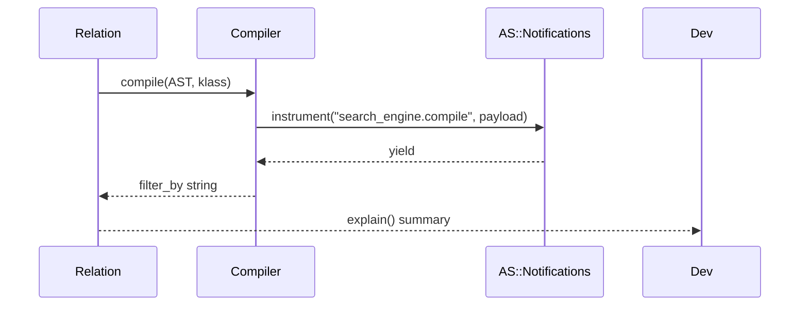

Related: <a href="/projects/search-engine-for-typesense/v29/compiler">Compiler</a>, <a href="/projects/search-engine-for-typesense/v29/dx">DX</a>

Add compile-time instrumentation and a developer-friendly introspection helper for relations.

- <code>search_engine.compile</code>: emitted around AST → Typesense params compilation.
- <code>Relation#explain</code>: prints a concise summary of chainers and compiled params without network calls.

## `search_engine.compile`

Emitted by <code>SearchEngine::Compiler.compile</code> for every AST compilation. Payload fields are minimal and redacted-safe:

- <code>collection</code>: Typesense collection name when resolvable, else nil
- <code>klass</code>: model class name when provided, else nil
- <code>node_count</code>: total AST node count compiled
- <code>duration_ms</code>: elapsed time in milliseconds (float)
- <code>source</code>: <code>:ast</code>

Subscribe example:

```ruby
ActiveSupport::Notifications.subscribe('search_engine.compile') do |*args|
  ev = ActiveSupport::Notifications::Event.new(*args)
  # ev.payload => { collection:, klass:, node_count:, duration_ms:, source: :ast }
end
```

See also: <a href="/projects/search-engine-for-typesense/v29/dx">DX</a>.

## `Relation#explain`

Summarizes the relation state by compiling params locally. No HTTP requests are performed.

- <strong>where</strong>: humanized <code>filter_by</code> with AND/OR/IN/NOT IN tokens
- <strong>order</strong>: joined <code>sort_by</code> (comma-separated)
- <strong>select</strong>: <code>include_fields</code>
- <strong>page/per</strong>: shows when present (supports <code>page/per</code> and <code>limit/offset</code> fallback)

Usage:

```ruby
rel = Book.all.where(active: true).where(author_id: [1,2]).order(updated_at: :desc).page(2).per(20)
puts rel.explain
```

Sample output:

```text
SearchEngine::Book Relation
  where: active:=true AND author_id NOT IN [1, 2]
  order: updated_at:desc
  select: id,name
  page/per: 2/20
```

Options:

- <code>to: :stdout</code> — also prints the summary to STDOUT (default: return-only)

Caveats:

- Does not include secrets or full query bodies. <code>q</code> is not shown; API keys are never included.

## Compile timeline



Backlinks: <a href="/projects/search-engine-for-typesense/v29/index">Home</a> · <a href="/projects/search-engine-for-typesense/v29/dx">DX</a> · <a href="/projects/search-engine-for-typesense/v29/compiler">Compiler</a>


