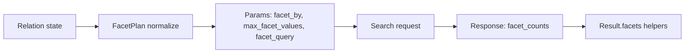

Faceting lets you present category-like distributions for fields alongside search results. This page describes the DSL, compiler mapping to Typesense params, and result helpers.

## DSL usage

Use chainable, immutable methods on <code>Relation</code>:

```ruby
rel = SearchEngine::Book
  .facet_by(:author_id, max_values: 20)
  .facet_by(:category, sort: :count)
  .facet_query(:price, "[0..9]", label: "under_10")
```

Notes:

- <code>facet_by(field, max_values: nil)</code> adds a field to the facets list. If specified multiple times, fields are de‑duplicated by first occurrence.
- <code>facet_query(field, expr, label: nil)</code> adds a client‑labeled query bucket. Labels are attached client‑side in <code>Result#facets</code>.
- Relation stays immutable; each call returns a new instance.

## Compiler mapping

- Fields → <code>facet_by</code>: comma‑separated list in first‑mention order; duplicates removed.
- Caps → <code>max_facet_values</code>: Typesense supports a single global cap; we compile the maximum of requested per‑call caps.
- Queries → <code>facet_query</code>: compiled as a comma‑separated list of <code>"field:expr"</code> tokens.
- Sorting/statistics: not emitted. If provided, you’ll get a compile‑time error with a hint.



## Supported options

- <code>facet_by(field, max_values: nil)</code>: supports base fields only. Per‑field caps are normalized to a single <code>max_facet_values</code> by choosing the maximum request.
- <code>facet_query(field, expr, label: nil)</code>: basic validation for non‑empty strings and balanced range brackets (e.g., <code>"[0..9]"</code>).
- Unsupported: <code>sort</code>, <code>stats</code>. Attempting to use them raises with <code>docs/faceting.md#supported-options</code> anchor in the error.

## Result helpers

- <code>Result#facets</code> → `{ "author_id" => [ { value:, count:, highlighted:, label: }, ... ] }`
- <code>Result#facet_values(name)</code> → array of value/count hashes for a field.
- <code>Result#facet_value_map(name)</code> → convenience `{ value => count }` hash.

Labels from <code>facet_query</code> are attached to buckets whose <code>value</code> exactly equals the declared expression.

## DX & explain

- <code>rel.dry_run!</code> and <code>rel.explain</code> include facet params preview: <code>facet_by</code>, <code>max_facet_values</code>, and <code>facet_query</code>.
- Observability redaction masks only sensitive values; facet params are left intact for clarity.

## Backlinks

- See <a href="/projects/search-engine-for-typesense/v29/relation-reference">Relation Guide</a> for general DSL patterns.
- See <a href="/projects/search-engine-for-typesense/v29/dx">DX</a> for dry‑run and explain helpers.
- See <a href="/projects/search-engine-for-typesense/v29/joins-selection-grouping">JOINs, Selection & Grouping</a> for grouping interactions.
- See <a href="/projects/search-engine-for-typesense/v29/field-selection">Field selection</a> for attribute guardrails.


