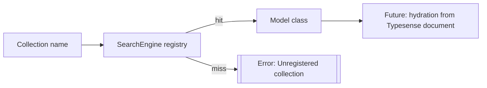

Related: <a href="/projects/search-engine-for-typesense/v29/relation">Relation</a>, <a href="/projects/search-engine-for-typesense/v29/materializers">Materializers</a>, <a href="/projects/search-engine-for-typesense/v29/upsert">Upsert</a>

## Models and the Collection Registry

<strong>SearchEngine</strong> provides a minimal model layer to prepare for future hydration of Typesense documents into Ruby objects. A thread-safe registry maps Typesense collection names to model classes.

- <strong>Registry</strong>: <code>SearchEngine.register_collection!(name, klass)</code> and <code>SearchEngine.collection_for(name)</code>
- <strong>Base class</strong>: <code>SearchEngine::Base</code> with <code>collection</code> and <code>attribute</code> macros

### Declare a model

```ruby
class SearchEngine::Book < SearchEngine::Base
  collection :books

  # id is reserved and is not declared via `attribute`
  attribute :title, :string
end
```

### Lookup

```ruby
SearchEngine.collection_for(:books)
#=> SearchEngine::Book
```

#### Convenience: find by id

```ruby
SearchEngine::Book.find("BOOK-1")
# same as:
SearchEngine::Book.find_by(id: "BOOK-1")
```

Note: <code>.find</code> is available on the model class only; it is not delegated to relations.

### Errors

- Unknown collection: raises <code>ArgumentError</code> with a helpful message
- Duplicate registration: re-registering the same mapping is a no-op; attempting to map a collection to a different class raises <code>ArgumentError</code>

### Document identity (identify_by)

Every Typesense document must include a unique String <code>id</code>. The gem computes this
automatically per record and injects it during indexing.

<Warning>
  When <code>source</code> is not <code>:active_record</code>, you must define
  <code>identify_by</code>. SQL and lambda sources yield rows that do not expose
  <code>id</code>, and the mapper ignores any <code>id</code> returned from <code>map</code>.
  See <a href="/projects/search-engine-for-typesense/v29/troubleshooting">Troubleshooting</a> for
  missing id errors during indexing.
</Warning>

- Default: <code>record.id.to_s</code>
- Override with <code>identify_by</code>:

```ruby
class SearchEngine::Book < SearchEngine::Base
  collection :books

  # Use a method name on the source record
  identify_by :isbn

  # or a custom proc
  # identify_by ->(r) { "#{r.publisher_id}-#{r.id}" }

  index do
    source :active_record, model: ::Book
    map do |r|
      { title: r.title } # any provided :id here will be ignored
    end
  end
end
```

Rules and behavior:

- <code>attribute :id, ...</code> is invalid and raises. Use <code>identify_by</code>.
- Any <code>id</code> returned from <code>index -> map</code> is ignored.
- Inspect output renders <code>id</code> first regardless of whether it was declared.
- **Precedence order**: When creating/upserting documents, the id is resolved as:
  (1) explicit <code>:id</code> attribute provided, (2) <code>identify_by</code> strategy
  result, (3) <code>record.id.to_s</code> fallback (ActiveRecord sources only).
- **String coercion**: All IDs are coerced to strings internally (Typesense requirement). The gem handles this automatically.

### System field: `doc_updated_at`

- Always injected on create/upsert/update (epoch seconds).
- If declared via `attribute`, its type is coerced to `int64` during schema compilation.
- Hydration converts it to `Time` (uses `Time.zone` when present).
- Cannot be disabled; Typesense requires it for tracking.

### Creating documents

Use <code>Model.create(attrs)</code> to insert a single document into the backing collection and get a hydrated instance back.

```ruby
class SearchEngine::Book < SearchEngine::Base
  collection :books
  attribute :title, :string
  identify_by :isbn
end

book = SearchEngine::Book.create(title: "The Ruby Guide", isbn: "978-1234567890")
#=> #<SearchEngine::Book @id="978-1234567890" @title="The Ruby Guide" @doc_updated_at=...>
```

Notes:

- Validates required fields (respects <code>optional:</code>). Unknown fields are rejected when <code>mapper.strict_unknown_keys</code> is enabled.
- Automatically sets <code>doc_updated_at</code> and hidden flags (`*_empty`, `*_blank`) when present in schema.
- <code>:id</code> may be provided explicitly; otherwise it is computed via <code>identify_by</code>. If absent, Typesense may generate one.
- By default, targets the alias (logical) collection; pass <code>into: "physical_name"</code> to override.

### Updating documents

Use <code>record.update(attrs)</code> to partially update fields of a hydrated record in Typesense.

```ruby
book = SearchEngine::Book.find("978-1234567890")
book.update(title: "New Title", price: 19.99)
# => 1
```

Notes:

- Updates are partial; only provided fields are sent.
- Requires the record to have an <code>id</code> (hydrated or computable).
- Returns <code>1</code> on success, <code>0</code> on failure (failures are logged).
- Accepts <code>into:</code>, <code>partition:</code>, <code>timeout_ms:</code>, and <code>cascade:</code> options.

### Mapping source data to model instances (`.from`)

Use <code>Model.from(data, mode: :instance)</code> to map source data (ActiveRecord instances or SQL results) onto the model's schema and return hydrated instances or hashes. This uses the same mapping logic defined in your <code>index</code> DSL but does not make any Typesense API calls.

The method accepts input corresponding to your configured source type:

- <strong><code>:active_record</code> source</strong>: Accepts an ActiveRecord instance or an Array of instances. Output preserves input shape (single instance → single instance, array → array).
- <strong><code>:sql</code> source</strong>: Accepts a SQL String, executes it internally to fetch rows, and always returns an Array of results (even when a single row is returned).

#### ActiveRecord source examples

```ruby
class SearchEngine::Book < SearchEngine::Base
  collection :books
  attribute :title, :string
  attribute :author_id, :integer

  index do
    source :active_record, model: ::Book
    map do |r|
      { title: r.title, author_id: r.author_id }
    end
  end
end

# Single instance → single instance
book = SearchEngine::Book.from(::Book.first)
#=> #<SearchEngine::Book @id="1" @title="The Ruby Guide" @author_id=123>

# Array → array
books = SearchEngine::Book.from([::Book.first, ::Book.second])
#=> [#<SearchEngine::Book ...>, #<SearchEngine::Book ...>]
```

#### SQL source examples

```ruby
class SearchEngine::Book < SearchEngine::Base
  collection :books
  attribute :title, :string
  attribute :author_id, :integer
  identify_by ->(row) { row['id'] }

  index do
    source :sql, sql: "SELECT id, title, author_id FROM books"
    map do |row|
      { title: row['title'], author_id: row['author_id'] }
    end
  end
end

# SQL always returns an array, even for single-row results
books = SearchEngine::Book.from("SELECT id, title, author_id FROM books WHERE id = 1")
#=> [#<SearchEngine::Book @id="1" @title="The Ruby Guide" @author_id=123>]
```

#### Hash mode

Pass <code>mode: :hash</code> to return <code>HashWithIndifferentAccess</code> documents instead of model instances. This is useful when you need raw hash data or want to avoid hydration overhead.

```ruby
# Returns HashWithIndifferentAccess with both symbol and string keys
doc = SearchEngine::Book.from(::Book.first, mode: :hash)
#=> {"id"=>"1", :id=>"1", "title"=>"The Ruby Guide", :title=>"The Ruby Guide", ...}

# Access with either key type
doc[:title]   #=> "The Ruby Guide"
doc['title']  #=> "The Ruby Guide"
```

#### Behavior and validation

- <strong>Mapping</strong>: Uses the same <code>map</code> block and schema validation as defined in your <code>index</code> DSL.
- <strong>No Typesense calls</strong>: This method only performs local mapping and validation; it does not interact with Typesense.
- <strong>Schema validation</strong>: Validates mapped documents against the compiled schema (required fields, types, etc.).
- <strong>Shape preservation</strong>: For ActiveRecord sources, single input → single output, array input → array output. For SQL sources, output is always an array.
- <strong>Source requirement</strong>: The model must have a <code>source</code> defined in its <code>index</code> DSL (<code>:active_record</code> or <code>:sql</code>). Models using only <code>partition_fetch</code> without a <code>source</code> declaration will raise an error.

#### Error cases

- Missing mapper: Raises <code>SearchEngine::Errors::InvalidParams</code> if no <code>map</code> block is defined.
- Missing source: Raises <code>SearchEngine::Errors::InvalidParams</code> if no <code>source</code> is defined in the <code>index</code> DSL.
- Invalid mode: Raises <code>SearchEngine::Errors::InvalidOption</code> if <code>mode</code> is not <code>:instance</code> or <code>:hash</code>.
- Type mismatch: For ActiveRecord sources, raises <code>SearchEngine::Errors::InvalidParams</code> if input is not an instance of the configured model class.
- Unsupported source: Raises <code>SearchEngine::Errors::InvalidOption</code> for source types other than <code>:active_record</code> or <code>:sql</code>.

Backlinks: <a href="/projects/search-engine-for-typesense/v29/indexer">Indexer</a>, <a href="/projects/search-engine-for-typesense/v29/schema">Schema</a>

### Custom instance methods

Hydrated results are instances of your model class, so any instance methods you define are available on results.

```ruby
class SearchEngine::Publisher < SearchEngine::Base
  collection :publishers

  attribute :category_id, :integer

  index do
    # ... indexation logic ...
  end

  def category_name
    @category_name ||= ::Category.find_by(id: category_id).name
  end
end

SearchEngine::Publisher.first.category_name
# => "Technical Publishing"
```

Notes:

- Declared attributes get <code>attr_reader</code>s automatically (e.g., <code>category_id</code>).
- Boolean attributes automatically get a question-mark alias method (e.g., <code>available?</code> for <code>attribute :available, :boolean</code>).
- See also: <a href="/projects/search-engine-for-typesense/v29/relation">Relation</a>, <a href="/projects/search-engine-for-typesense/v29/materializers">Materializers</a>

### Instance association readers (joins)

When you declare <code>belongs_to</code>, <code>has_one</code>, or <code>has_many</code> on a model, an instance method with the same name is defined to resolve referenced records:

- <code>belongs_to :author</code> → <code>book.author</code> returns a single record or <code>nil</code>.
- <code>has_many :orders</code> → <code>book.orders</code> returns a chainable <code>Relation</code>.

See details and examples in <a href="/projects/search-engine-for-typesense/v29/joins#instance-association-readers-ar-like-hop">Joins</a>.

### Inheritance

Attributes declared in a parent class are inherited by subclasses. A subclass may override an attribute by redeclaring it:

```ruby
class SearchEngine::Item < SearchEngine::Base
  attribute :name, :string
end

class SearchEngine::Book < SearchEngine::Item
  attribute :name, :text # overrides only for Book
end
```

### Flow (registry lookup)



See also: <a href="/projects/search-engine-for-typesense/v29/materializers">Materializers</a>.

### Thread-safety and reload-friendliness

The collection registry uses a copy-on-write Hash guarded by a small Mutex. Reads are lock-free and writes are atomic, which makes it safe under concurrency and friendly to Rails code reloading in development.

See also: <a href="/projects/search-engine-for-typesense/v29/relation">Relation</a>.

## Nested fields (object / object[])

When you need to store nested objects:

- Declare the base attribute as <code>:object</code> (single) or <code>[:object]</code> (array of objects).
- Prefer declaring subfields inline via the <code>nested:</code> option on <code>attribute</code>.

Rules:

- If base is <code>:object</code>, subfields compile to scalar Typesense types (e.g., <code>float</code>).
- If base is <code>[:object]</code>, subfields compile to array Typesense types (e.g., <code>float[]</code>).
- The schema compiler auto-enables <code>enable_nested_fields</code> at collection level when any object/object[] is present.

Example (inline nested):

```ruby
class SearchEngine::Book < SearchEngine::Base
  collection :books

  attribute :prices, [:object], nested: {
    current_price: :float,
    list_price: :float,
    discount_percent: :float,
    minimum_quantity: :integer,
    price_type: :string,
    start_date: :string,
    end_date: :string
  }
end
```

Backlinks: <a href="/projects/search-engine-for-typesense/v29/schema">Schema</a>, <a href="/projects/search-engine-for-typesense/v29/index">Home</a>

## Model scopes (ActiveRecord-like)

Define reusable, chainable scopes on your model. Scopes are evaluated against a fresh Relation (<code>all</code>) and must return a <code>SearchEngine::Relation</code>.

```ruby
class SearchEngine::Book < SearchEngine::Base
  collection :books

  scope :published, -> { where(published: true) }
  scope :featured, -> { where(published: true, featured: true) }
  scope :by_publisher, ->(publisher_id) { where(publisher_id: publisher_id) }
end

# Usage
SearchEngine::Book
  .published
  .featured
  .by_publisher(params[:publisher_id])
  .search(params[:search_query])
```

Notes:

- Scopes are class methods created by `scope :name, -&gt;{ ... }`.
- The block is executed with <code>self</code> set to a fresh Relation; return a Relation (or <code>nil</code> to fallback to <code>all</code>).
- You can pass parameters to scopes (e.g., <code>by_store(id)</code>).

## Per‑model default `query_by`

You can set a default <code>query_by</code> for a collection at the model level. This value participates in the usual precedence: relation options override model default, which overrides global config (<code>SearchEngine.config.default_query_by</code>).

```ruby
class SearchEngine::Book < SearchEngine::Base
  collection :books
  query_by :title, :description
  # also accepts a comma string: query_by "title, description"
end

# Effective precedence inside compile
# relation.options(query_by: ...) > model.query_by > config.default_query_by
```

Return value on write is <code>self</code> to allow macro chaining; when called with no arguments it returns the canonical comma‑separated String or <code>nil</code> if unset.

Backlinks: <a href="/projects/search-engine-for-typesense/v29/configuration">Configuration</a>, <a href="/projects/search-engine-for-typesense/v29/relation">Relation</a>

## Attribute options reference

Attributes accept additional options to influence schema and query behavior.

```ruby
class SearchEngine::Article < SearchEngine::Base
  collection :articles

  attribute :title, :string, sort: true, optional: false, infix: true
  attribute :tags,  [:string], empty_filtering: true
  attribute :name,  :string, locale: "en"
  attribute :category, :string, facet: true
  attribute :published, :boolean
end
```

### Boolean attribute question-mark aliases

When you declare a boolean attribute, a question-mark alias method is automatically created for convenient predicate-style access:

```ruby
class SearchEngine::Article < SearchEngine::Base
  collection :articles

  attribute :published, :boolean
  attribute :featured, :boolean
end

article = SearchEngine::Article.from_document(
  id: '1',
  published: true,
  featured: false
)

# Both forms work identically
article.published   # => true
article.published? # => true

article.featured   # => false
article.featured?  # => false
```

The question-mark alias is a simple method alias; it returns the same value as the regular reader with no additional logic. Only attributes declared with type <code>:boolean</code> (not array types like <code>[:boolean]</code>) receive this alias.

Supported options and constraints:

- <code>locale: String</code> — only for <code>:string</code> or <code>[:string]</code> attributes.
- <code>sort: true|false</code> — mark field sortable in schema.
- <code>optional: true|false</code> — marks field optional; enables <code>&lt;name&gt;_blank</code> flag in schema.
- <code>infix: true|false</code> — enable Typesense infix for this field in schema.
- <code>empty_filtering: true|false</code> — only for array types (e.g., <code>[:string]</code>); enables <code>&lt;name&gt;_empty</code> hidden field for safe empty‑array filtering.
- <code>facet: true|false</code> — mark field as facetable in schema for faceted search/filtering.
- <code>index: true|false</code> — when <code>false</code>, the field is omitted from the compiled Typesense schema. You may still send the field in documents; Typesense stores it and returns it with hits, but it is not indexed in memory. Nested subfields under an unindexed base object are also omitted from schema.

Example (display‑only attribute that is not indexed):

```ruby
class SearchEngine::Article < SearchEngine::Base
  collection :articles

  attribute :slug, :string
  attribute :headline, :string
  attribute :body_html, :string, index: false # stored & returned, but not indexed
end

# Articles#create/upsert may include :body_html, and hydrated results render it in console output/inspect like any other declared attribute.
```

See also how these options appear in the compiled schema and diffs in <a href="/projects/search-engine-for-typesense/v29/schema">Schema</a> (keys: <code>locale</code>, <code>sort</code>, <code>optional</code>, <code>infix</code>).

### Declaring nested subfields with `nested`

As an alternative to inline <code>nested:</code> on <code>attribute</code>, you can declare subfields after the base attribute is defined as <code>:object</code> or <code>[:object]</code>:

```ruby
attribute :prices, [:object]
nested :prices,
  current_price: :float,
  price_type: :string
```

When the base is <code>:object</code>, nested subfield types are scalar (e.g., <code>:float</code>). When the base is <code>[:object]</code>, nested subfield types are arrays (e.g., <code>[:float]</code>).

Backlinks: <a href="/projects/search-engine-for-typesense/v29/schema">Schema</a>, <a href="/projects/search-engine-for-typesense/v29/field-selection">Field Selection</a>, <a href="/projects/search-engine-for-typesense/v29/indexer">Indexer</a>
