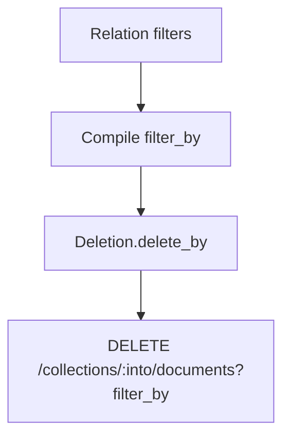

Related: <a href="/projects/search-engine-for-typesense/v30.1/indexer">Indexer</a>, <a href="/projects/search-engine-for-typesense/v30.1/cli">CLI</a>, <a href="/projects/search-engine-for-typesense/v30.1/troubleshooting">Troubleshooting</a>

Delete documents by filter from a collection. Use relation‑level convenience for “delete what I just filtered”, model‑level helpers for ad‑hoc deletes, or the low‑level API when you need full control.

<Info>
  <strong>Safety</strong>: With no filters, relation deletion uses a safe match‑all filter <code>id:!=null</code>. Prefer targeted filters; consider <a href="/projects/search-engine-for-typesense/v30.1/indexer#stale-deletes">Indexer → Stale Deletes</a> for recurring cleanup flows with guardrails.
</Info>

## Relation‑level: delete_all

```ruby
# Delete all published=false books (compiled to filter_by)
SearchEngine::Book.where(published: false).delete_all

# Override physical collection and partition context if needed
SearchEngine::Book
  .where(publisher_id: 123)
  .delete_all(into: "books_20251011_120000_001", partition: 123, timeout_ms: 5_000)
```

- Compiles current <code>where</code> AST to <code>filter_by</code> and sends <code>DELETE /documents</code>.
- When the relation has no predicates, falls back to <code>id:!=null</code> (match‑all).
- Options:
  - <code>into:</code> physical collection name (skip alias resolution)
  - <code>partition:</code> forwarded to the resolver (see below)
  - <code>timeout_ms:</code> read timeout override for the delete call

### Flow



## Model‑level: delete_by

Use either a filter string or a Hash that will be converted safely.

```ruby
# String form
SearchEngine::Book.delete_by("archived:=true && publisher_id:=123")

# Hash form (converted via Sanitizer)
SearchEngine::Book.delete_by(archived: true, publisher_id: 123)

# With options
SearchEngine::Book.delete_by(
  { archived: true }, into: "books_20251011_120000_001", partition: 123, timeout_ms: 2_000
)
```

Rules:

- Provide either a non‑blank String or a non‑empty Hash. An empty input raises.
- <code>into:</code> overrides the target physical collection.
- <code>partition:</code> is passed to the resolver (see next section).
- Return value is the number of deleted documents the server reports.

## Instance‑level: delete (single record)

Delete a single hydrated record by its document id.

```ruby
book = SearchEngine::Book.find_by(book_id: 123123)
book.delete # => 1 when deleted, 0 when nothing matched

# Options (parity with relation delete_all)
book.delete(into: "books_20251011_120000_001", partition: 123, timeout_ms: 2_000)
```

Notes:

- The record id is taken from hydrated <code>id</code> when present, otherwise computed via the model’s <code>identify_by</code> strategy.
- If the id cannot be determined, an error is raised.
- Calling <code>delete</code> on a Relation is not supported; use <code>delete_all</code>.

## Low‑level helper: SearchEngine::Deletion.delete_by

```ruby
SearchEngine::Deletion.delete_by(
  klass: SearchEngine::Book,
  filter: "archived:=true",
  into: nil, partition: nil, timeout_ms: nil
)
```

### Into resolution

The target collection is resolved in order:
- Explicit <code>into:</code> option when provided
- Contextual <code>into</code> from instrumentation (used during schema apply/indexation)
- <code>SearchEngine.config.partitioning.default_into_resolver</code> if configured
- Fallback to the model’s logical collection name (<code>klass.collection</code>)

This allows deletes to target a just‑created physical during blue/green apply before the alias is swapped.

### Timeouts

<code>timeout_ms:</code> overrides the read timeout. When omitted, it falls back to
<code>SearchEngine.config.stale_deletes.timeout_ms</code> when set; otherwise the client default is used.

## When to use Indexer stale deletes

Prefer <a href="/projects/search-engine-for-typesense/v30.1/indexer#stale-deletes">Indexer → Stale Deletes</a> when you routinely delete by a known filter. It offers:

- Centralized <code>stale</code> rules on the model (declared inside <code>index</code>)
- Strict‑mode guardrails to block suspicious catch-alls
- Optional estimation and events for observability

Use relation/model deletion for one‑off cleanup or admin tooling where you have the exact filter already.

## Troubleshooting

- Empty input: <code>delete_by</code> requires a filter string or a non‑empty hash
- Deleted 0 docs unexpectedly: check <code>into:</code> (physical vs alias) and filter
- Partitioned setups: pass <code>partition:</code> so your resolver can pick a target
- Timeouts: increase <code>timeout_ms</code> for large deletes

Backlinks: <a href="/projects/search-engine-for-typesense/v30.1/index">Home</a>, <a href="/projects/search-engine-for-typesense/v30.1/cli">CLI</a>, <a href="/projects/search-engine-for-typesense/v30.1/indexer">Indexer</a>, <a href="/projects/search-engine-for-typesense/v30.1/troubleshooting">Troubleshooting</a>


