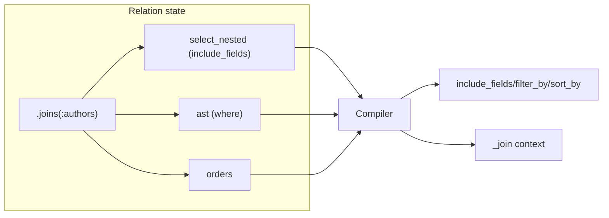
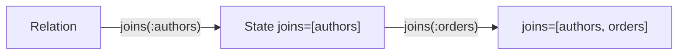

Related: <a href="/projects/search-engine-for-typesense/v30.1/observability">Observability</a>, <a href="/projects/search-engine-for-typesense/v30.1/field-selection">Field selection</a>, <a href="/projects/search-engine-for-typesense/v30.1/troubleshooting#joins">Troubleshooting → Joins</a>, <a href="/projects/search-engine-for-typesense/v30.1/references-joins-deep-dive">References & JOINs — Deep dive</a>

Server‑side joins require lightweight association metadata declared on your model class. This page documents the model‑level DSL, the per‑class registry, how the relation compiles joined selections/filters/sorts, and the instrumentation emitted during compile. It also documents the client‑side fallback for shared‑key joins when a Typesense reference is unavailable.

See example: <code>examples/demo_shop/app/controllers/books_controller.rb</code>.

## Overview

- <strong>Declare</strong> associations on your model with <code>belongs_to :name</code>, <code>has_one :name</code>, and <code>has_many :name</code> (options: <code>collection:</code>, <code>local_key:</code>, <code>foreign_key:</code>; <code>async_ref:</code> for belongs_to).
- <strong>Select</strong> joins in queries with <code>Relation#joins(*assocs)</code>; names validated against the model’s registry.
- <strong>Use</strong> nested include fields for joined collections; <code>where</code>/<code>order</code> can target joined fields using <code>$assoc.field</code>.
- <strong>Observe</strong> compile‑time summaries via <code>search_engine.joins.compile</code> without exposing raw literals.



## DSL

Declare associations on your model using <code>belongs_to</code> / <code>belongs_to_many</code> / <code>has_one</code> / <code>has_many</code>:

```ruby
class SearchEngine::Book < SearchEngine::Base
  collection "books"
  attribute :id, :integer
  attribute :author_id, :string  # Reference fields must be :string or [:string]

  # Auto‑resolve keys for a one‑to‑one/one‑to‑many style link
  belongs_to :author

  # For outgoing has‑style links (deterministic)
  has_many :orders, foreign_key: :book_id
end
```

- <code>name</code> (Symbol/String): logical association name.
- <code>collection</code> (Symbol/String): target Typesense collection name (auto‑resolved from <code>name</code>).
- <code>local_key</code> (Symbol/String): local attribute used as the join key (auto‑resolved; overrideable).
- <code>foreign_key</code> (Symbol/String): foreign key in the target collection (auto‑resolved; overrideable).
- <code>async_ref</code> (Boolean, belongs_to / belongs_to_many only): mark the reference asynchronous in schema.

### Declaring references

When declaring a <code>belongs_to</code> or <code>belongs_to_many</code> association, the <code>local_key</code> attribute must be declared with type <code>:string</code> or <code>[:string]</code> in your model. Typesense requires reference fields to be strings, and the schema compiler validates this during compilation.

```ruby
class SearchEngine::Order < SearchEngine::Base
  collection :orders

  # Reference fields must be :string or [:string]
  attribute :customer_id, :string
  attribute :book_ids, [:string]  # Array of references

  belongs_to :customer, local_key: :customer_id
  belongs_to_many :books, local_key: :book_ids
end
```

If you declare a reference field with a different type (e.g., <code>:integer</code>), schema compilation will raise an error with guidance to update the attribute declaration.

### Auto‑resolution rules

- <strong>belongs_to / belongs_to_many</strong> (association‑name based):
  - <code>collection</code>: plural of the first argument
  - <code>local_key</code>: <code>singular(name)_ids</code> when the argument is plural; else <code>singular(name)_id</code>
  - <code>foreign_key</code>: <code>singular(name)_id</code>
- <strong>has_one</strong> (deterministic):
  - <code>collection</code>: plural of the first argument
  - <code>local_key</code>: <code>&lt;current_singular&gt;_id</code>
  - <code>foreign_key</code>: <code>&lt;current_singular&gt;_id</code>
- <strong>has_many</strong> (deterministic):
  - <code>collection</code>: plural of the first argument
  - <code>local_key</code>: <code>&lt;current_singular&gt;_id</code>
  - <code>foreign_key</code>: <code>&lt;current_singular&gt;_ids</code>

Override defaults with explicit <code>collection:</code>, <code>local_key:</code>, or <code>foreign_key:</code>.

## Instance association readers (AR-like hop)

Declaring <code>belongs_to</code>, <code>belongs_to_many</code>, <code>has_one</code>, or <code>has_many</code> also defines an instance method with the same name that resolves referenced records using the join config.

Example:

```ruby
module SearchEngine
  class Author < Base
    collection :authors
    attribute :author_id, :integer
    attribute :category_id, :integer, optional: true

    belongs_to :category
    has_many :reviews, foreign_key: :author_ids
  end
end

module SearchEngine
  class Category < Base
    collection :categories
    attribute :category_id, :integer

    has_many :authors, foreign_key: :category_id
    has_many :reviews
  end
end

module SearchEngine
  class Review < Base
    collection :reviews
    identify_by :review_id
    attribute :book_id, :string  # Reference fields must be :string
    attribute :author_ids, [:string], empty_filtering: true  # Array references must be [:string]
    attribute :category_ids, [:string], empty_filtering: true

    belongs_to :authors, async_ref: true
    belongs_to :categories, async_ref: true
  end
end

author = SearchEngine::Author.take
author.category
# => #<SearchEngine::Category ...> or nil

author.reviews
# => #<SearchEngine::Relation [...]]> (chainable)

author.reviews.where(published: true)
# => #<SearchEngine::Relation [...]]>
```

Behavior:

- <strong>belongs_to</strong> (singular name): returns a single record via <code>find_by(foreign_key: local_value)</code>; returns nil when local value is nil.
- <strong>belongs_to</strong> (plural or when local value is an Array): returns a <code>Relation</code> scoped with <code>where(foreign_key: local_array)</code>; empty array yields an empty relation.
- <strong>has_one</strong> (any name): returns a single record via <code>find_by(foreign_key: local_value)</code>; returns nil when local value is nil.
- <strong>has_many</strong> (any name): always returns a <code>Relation</code> scoped with <code>where(foreign_key: local_value)</code>; nil local value yields an empty relation.
- <strong>belongs_to_many</strong> (any name): always returns a <code>Relation</code> scoped with <code>where(foreign_key: local_value)</code>; nil local value yields an empty relation. Use for shared-key one‑to‑many joins.

Notes:

- Methods are defined at declaration time; resolution uses the per‑class <code>join_for(:name)</code> and <code>SearchEngine.collection_for(cfg[:collection])</code>.
- Returned <code>Relation</code> is fully chainable (<code>where</code>, <code>order</code>, <code>joins</code>, etc.).
- Asynchronous belongs_to (<code>async_ref: true</code>) works the same; if the referenced target is missing, the singular call returns nil.

Backlinks: <a href="/projects/search-engine-for-typesense/v30.1/models">Models</a> · <a href="/projects/search-engine-for-typesense/v30.1/relation">Relation</a>

### Shared‑key example (generic)

```ruby
module SearchEngine
  class Order < Base
    collection :orders
    attribute :order_id, :integer

    # one order → many shipments via shared order_id
    belongs_to_many :shipments, local_key: :order_id, foreign_key: :order_id
  end
end

module SearchEngine
  class Shipment < Base
    collection :shipments
    attribute :order_id, :integer

    # reverse hop: many shipments → one order
    has_one :order, local_key: :order_id, foreign_key: :order_id
  end
end

# Filtering by a joined field
SearchEngine::Order
  .joins(:shipments)
  .where(shipments: { carrier: 'UPS' })
```

## Advanced behavior

- Client-side fallback can run when Typesense references are missing or shared keys are used.
- Asynchronous references are available via <code>async_ref: true</code> on <code>belongs_to</code>.

<Info>
  <strong>Quoting and type coercion</strong>: Joined-field values are coerced using the target model’s attribute types. If a joined field is typed as <code>:string</code>, numeric inputs are converted to strings and quoted in <code>filter_by</code> (e.g., <code>$calculated_products(store_id:="1070")</code>).
</Info>

<Note>
  See <a href="/projects/search-engine-for-typesense/v30.1/references-joins-deep-dive">References & JOINs — Deep dive</a> for full rules and caveats.
</Note>

## Relation Usage

Use <code>Relation#joins(*assocs)</code> to select join associations on a query. Names are validated against the model’s <code>joins_config</code> and stored in the relation’s immutable state in the order provided. Multiple calls append:

```ruby
SearchEngine::Book
  .joins(:authors, :orders)
  .where(authors: { last_name: "Rowling" })
  .where(orders: { total_price: 12.34 })
  .order(authors: { last_name: :asc })
```



- <code>joins</code> accepts symbols/strings; inputs are normalized to symbols.
- Unknown names raise <code>SearchEngine::Errors::UnknownJoin</code> with an actionable message that lists available associations.
- Order is preserved and duplicates are not deduped by default; explicit chaining is honored.
- For debugging, <code>rel.joins_list</code> returns the frozen array of association names in state.

Backlinks: <a href="/projects/search-engine-for-typesense/v30.1/index">Overview</a> · <a href="/projects/search-engine-for-typesense/v30.1/relation">Relation</a> · <a href="/projects/search-engine-for-typesense/v30.1/compiler">Compiler</a> · <a href="/projects/search-engine-for-typesense/v30.1/observability#observability">Observability</a> · <a href="/projects/search-engine-for-typesense/v30.1/field-selection">Field Selection</a>

## Filtering and Ordering on Joined Fields

With joins applied, you can reference joined collection fields in <code>where</code> and <code>order</code> using nested hashes. Joined left‑hand‑sides render as <code>$assoc.field</code>.

| Input (Ruby) | Compiled filter_by | Compiled sort_by |
| --- | --- | --- |
| `where(authors: { last_name: "Rowling" })` | <code>$authors.last_name:="Rowling"</code> | – |
| `where(orders: { total_price: 12.34 })` | <code>$orders.total_price:=12.34</code> | – |
| `order(authors: { last_name: :asc })` | – | <code>$authors.last_name:asc</code> |
| <code>order("$authors.last_name:asc")</code> | – | <code>$authors.last_name:asc</code> |

Notes:

- Base fields continue to work unchanged (e.g., <code>where(active: true)</code>).
- Mixed base and joined predicates interleave as usual; the compiler preserves grouping semantics.
- Raw <code>order</code> strings are accepted as‑is; ensure you supply valid Typesense fragments.

## Nested field selection for joined collections

You can select fields from joined collections using a nested Ruby shape. These compile to Typesense <code>include_fields</code> with <code>$assoc(field,...)</code> segments.

```ruby
# Full relation example
SearchEngine::Book
  .joins(:authors)
  .include_fields(:id, :title, authors: [:first_name, :last_name])
```

Compiles to:

```
$authors(first_name,last_name),id,title
```

- <strong>Input types</strong>: mix base fields (<code>:id, "title"</code>) and nested hashes (<code>authors: [:first_name, :last_name]</code>).
- <strong>Merging</strong>: multiple calls merge and dedupe. First mention wins ordering; later calls append only new fields.

```ruby
# Merged across calls
SearchEngine::Book
  .include_fields(:id, authors: [:a])
  .include_fields(:title, authors: [:b, :a])
# => "$authors(a,b),id,title"
```

- <strong>Ordering policy</strong>: nested <code>$assoc(...)</code> segments are emitted first in association first-mention order, then base fields.
- <strong>Validation</strong>: association keys are validated against <code>klass.joins_config</code> (<code>UnknownJoin</code> on typos). Calling <code>.joins(:assoc)</code> before selecting nested fields is recommended; the compiler will still emit <code>$assoc(...)</code> even if <code>joins</code> wasn't chained yet.

### End-to-end example with filters and sort

```ruby
rel = SearchEngine::Book
  .joins(:authors)
  .include_fields(authors: [:first_name])
  .where(authors: { last_name: "Rowling" })
  .order(authors: { last_name: :asc })
rel.to_typesense_params
# => { q: "*", query_by: "name, description", include_fields: "$authors(first_name)", filter_by: "$authors.last_name:=\"Rowling\"", sort_by: "$authors.last_name:asc" }
```

Internals: the returned params also include a reserved <code>:_join</code> key with join context for downstream components. See <a href="/projects/search-engine-for-typesense/v30.1/compiler">Compiler</a> for the exact shape.

---

## Common pitfalls

- Declare every association on the model before using <code>.joins(:assoc)</code>.
- Use only single-hop paths like <code>$assoc.field</code>.
- Keep joined field names aligned with the target model attributes.

## Deep dives

- Reference fields and async refs: <a href="/projects/search-engine-for-typesense/v30.1/references-joins-deep-dive">References & JOINs — Deep dive</a>
- Joined selection + grouping example: <a href="/projects/search-engine-for-typesense/v30.1/joins-selection-grouping">JOINs, Selection, and Grouping</a>
- JOIN instrumentation and logs: <a href="/projects/search-engine-for-typesense/v30.1/observability">Observability</a>


