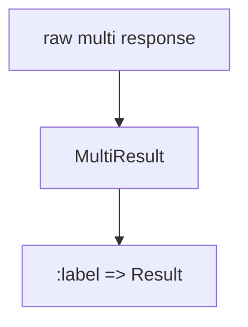
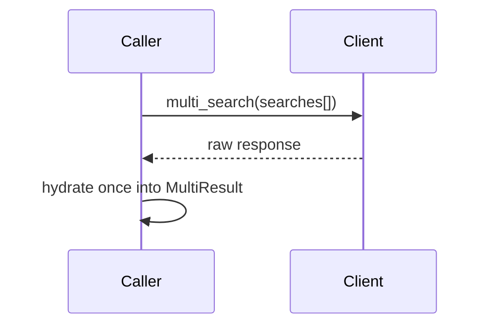

Related: <a href="/projects/search-engine-for-typesense/v30.1/client">Client</a>, <a href="/projects/search-engine-for-typesense/v30.1/multi-search-guide">Multi-search Guide</a>

## Federated multi-search

### Overview

Federate multiple labeled <code>Relation</code>s into a single Typesense multi-search request while preserving order and mapping results back to labels.

- <strong>Pure builder:</strong> collects labeled relations, no HTTP
- <strong>Order preserved:</strong> results map back in insertion order
- <strong>Unique labels:</strong> labels are case-insensitive and must be unique
- <strong>Common params:</strong> <code>common:</code> is shallow-merged into each per-search payload; per-search keys win
- <strong>No URL knobs in body:</strong> cache options are handled as URL/common params by the client

### DSL

```ruby
res = SearchEngine.multi_search(common: { query_by: SearchEngine.config.default_query_by }) do |m|
  m.add :books, Book.where(category_id: 5).select(:id, :name).per(10)
  m.add :publishers,   Publisher.where('name:~rud').per(5)
end

res[:books].found
res.dig(:publishers).to_a
res.labels #=> [:books, :publishers]
```

### Label rules

- Accepts <code>String</code> or <code>Symbol</code>
- Canonicalization: <code>label.to_s.downcase.to_sym</code>
- Must be unique (case-insensitive)

### Common params merge

- Merge precedence: per-search params override <code>common:</code> keys
- URL-only keys filtered from bodies: <code>use_cache</code>, <code>cache_ttl</code> (these live in URL opts)

Example:

```ruby
res = SearchEngine.multi_search(common: { q: 'milk', per_page: 50 }) do |m|
  m.add :books, Book.all.per(10) # per_page: 10 overrides common 50
  m.add :publishers,   Publisher.all           # per_page not present, inherits 50
end
```

### Guardrails

- <strong>Unique labels</strong>: accept <code>String</code> or <code>Symbol</code>; canonicalization is <code>label.to_s.downcase.to_sym</code> and labels must be unique (case-insensitive).
- <strong>No URL-only knobs in bodies</strong>: <code>use_cache</code>, <code>cache_ttl</code> are URL opts only and are filtered from both <code>common:</code> and per-search bodies.
- <strong>Actionable errors</strong>: duplicate labels, invalid relation (missing bound collection), or exceeding <code>SearchEngine.config.multi_search_limit</code> raise <code>ArgumentError</code> before any network call.
- <strong>Per-search api_key</strong>: unsupported in Typesense multi-search; set <code>SearchEngine.config.api_key</code> instead.

### Mapping (Relation → per-search payload)

| Relation aspect | Per-search key |
| --- | --- |
| query (`q`, default `*`) | `q` |
| fields to search | `query_by` |
| filters (AST / `where`) | `filter_by` |
| order (`order`) | `sort_by` |
| select (`select`) | `include_fields` |
| pagination (`page`/`per`) | `page`, `per_page` |
| infix (config or override) | `infix` |

Example payload shape:

```ruby
{
  collection: "books",
  q: "*",
  query_by: SearchEngine.config.default_query_by,
  filter_by: "category_id:=5",
  include_fields: "id,name",
  per_page: 10
}
```

### Compile flow

```mermaid
flowchart LR
  A[Relations] --> B[Params compile]
  B --> C[Merge common]
  C --> D[searches[] payload]
```

### Per-search API key policy

Per-search <code>api_key</code> is not supported by the underlying Typesense multi-search API. Passing a non-nil <code>api_key</code> to <code>m.add</code> raises an <code>ArgumentError</code>. Use the global <code>SearchEngine.config.api_key</code> instead.

### Result mapping

The helper pairs Typesense responses back to the original labels and model classes, returning a <code>SearchEngine::Multi::ResultSet</code> by default. For a dedicated wrapper with additional Hash-like APIs, see <a href="#multiresult">MultiResult</a> below.

- <code>#[]</code> / <code>#dig(label)</code> → <code>SearchEngine::Result</code>
- <code>#labels</code> → <code>[:label_a, :label_b, ...]</code> in insertion order
- <code>#to_h</code> → `{ label: Result, ... }`
- <code>#each_pair</code> → iterate <code>(label, result)</code> in order

---

## MultiResult

A lightweight, ordered wrapper over the raw multi-search list that exposes labeled <code>Result</code> objects and stable insertion order. Hydration uses:

1. The model class captured alongside each label at request time
2. Fallback to the collection registry when the raw item exposes a <code>collection</code>
3. Fallback to <code>OpenStruct</code> otherwise



- Accessors: <code>#[]</code>, <code>#dig</code>, <code>#labels</code>, <code>#keys</code>, <code>#to_h</code>, <code>#each_label</code>
- Label canonicalization: <code>label.to_s.downcase.to_sym</code>
- Order: deterministic and identical to the order of <code>m.add</code>

Usage (shape matches the default helper):

```ruby
mr = SearchEngine.multi_search_result { |m| m.add :books, rel1; m.add :publishers, rel2 }
mr[:books].found
mr.dig(:publishers).to_a
mr.labels # => [:books, :publishers]
```

### URL opts, caching, and limits

- URL-level caching knobs are passed as URL options only and never included in per-search bodies.
- <code>url_opts</code> are built from config: `{ use_cache: SearchEngine.config.use_cache, cache_ttl: SearchEngine.config.cache_ttl_s }`.
- A hard cap on the number of searches is enforced via <code>SearchEngine.config.multi_search_limit</code> (default: 50). Exceeding this limit raises before any network call.

### Raw response helper

If you prefer the raw response returned by the Typesense client, use:

```ruby
raw = SearchEngine.multi_search_raw(common: { query_by: SearchEngine.config.default_query_by }) do |m|
  m.add :books, Book.where(category_id: 5).per(10)
  m.add :publishers,   Publisher.where('name:~rud').per(5)
end
```

Errors are mapped to <code>SearchEngine::Errors</code> and, when available, the first failing label and status are included in the error message.

### Memoization & Ergonomics

- Single roundtrip: the HTTP request is performed exactly once by <code>Client#multi_search</code>.
- The raw response array is stored privately inside <code>MultiResult</code> and hydration into `{ label => Result }` occurs once.
- All accessors and helpers operate purely in-memory and never perform HTTP.



Helpers:

- <code>#to_h</code> returns a shallow copy of the mapping; insertion order preserved
- <code>#each_label</code> yields <code>(label, result)</code> in order; returns Enumerator without a block
- <code>#map_labels</code> is a convenience implemented via <code>each_label</code> and is equally pure

### See also

- <a href="/projects/search-engine-for-typesense/v30.1/client">Client</a> for URL/common params and error mapping
- <a href="/projects/search-engine-for-typesense/v30.1/relation-reference">Relation Guide</a> for query composition and compilation
- <a href="/projects/search-engine-for-typesense/v30.1/configuration">Configuration</a> for cache knobs and <code>multi_search_limit</code>

---

## Observability

<a href="/projects/search-engine-for-typesense/v30.1/observability">Observability</a> · <a href="/projects/search-engine-for-typesense/v30.1/dx">DX</a> · <a href="/projects/search-engine-for-typesense/v30.1/testing">Testing</a>

Multi-search emits a single event around the network call:

- <strong>Event</strong>: <code>search_engine.multi_search</code>
- <strong>Payload</strong>: `{ searches_count, labels, http_status, source: :multi }`
- <strong>Duration</strong>: available as <code>ev.duration</code> for subscribers

Redaction policy: payload does not include per-search bodies, <code>q</code>, or <code>filter_by</code>. Labels are considered safe.

Example compact log line shape:

```text
[se.multi] count=2 labels=products,publishers status=200 duration=12.3ms cache=true ttl=60
```


