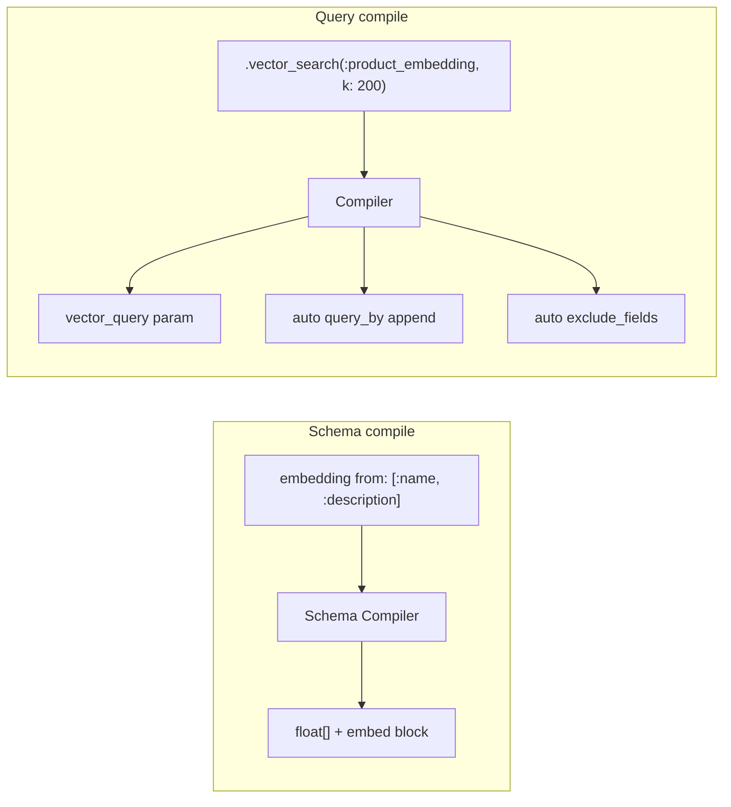

Related: <a href="/projects/search-engine-for-typesense/v30.1/configuration">Configuration</a>, <a href="/projects/search-engine-for-typesense/v30.1/relation">Relation</a>, <a href="/projects/search-engine-for-typesense/v30.1/compiler">Compiler</a>, <a href="/projects/search-engine-for-typesense/v30.1/dx">DX</a>, <a href="/projects/search-engine-for-typesense/v30.1/models">Models</a>, <a href="/projects/search-engine-for-typesense/v30.1/observability">Observability</a>

Vector search lets you find documents by meaning rather than exact keywords. The gem wraps Typesense's <a href="https://typesense.org/docs/30.1/api/vector-search.html" target="_blank">vector search</a> capabilities with a Ruby DSL covering schema declarations, query composition, and automatic compiler behaviour.

## Configuration

Set a default embedding model once in your initializer. Every `embedding` declaration that does not specify its own model inherits this value.

```ruby
SearchEngine.configure do |c|
  # Required for auto-embedding fields
  c.embedding.model = 'ts/all-MiniLM-L12-v2'

  # Optional: API key for remote providers (OpenAI, PaLM, etc.)
  c.embedding.api_key = ENV['OPENAI_API_KEY']

  # Optional: extra model_config merged into every embed block
  c.embedding.model_config = {
    indexing_prefix: 'passage:',
    query_prefix:    'query:'
  }
end
```

| Field | Type | Default | Purpose |
|---|---|---|---|
| `embedding.model` | String | `nil` | Typesense model name (e.g. `ts/all-MiniLM-L12-v2`, `openai/text-embedding-3-small`) |
| `embedding.api_key` | String | `nil` | API key for remote embedding providers |
| `embedding.model_config` | Hash | `nil` | Extra keys merged into the Typesense `embed.model_config` block |

<Warning>
If no model is set globally or per-field, the `embedding` macro raises `SearchEngine::Errors::ConfigurationError` at load time.
</Warning>

## Schema: the `embedding` macro

Declare embedding fields on your model with the `embedding` macro. It registers a `:vector` attribute internally and builds the Typesense `embed` block (or `num_dim` for external embeddings) at schema compile time.

### Basic forms

```ruby
class SearchEngine::Product < SearchEngine::Base
  collection 'products'

  attribute :name, :string, sort: true
  attribute :description, :string
  attribute :brand_name, :string, facet: true
  attribute :category, :string, facet: true

  # Shortest form: derive field name from class, explicit sources
  # => field "product_embedding", from: [:name, :description]
  embedding from: %i[name description]

  # Named with auto-suffix: single source inferred
  # => field "name_embedding", from: [:name]
  embedding :name

  # Named with explicit sources
  # => field "search_embedding", from: [:name, :description, :category]
  embedding :search, from: %i[name description category]

  # Already-suffixed name: used as-is
  # => field "product_embedding", from: [:name, :description]
  embedding :product_embedding, from: %i[name description]

  # Per-field model override
  embedding :visual, from: %i[name],
    model: 'openai/text-embedding-3-small', num_dim: 512

  # Suppress auto-suffix
  # => field "vectors", from: [:name, :description]
  embedding :vectors, from: %i[name description], suffix: false

  query_by %i[name description brand_name]
end
```

### External embeddings

When your application generates vectors outside Typesense, declare `num_dim:` without `from:`. The mapper expects your `map` block to supply a float array of the declared dimension.

```ruby
embedding :custom_embedding, num_dim: 768
```

No `embed` block is emitted in the schema; Typesense stores the field as `float[]` with the given dimension constraint.

### Name resolution rules

| # | Condition | Resolved field name | `from:` |
|---|-----------|---------------------|---------|
| 1 | No name, `from:` given | `"#{klass.demodulize.underscore}_embedding"` | as given |
| 2 | Name given, `suffix: true` (default), name does not end with `_embedding` | `"#{name}_embedding"` | as given, or inferred as `[name]` |
| 3 | Name given, name already ends with `_embedding` | as-is | as given |
| 4 | Name given, `suffix: false` | as-is | as given, or inferred as `[name]` |
| 5 | No name, no `from:`, no `num_dim:` | raises `ArgumentError` | -- |
| 6 | `num_dim:` given without `from:` | external embedding, no `embed` block | -- |

**Model resolution precedence:** per-field `model:` > `config.embedding.model` > raises `ConfigurationError`.

**`from:` inference:** when `from:` is omitted and the field is not external, the macro infers `from: [bare_name]` where `bare_name` is the positional argument before the `_embedding` suffix.

### Macro signature

```ruby
embedding(name = nil,
  from: nil,
  suffix: true,
  model: nil,
  api_key: nil,
  num_dim: nil,
  hnsw: nil,
  model_config: nil)
```

| Param | Type | Purpose |
|---|---|---|
| `name` | Symbol, String, nil | Field name (auto-derived when omitted) |
| `from:` | Array&lt;Symbol&gt; | Source attribute names to embed from |
| `suffix:` | Boolean | Append `_embedding` to the name (default: `true`) |
| `model:` | String | Per-field embedding model override |
| `api_key:` | String | Per-field API key for remote providers |
| `num_dim:` | Integer | Vector dimensions for external embeddings |
| `hnsw:` | Hash | HNSW index tuning (`{ ef_construction:, M: }`) |
| `model_config:` | Hash | Extra `model_config` merged into the `embed` block |

## Semantic search

When the query string is not `"*"` and no explicit `query:` vector is provided, Typesense auto-embeds the query text with the same model used at index time and performs nearest-neighbor search.

```ruby
SearchEngine::Product
  .search("comfortable ergonomic chair")
  .vector_search(:product_embedding, k: 200)
```

The compiler auto-appends `product_embedding` to `query_by` so Typesense performs rank fusion between keyword and vector results.

## Hybrid search

Combine keyword and vector results with an explicit alpha weight. Typesense uses rank fusion:

```text
rank_fusion_score = (1 - alpha) * keyword_rank + alpha * vector_rank
```

```ruby
SearchEngine::Product
  .search("chair")
  .vector_search(:product_embedding, alpha: 0.8, k: 200)
```

| `alpha` | Behaviour |
|---|---|
| `0.0` | Pure keyword search |
| `0.5` | Equal weight |
| `1.0` | Pure vector search |

<Tip>
Start with `alpha: 0.7` and tune based on your dataset. Higher alpha favours semantic similarity; lower alpha favours exact keyword matches.
</Tip>

## Find similar documents

`find_similar` is sugar over `vector_search` with `id:`. Typesense retrieves the stored embedding for the given document and finds its nearest neighbors.

```ruby
SearchEngine::Product
  .find_similar("product-42", field: :product_embedding, k: 20)
```

Chain filters to refine results:

```ruby
SearchEngine::Product
  .find_similar("product-42", field: :product_embedding)
  .where(category: "furniture")
  .where.not(id: "product-42")
```

## Historical queries

Weight multiple past queries and let Typesense blend their embeddings server-side.

```ruby
SearchEngine::Product
  .vector_search(:product_embedding,
    queries: ["ergonomic keyboard", "standing desk"],
    weights: [0.7, 0.3],
    k: 20)
```

<Note>
`weights:` must sum to approximately 1.0 (tolerance: 0.01). The gem validates this and raises `InvalidVectorQuery` if violated.
</Note>

## External vector queries

When you generate embeddings in your own pipeline, pass the float array directly.

```ruby
SearchEngine::Product
  .vector_search(:custom_embedding,
    query: [0.2, 0.4, 0.1, 0.8, ...],
    k: 100)
```

This bypasses Typesense's auto-embedding; the provided vector is used as-is for nearest-neighbor search.

## Sort by vector distance

Use `order(vector_distance: :asc)` as a secondary sort to rank keyword results by their semantic proximity.

```ruby
SearchEngine::Product
  .search("chair")
  .vector_search(:product_embedding)
  .order(vector_distance: :asc)
```

The compiler resolves `vector_distance` to the Typesense token `_vector_query(product_embedding:([])):asc`.

<Warning>
`order(vector_distance: ...)` requires `.vector_search` to be chained on the same relation. Using it without vector search raises `InvalidVectorQuery`.
</Warning>

## Distance threshold

Cap results by cosine distance to filter out low-relevance matches.

```ruby
SearchEngine::Product
  .search("chair")
  .vector_search(:product_embedding, alpha: 0.7, distance_threshold: 0.3)
```

## HNSW tuning

Override HNSW search parameters per query.

```ruby
SearchEngine::Product
  .search("chair")
  .vector_search(:product_embedding, k: 200, ef: 100)
```

For small result sets, bypass HNSW with brute-force flat search:

```ruby
SearchEngine::Product
  .where(category: "shoes")
  .vector_search(:product_embedding, k: 50, flat_search_cutoff: 20)
```

## Auto-exclude behaviour

Embedding fields contain large float arrays (384--1536 dimensions). To avoid inflating response payloads, the compiler automatically adds the embedding field to `exclude_fields` unless you explicitly select it.

To include the raw vectors in the response:

```ruby
SearchEngine::Product
  .vector_search(:product_embedding, k: 10)
  .select(:product_embedding)
```

## Multi-search

Vector search works inside `multi_search` blocks:

```ruby
SearchEngine.multi_search do |m|
  m.add :semantic, SearchEngine::Product
    .search("chair")
    .vector_search(:product_embedding, k: 50)

  m.add :keyword, SearchEngine::Product
    .search("chair")
    .per(10)
end
```

## Compiler mapping



The compiler:

1. Builds the `vector_query` string: `product_embedding:([], k:200, alpha:0.8)`
2. Auto-appends the embedding field to `query_by` in hybrid mode (text query + vector search, no explicit `query:` array)
3. Auto-adds the embedding field to `exclude_fields` unless explicitly selected
4. Resolves `order(vector_distance: ...)` to the real Typesense sort token

## DX & explain

All DX helpers include vector search state. Raw float arrays are redacted to `[<N dims>]` in all surfaces.

```ruby
rel = SearchEngine::Product
  .search("chair")
  .vector_search(:product_embedding, alpha: 0.7, k: 100)

rel.explain
# => includes vector search mode, field, k, alpha

rel.to_curl
# => curl command with vector_query param

rel.dry_run!
# => { url:, body: { ..., vector_query: "product_embedding:([], k:100, alpha:0.7)" }, ... }
```

## Method signatures

### `vector_search`

```ruby
def vector_search(field, k: nil, alpha: nil, query: nil, id: nil,
                  distance_threshold: nil, queries: nil, weights: nil,
                  ef: nil, flat_search_cutoff: nil)
```

| Param | Type | Purpose |
|---|---|---|
| `field` | Symbol, String | Embedding field name (required) |
| `k:` | Integer | Number of nearest neighbors |
| `alpha:` | Float (0.0--1.0) | Hybrid blend weight |
| `query:` | Array&lt;Numeric&gt; | Explicit embedding vector |
| `id:` | #to_s | Document ID for similarity search |
| `distance_threshold:` | Float (&gt;= 0) | Maximum cosine distance |
| `queries:` | Array&lt;String&gt; | Historical query strings |
| `weights:` | Array&lt;Numeric&gt; | Per-query weights (sum to ~1.0) |
| `ef:` | Integer | HNSW ef search override |
| `flat_search_cutoff:` | Integer | Brute-force threshold |

Mutually exclusive modes: `query:`, `id:`, and `queries:`. Providing more than one raises `InvalidVectorQuery`. Last `vector_search` call wins (Typesense supports one `vector_query` per search).

### `find_similar`

```ruby
def find_similar(document_id, field:, k: nil, distance_threshold: nil)
```

Sugar over `vector_search(field, id: document_id, ...)`.

## Observability

The compiler emits a `search_engine.vector.compile` event with:

| Key | Value |
|---|---|
| `field` | Embedding field name |
| `mode` | `:semantic`, `:hybrid`, `:similar`, `:historical`, or `:external` |
| `query_vector_present` | Whether an explicit `query:` array was provided |
| `dims` | Size of `query:` array (nil if auto-embedded) |
| `k` | Requested nearest neighbors |
| `hybrid_weight` | Alpha value |
| `ann_params_present` | Whether `ef` or `flat_search_cutoff` was set |

Compact logging redacts raw vector arrays. OTel spans include these attributes when enabled.

See <a href="/projects/search-engine-for-typesense/v30.1/observability">Observability</a> for event payloads and log format.

## Backlinks

- <a href="/projects/search-engine-for-typesense/v30.1/configuration">Configuration</a> -- `config.embedding.*` settings
- <a href="/projects/search-engine-for-typesense/v30.1/models">Models</a> -- `embedding` macro declaration
- <a href="/projects/search-engine-for-typesense/v30.1/relation">Relation</a> -- immutable chaining
- <a href="/projects/search-engine-for-typesense/v30.1/compiler">Compiler</a> -- `vector_query` compilation details
- <a href="/projects/search-engine-for-typesense/v30.1/dx">DX</a> -- `explain`, `dry_run!`, `to_curl`
- <a href="/projects/search-engine-for-typesense/v30.1/observability">Observability</a> -- events and redaction
- <a href="https://typesense.org/docs/30.1/api/vector-search.html" target="_blank">Typesense Vector Search docs</a>
